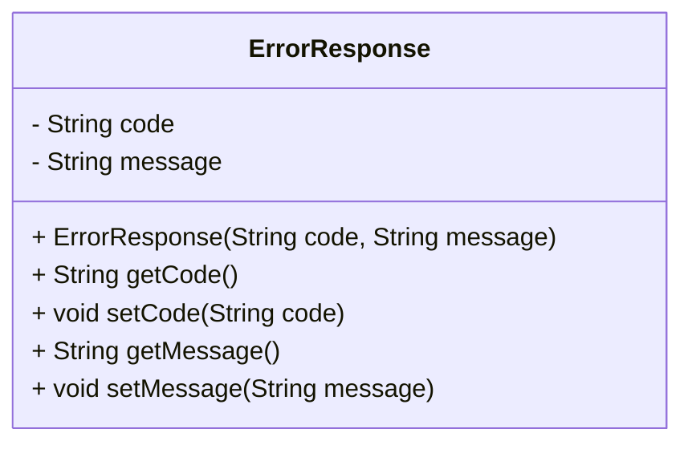

# ErrorResponse.java: Error Response Data Structure

## Overview
The `ErrorResponse` class is a simple data structure designed to encapsulate error information. It contains two attributes: `code` and `message`, which represent the error code and the corresponding error message, respectively. This class provides getter and setter methods for accessing and modifying these attributes.

## Process Flow
Since this is a data structure, the process flow is represented as a class diagram showing its attributes and methods.

## Insights
- The class is designed to encapsulate error-related information in a structured way.
- It provides a constructor for initializing the `code` and `message` attributes.
- Getter and setter methods are available for both attributes, ensuring encapsulation and flexibility in accessing/modifying the data.
- This class can be used in scenarios where error details need to be communicated, such as API responses or logging mechanisms.

## Dependencies (Optional)
No external dependencies are detected in this code.
