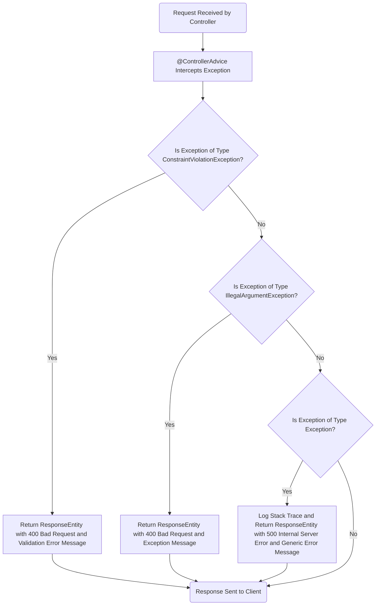
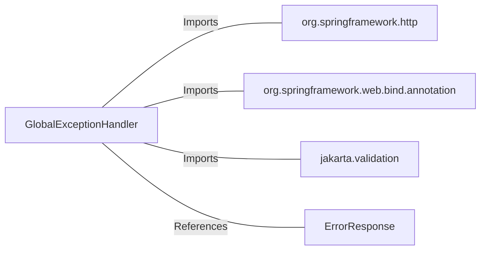

# GlobalExceptionHandler.java: Centralized Exception Handling

## Scope and Purposes

The `GlobalExceptionHandler` class is designed to provide centralized exception handling for a Spring Boot application. It uses the `@ControllerAdvice` annotation to intercept exceptions thrown by controllers and return appropriate HTTP responses. This approach ensures consistent error handling across the application.

### Key Functionalities:
1. **Constraint Violation Handling**:
   - Captures exceptions of type `ConstraintViolationException`, typically thrown during validation failures.
   - Returns a `400 Bad Request` HTTP status with a descriptive error message.

2. **Illegal Argument Handling**:
   - Handles `IllegalArgumentException`, which may occur due to invalid method arguments.
   - Responds with a `400 Bad Request` HTTP status and the exception's message.

3. **Generic Exception Handling**:
   - Catches all other exceptions that are not explicitly handled.
   - Logs the stack trace for debugging purposes.
   - Returns a `500 Internal Server Error` HTTP status with a generic error message.

### Data Types Processed:
- **ErrorResponse**:
  - A custom object encapsulating error details, including:
    - HTTP status code as a string.
    - A descriptive error message.

### Insights:
- The class ensures that the application adheres to best practices for exception handling by providing meaningful HTTP responses for different error scenarios.
- The use of `@ControllerAdvice` makes the exception handling logic reusable and decoupled from individual controllers.
- Logging the stack trace in the generic exception handler aids in debugging unexpected issues.
## Process Flow

## Functional Overview

The `GlobalExceptionHandler` class provides centralized exception handling for a Spring Boot application. It ensures consistent error responses for various types of exceptions thrown by controllers. By using the `@ControllerAdvice` annotation, it intercepts exceptions globally, eliminating the need for repetitive error-handling code in individual controllers.

### Insights:
- **Centralized Exception Handling**: Reduces redundancy and improves maintainability by consolidating error-handling logic in one place.
- **Custom Error Responses**: Returns meaningful HTTP responses tailored to the type of exception, enhancing the user experience.
- **Debugging Support**: Logs stack traces for generic exceptions, aiding in troubleshooting and debugging.

---

## Features Details

### Logic

The program uses the `@ControllerAdvice` annotation to globally intercept exceptions. It defines three specific exception handlers:
1. **ConstraintViolationException Handler**:
   - Captures validation errors and returns a `400 Bad Request` response with a descriptive message.
2. **IllegalArgumentException Handler**:
   - Handles invalid arguments passed to methods and returns a `400 Bad Request` response with the exception's message.
3. **Generic Exception Handler**:
   - Catches all other exceptions, logs the stack trace, and returns a `500 Internal Server Error` response with a generic error message.

### Variables

| Variable Name | Description                                                                 |
|---------------|-----------------------------------------------------------------------------|
| `ex`          | Represents the exception object passed to the handler methods.             |
| `e`           | Represents the exception object in the generic exception handler.          |

### Data Structures

| Data Structure Name | Description                                                                 |
|----------------------|-----------------------------------------------------------------------------|
| `ErrorResponse`      | A custom object encapsulating error details, including HTTP status and a descriptive error message. |

### Error Handling

| Error Type                     | Handling Mechanism                                                                 |
|--------------------------------|------------------------------------------------------------------------------------|
| `ConstraintViolationException` | Returns a `400 Bad Request` response with a validation error message.              |
| `IllegalArgumentException`     | Returns a `400 Bad Request` response with the exception's message.                 |
| `Exception`                    | Logs the stack trace and returns a `500 Internal Server Error` response with a generic error message. |
## Dependencies

### Identified External References

- `org.springframework.http`: Provides classes for handling HTTP requests and responses, such as `HttpStatus` and `ResponseEntity`. The program imports these classes to construct HTTP responses.
- `org.springframework.web.bind.annotation`: Contains annotations like `@ControllerAdvice` and `@ExceptionHandler`, which are used to define exception handling logic.
- `jakarta.validation`: Includes `ConstraintViolationException`, which is used to handle validation errors.
- `ErrorResponse`: A custom data structure referenced to encapsulate error details in the response.
## Involved Objects

### List of Objects
- **Program Name**: `GlobalExceptionHandler`
- **External Objects**:
  - `org.springframework.http`: Provides HTTP-related classes used for constructing responses.
  - `org.springframework.web.bind.annotation`: Supplies annotations for exception handling.
  - `jakarta.validation`: Includes validation-related classes such as `ConstraintViolationException`.
  - `ErrorResponse`: A custom data structure used to encapsulate error details.

## Data Manipulation (SQL) (Optional)

No SQL-related data manipulation or table structures are detected in the code.
## Profiling Details

The `GlobalExceptionHandler` does not implement any specific behavior based on user permissions or profiles. Its functionality is independent of user roles and is designed to handle exceptions globally across the application.

---

## Subroutines

### Subroutine: `handleConstraintViolationException`
- **Purpose**: Handles exceptions of type `ConstraintViolationException`, typically thrown during validation failures.
- **Parameters**: 
  - `ConstraintViolationException ex`: The exception object containing details about the validation error.
- **Usage**: Returns a `ResponseEntity` with a `400 Bad Request` status and a descriptive validation error message.
- **Considerations**: Ensure that validation rules are properly defined to trigger this exception when necessary.

### Subroutine: `handleIllegalArgumentException`
- **Purpose**: Handles exceptions of type `IllegalArgumentException`, which occur due to invalid method arguments.
- **Parameters**: 
  - `IllegalArgumentException ex`: The exception object containing details about the invalid argument.
- **Usage**: Returns a `ResponseEntity` with a `400 Bad Request` status and the exception's message.
- **Considerations**: Ensure that method arguments are validated to avoid triggering this exception unnecessarily.

### Subroutine: `handleException`
- **Purpose**: Handles all other exceptions not explicitly covered by the other handlers.
- **Parameters**: 
  - `Exception e`: The exception object containing details about the error.
- **Usage**: Logs the stack trace for debugging purposes and returns a `ResponseEntity` with a `500 Internal Server Error` status and a generic error message.
- **Considerations**: Use this as a fallback mechanism for unexpected errors.

---

## Unexpected Cases

### Error Handling
- **ConstraintViolationException**: Returns a `400 Bad Request` response with a validation error message.
- **IllegalArgumentException**: Returns a `400 Bad Request` response with the exception's message.
- **Generic Exception**: Logs the stack trace and returns a `500 Internal Server Error` response with a generic error message.

### Error Codes and Messages
- **400 Bad Request**: Indicates a client-side error, such as validation failure or invalid arguments.
- **500 Internal Server Error**: Indicates an unexpected server-side error.

### Recovery Mechanisms
- For generic exceptions, the stack trace is logged to aid in debugging and identifying the root cause of the issue. No automated recovery mechanisms are implemented.

### Concurrency Management
- The program does not include specific behaviors for managing concurrency or concurrent transactions.

---

## Testing and Validation

### General Guide for Testing
1. **Validation Error Test**:
   - **Input**: Send a request with invalid data that violates validation rules.
   - **Expected Output**: A `400 Bad Request` response with a descriptive validation error message.

2. **Invalid Argument Test**:
   - **Input**: Call a method with invalid arguments.
   - **Expected Output**: A `400 Bad Request` response with the exception's message.

3. **Generic Exception Test**:
   - **Input**: Trigger an unexpected exception in the application.
   - **Expected Output**: A `500 Internal Server Error` response with a generic error message and the stack trace logged.

### Sample Test Cases
| Test Case                     | Input Scenario                              | Expected Output                                                                 |
|-------------------------------|---------------------------------------------|---------------------------------------------------------------------------------|
| Validation Error Handling     | Invalid data violating validation rules     | `400 Bad Request` with "Validation error: <error_message>"                     |
| Invalid Argument Handling     | Invalid method argument                     | `400 Bad Request` with the exception's message                                 |
| Generic Exception Handling    | Unexpected exception in the application     | `500 Internal Server Error` with "An error occurred: <error_message>"         |

### Validation Steps
- Ensure that the appropriate exception handler is invoked for each type of exception.
- Verify that the HTTP status codes and error messages match the expected output.
- Check the application logs to confirm that stack traces are logged for generic exceptions.
