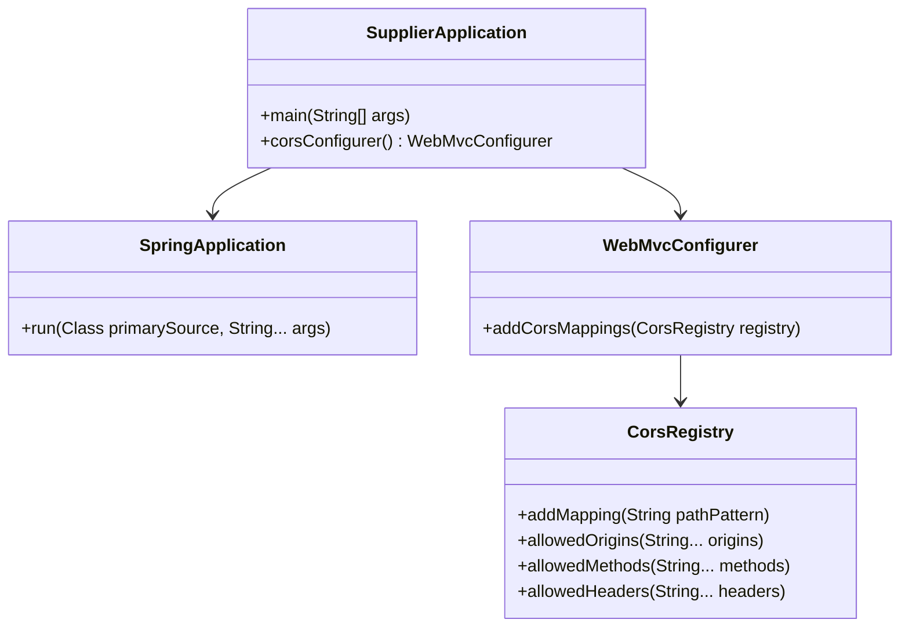

# Documentation of the file SupplierApplication.java

## Introduction
The `SupplierApplication.java` file serves as the entry point for a Spring Boot application. It initializes the application and configures Cross-Origin Resource Sharing (CORS) settings to allow communication between different domains.

## Description
This file is part of a Spring Boot project and contains the main class `SupplierApplication`. It is annotated with `@SpringBootApplication`, which is a convenience annotation that combines `@Configuration`, `@EnableAutoConfiguration`, and `@ComponentScan`. The file also includes a method to configure CORS settings, enabling the application to handle requests from different origins.

## Structure
The file consists of:
1. A `main` method to start the Spring Boot application.
2. A `Bean` method to configure CORS settings.

## Dependencies
The file depends on:
- Spring Boot framework for application initialization and configuration.
- Spring Web for handling web-related configurations, including CORS.

## Imports
The file imports the following packages:

```java
import org.springframework.boot.SpringApplication;
import org.springframework.boot.autoconfigure.SpringBootApplication;
import org.springframework.context.annotation.Bean;
import org.springframework.web.servlet.config.annotation.CorsRegistry;
import org.springframework.web.servlet.config.annotation.WebMvcConfigurer;

```


## Variables
This file does not define any custom variables. All configurations are handled within methods.

## Methods

### `main(String[] args)`
**Purpose**:  
The `main` method is the entry point of the application. It uses `SpringApplication.run()` to bootstrap the application.

**Parameters**:  
- `String[] args`: Command-line arguments passed to the application.

**Functionality**:  
Starts the Spring Boot application.

---

### `corsConfigurer()`
**Purpose**:  
Defines a `WebMvcConfigurer` bean to configure CORS settings.

**Functionality**:  
- Allows requests from all origins (`allowedOrigins("*")`).
- Permits HTTP methods such as `GET`, `POST`, `PUT`, `DELETE`, and `OPTIONS`.
- Accepts all headers (`allowedHeaders("*")`).

**Return Value**:  
Returns an instance of `WebMvcConfigurer` with the specified CORS configuration.

---

### `addCorsMappings(CorsRegistry registry)`
**Purpose**:  
Overrides the `addCorsMappings` method to specify CORS mappings.

**Parameters**:  
- `CorsRegistry registry`: The registry object used to configure CORS mappings.

**Functionality**:  
Adds mappings for all endpoints (`/**`) with the specified CORS settings.

---

## Example
Here is an example of how the application can be started:

```java
$ mvn spring-boot:run

```

Once the application is running, it will accept requests from any origin and support the specified HTTP methods.

## Dependency Diagram
Below is a mermaid diagram illustrating the dependencies of the `SupplierApplication` class:





## Notes
- The `allowCredentials(true)` line is commented out. If uncommented, it would allow credentials (e.g., cookies, authorization headers) to be sent in CORS requests.
- The current configuration is very permissive (`allowedOrigins("*")`), which may not be suitable for production environments. It is recommended to restrict origins to trusted domains.

## Vulnerabilities
- **Overly Permissive CORS Configuration**: Allowing all origins (`allowedOrigins("*")`) and headers (`allowedHeaders("*")`) can expose the application to security risks, such as Cross-Site Request Forgery (CSRF) attacks. It is advisable to restrict these settings in production.
- **Commented `allowCredentials(true)`**: If enabled, it could lead to security vulnerabilities if not properly configured. Ensure that credentials are only allowed for trusted origins.


