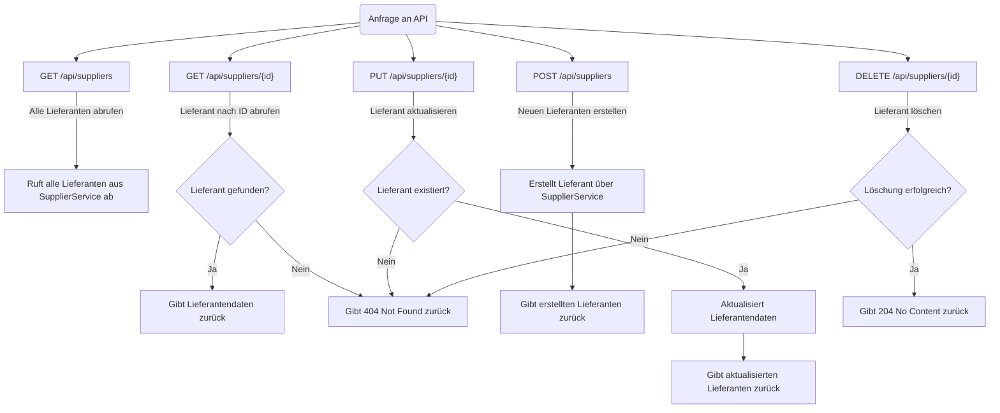
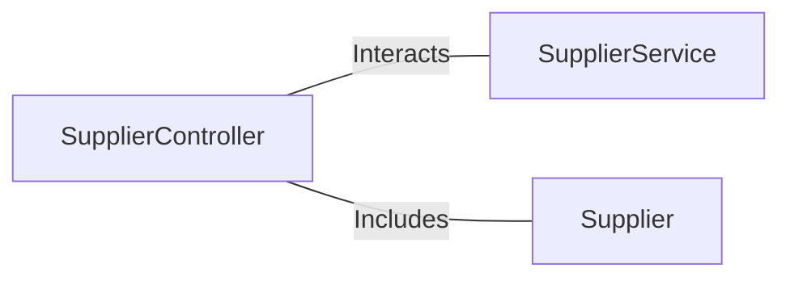

# SupplierController.java: Verwaltung von Lieferanten-APIs

## Übersicht

Die `SupplierController`-Klasse stellt REST-APIs für die Verwaltung von Lieferanten bereit. Sie ermöglicht das Abrufen, Erstellen, Aktualisieren und Löschen von Lieferantendaten. Die Klasse ist ein zentraler Bestandteil der Lieferantenverwaltung und interagiert mit der `SupplierService`-Schicht, um die Geschäftslogik auszuführen.

## Prozessablauf

## Erkenntnisse

- Die Klasse implementiert CRUD-Operationen (Create, Read, Update, Delete) für Lieferanten.
- Die API-Endpunkte sind REST-konform und verwenden HTTP-Methoden wie `GET`, `POST`, `PUT` und `DELETE`.
- Die Klasse verwendet `ResponseEntity`, um HTTP-Statuscodes wie `200 OK`, `404 Not Found` und `204 No Content` zurückzugeben.
- Die Geschäftslogik wird an die `SupplierService`-Schicht delegiert, was die Trennung von Verantwortlichkeiten fördert.
- Die Klasse unterstützt die Verarbeitung von JSON-Daten durch die Verwendung von `@RequestBody` und `@PathVariable`.

## Abhängigkeiten

- `SupplierService`: Führt die Geschäftslogik für die Verwaltung von Lieferanten aus.
- `Supplier`: Datenmodell, das die Lieferantendaten repräsentiert.
