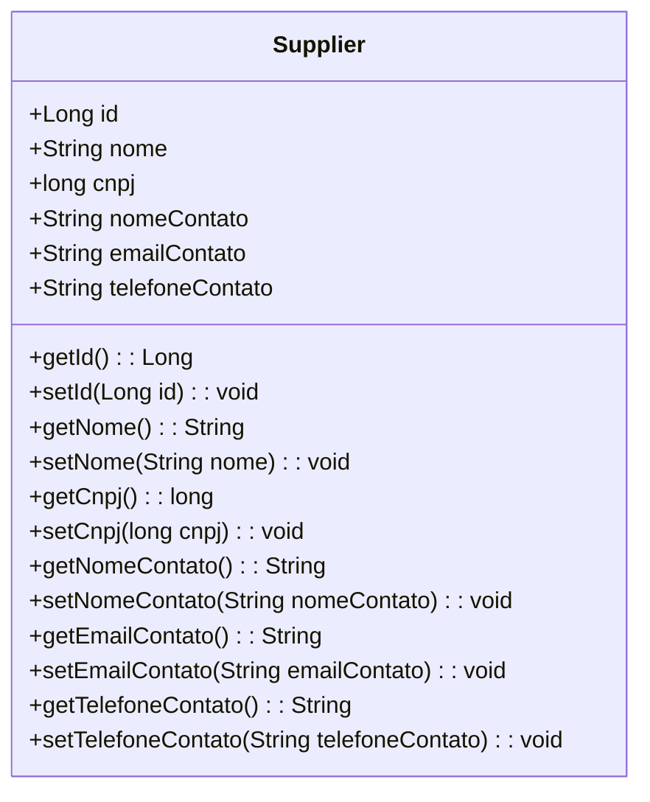

# Supplier.java: Lieferanten-Datenstruktur

## Übersicht
Die Klasse `Supplier` repräsentiert eine Datenstruktur zur Verwaltung von Lieferanteninformationen. Sie ist als JPA-Entität definiert und wird verwendet, um Lieferantendaten in einer Datenbank zu speichern und abzurufen. Die Klasse enthält Attribute wie Name, CNPJ, Kontaktname, E-Mail und Telefonnummer des Kontakts.

## Prozessfluss

## Erkenntnisse
- Die Klasse ist als JPA-Entität mit der Annotation `@Entity` definiert, was bedeutet, dass sie mit einer Datenbanktabelle verknüpft ist.
- Das Attribut `id` ist der Primärschlüssel der Entität und wird automatisch generiert (`GenerationType.IDENTITY`).
- Die Klasse enthält grundlegende Lieferanteninformationen:
  - `nome`: Name des Lieferanten.
  - `cnpj`: Steueridentifikationsnummer des Lieferanten.
  - `nomeContato`: Name des Ansprechpartners.
  - `emailContato`: E-Mail-Adresse des Ansprechpartners.
  - `telefoneContato`: Telefonnummer des Ansprechpartners.
- Es gibt Getter- und Setter-Methoden für alle Attribute, um die Daten zu lesen und zu ändern.

## Datenmanipulation (SQL)
Die Klasse `Supplier` wird in einer Datenbanktabelle gespeichert. Die Tabelle hat die folgenden Attribute:

| Attribut          | Datentyp       | Beschreibung                              |
|--------------------|----------------|------------------------------------------|
| `id`              | Long           | Primärschlüssel, automatisch generiert.  |
| `nome`            | String         | Name des Lieferanten.                    |
| `cnpj`            | long           | Steueridentifikationsnummer des Lieferanten. |
| `nomeContato`     | String         | Name des Ansprechpartners.               |
| `emailContato`    | String         | E-Mail-Adresse des Ansprechpartners.     |
| `telefoneContato` | String         | Telefonnummer des Ansprechpartners.      |
