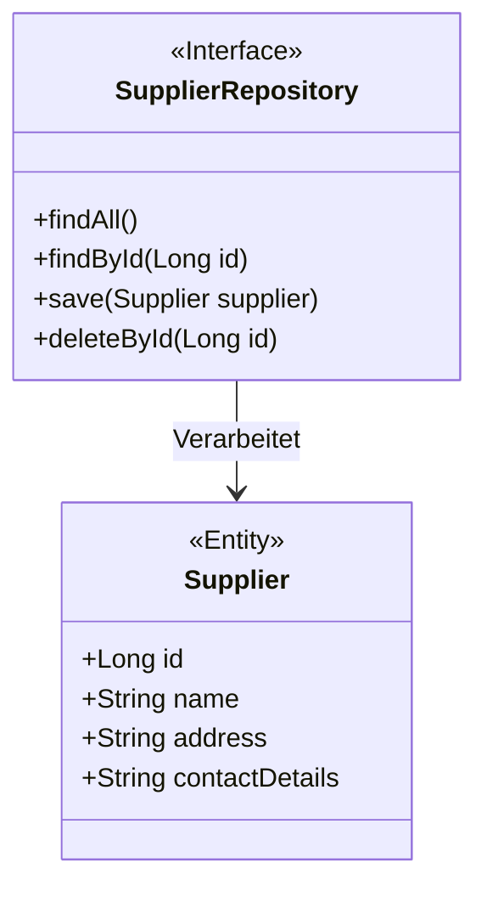
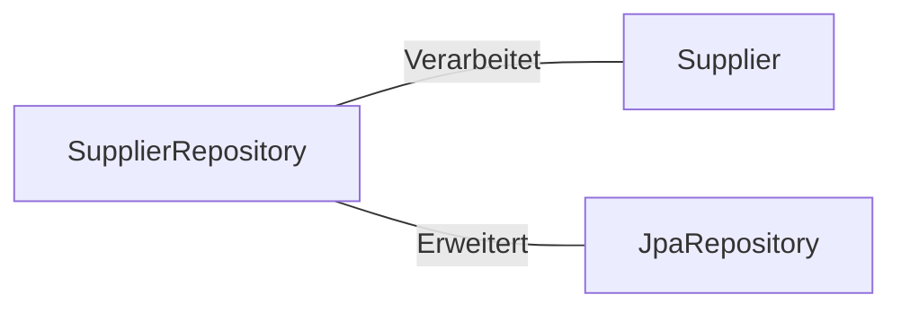

# SupplierRepository.java: Verwaltung der Lieferanten-Datenbank

## Übersicht
Die `SupplierRepository`-Schnittstelle dient als Datenzugriffsschicht für die Verwaltung von Lieferanteninformationen. Sie ermöglicht CRUD-Operationen (Erstellen, Lesen, Aktualisieren und Löschen) auf der Lieferanten-Datenbank und nutzt die Funktionalitäten von Spring Data JPA.

## Prozessfluss

## Erkenntnisse
- Die `SupplierRepository`-Schnittstelle erweitert `JpaRepository`, wodurch Standardmethoden für Datenbankoperationen bereitgestellt werden.
- Die Annotation `@Repository` kennzeichnet die Schnittstelle als Spring-Komponente für die Datenzugriffsschicht.
- Die Schnittstelle ist generisch und arbeitet mit der `Supplier`-Entität und einem Primärschlüssel vom Typ `Long`.

## Abhängigkeiten

- `Supplier`: Die Entität, die von der Datenbank verarbeitet wird. Sie enthält die Lieferanteninformationen.
- `JpaRepository`: Bietet Standardmethoden für Datenbankoperationen wie `findAll`, `findById`, `save` und `deleteById`.

## Datenmanipulation (SQL)
### Tabelle: Supplier
| Attribut         | Datentyp   | Beschreibung                          |
|------------------|------------|---------------------------------------|
| `id`             | Long       | Eindeutige Identifikation des Lieferanten. |
| `name`           | String     | Name des Lieferanten.                 |
| `address`        | String     | Adresse des Lieferanten.              |
| `contactDetails` | String     | Kontaktinformationen des Lieferanten. |
