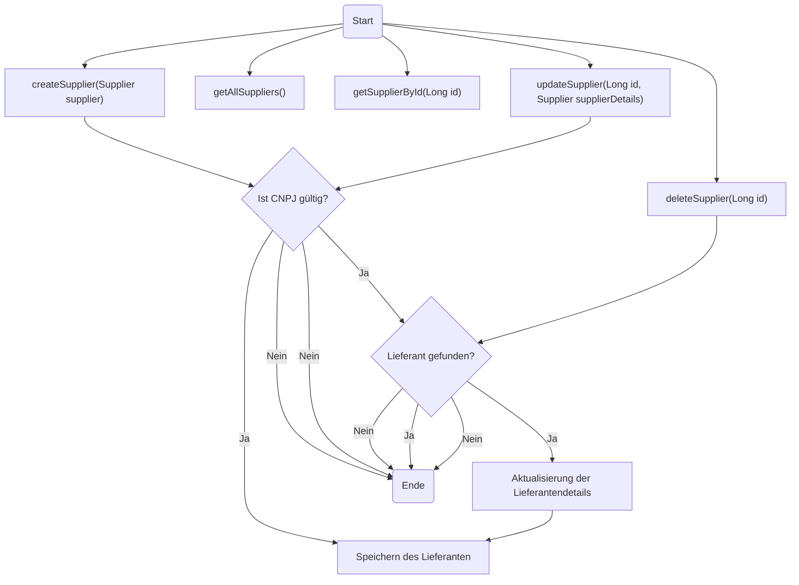
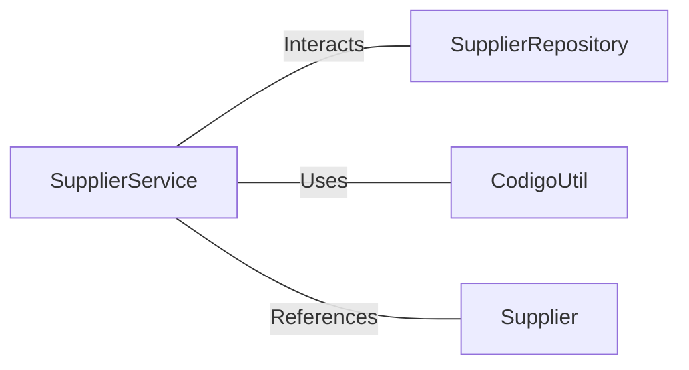

# SupplierService.java: Lieferantenmanagement-Service

## Übersicht
Die Klasse `SupplierService` bietet Funktionen zur Verwaltung von Lieferanten. Sie ermöglicht das Erstellen, Abrufen, Aktualisieren und Löschen von Lieferanten sowie die Validierung von Lieferantendaten, insbesondere der CNPJ (Cadastro Nacional da Pessoa Jurídica), einer brasilianischen Unternehmensidentifikationsnummer.

## Prozessfluss

## Erkenntnisse
- Die Klasse validiert die CNPJ eines Lieferanten vor dem Speichern oder Aktualisieren, um sicherzustellen, dass die Daten korrekt sind.
- Es wird eine Ausnahme ausgelöst, wenn die CNPJ ungültig ist oder ein Lieferant nicht gefunden wird.
- Die Klasse verwendet das Repository `SupplierRepository`, um Datenbankoperationen durchzuführen.
- Die Methode `deleteSupplier` gibt einen booleschen Wert zurück, um den Erfolg des Löschvorgangs zu bestätigen.
- Die Klasse ist stark von der Validierungslogik in der Hilfsklasse `CodigoUtil` abhängig.

## Abhängigkeiten

- `SupplierRepository`: Wird für Datenbankoperationen wie Speichern, Abrufen, Aktualisieren und Löschen von Lieferanten verwendet.
- `CodigoUtil`: Validiert die CNPJ eines Lieferanten.
- `Supplier`: Datenmodell, das die Lieferantendetails wie Name, CNPJ, Kontaktname, E-Mail und Telefonnummer enthält.
