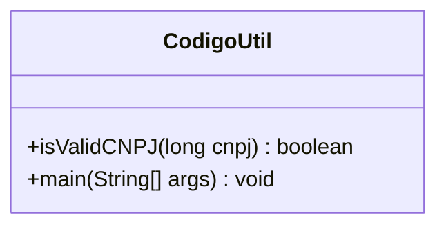

# Documentation of the file `CodigoUtil.java`

## Introduction
The `CodigoUtil.java` file contains utility methods for validating Brazilian CNPJ numbers. CNPJ (Cadastro Nacional da Pessoa Jurídica) is a unique identifier for companies registered in Brazil. This file provides functionality to check whether a given CNPJ number is valid according to the official algorithm.

## Description
The primary purpose of this file is to validate CNPJ numbers using a specific algorithm that involves calculating check digits based on weighted sums. The file includes a static method `isValidCNPJ` for this validation and a `main` method for testing the functionality.

## Structure
The file consists of:
- A utility class named `CodigoUtil`.
- A static method `isValidCNPJ` for validating CNPJ numbers.
- A `main` method for testing the validation logic.

## Dependencies
This file does not depend on external libraries or frameworks. It uses standard Java classes and methods.

## Imports
The file does not include any imports as it relies solely on Java's built-in functionality.

## Variables
### Local Variables
- `cnpjStr`: A string representation of the CNPJ number, formatted to ensure it has 14 digits.
- `weight1`: An array of integers representing the weights used for calculating the first check digit.
- `weight2`: An array of integers representing the weights used for calculating the second check digit.
- `sum`: An integer used to store the cumulative sum during the calculation of check digits.
- `mod`: An integer representing the modulus operation result used to determine the check digits.
- `firstDigit`: A character representing the first check digit.
- `secondDigit`: A character representing the second check digit.

## Methods
### `isValidCNPJ(long cnpj)`
#### Purpose
Validates a given CNPJ number by checking its format and calculating its check digits.

#### Parameters
- `cnpj`: A `long` representing the CNPJ number to be validated.

#### Returns
- `boolean`: Returns `true` if the CNPJ is valid, otherwise `false`.

#### Logic
1. Converts the CNPJ number to a 14-digit string.
2. Checks if the string length is exactly 14.
3. Calculates the first check digit using the `weight1` array.
4. Calculates the second check digit using the `weight2` array.
5. Compares the calculated check digits with the last two digits of the CNPJ string.
6. Returns `true` if both check digits match; otherwise, returns `false`.

### `main(String[] args)`
#### Purpose
Provides a simple test case for the `isValidCNPJ` method.

#### Parameters
- `args`: An array of `String` arguments passed to the program (not used in this implementation).

#### Logic
1. Defines a sample CNPJ number (`12345678000195L`).
2. Calls the `isValidCNPJ` method with the sample CNPJ.
3. Prints the result of the validation.

## Example

```java
public class CodigoUtilExample {
    public static void main(String[] args) {
        long cnpj = 12345678000195L; // Example CNPJ
        boolean isValid = CodigoUtil.isValidCNPJ(cnpj);
        System.out.println("CNPJ is valid: " + isValid);
    }
}

```


## Dependency Diagram
Below is a mermaid diagram illustrating the structure and dependencies of the `CodigoUtil` class:





## Notes
- The algorithm used for CNPJ validation is based on official rules defined by the Brazilian government.
- The method assumes that the input CNPJ is numeric and does not contain formatting characters like dots or dashes.
- The `main` method is included for demonstration purposes and should be removed or replaced in production environments.

## Vulnerabilities
- **Input Validation**: The method does not validate non-numeric inputs, which could lead to unexpected behavior or errors.
- **Error Handling**: The `catch` block in the `isValidCNPJ` method is generic and does not provide detailed information about the exception. This could make debugging more difficult.
- **Hardcoded Example**: The `main` method uses a hardcoded CNPJ number, which may not be suitable for real-world testing scenarios.
