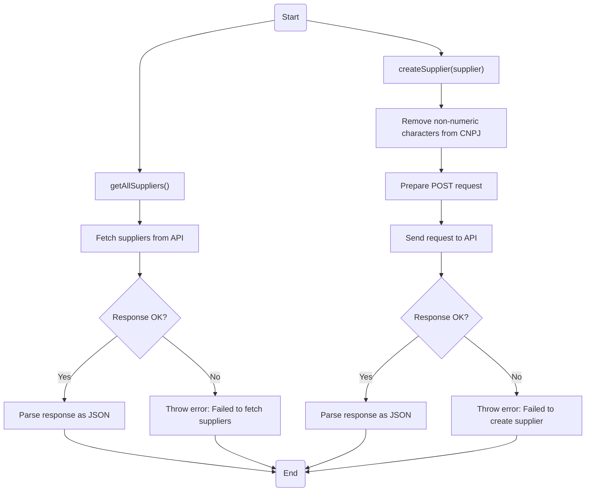
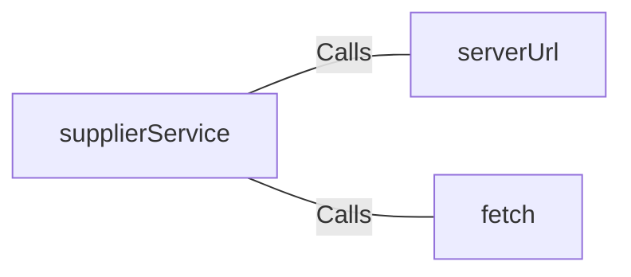

# supplierService.js: Supplier Management Service

## Overview
This module provides functionalities to interact with a supplier management API. It includes methods to retrieve all suppliers and create new suppliers, ensuring data validation and formatting before sending requests.

## Process Flow

## Insights
- **Error Handling**: Both methods include error handling to ensure proper feedback when API requests fail.
- **Data Validation**: The `createSupplier` method sanitizes the `cnpj` field by removing non-numeric characters before sending the request.
- **Asynchronous Operations**: The module uses `async/await` for handling asynchronous API calls, ensuring better readability and maintainability.
- **API Interaction**: The module interacts with a REST API hosted at `http://localhost:8081`.

## Dependencies

- `serverUrl`: Base URL for the API.
- `fetch`: Used for making HTTP requests to the API.

## External References
- `serverUrl`: Base URL for the supplier API (`http://localhost:8081`).
- `fetch`: Native JavaScript function for making HTTP requests.
