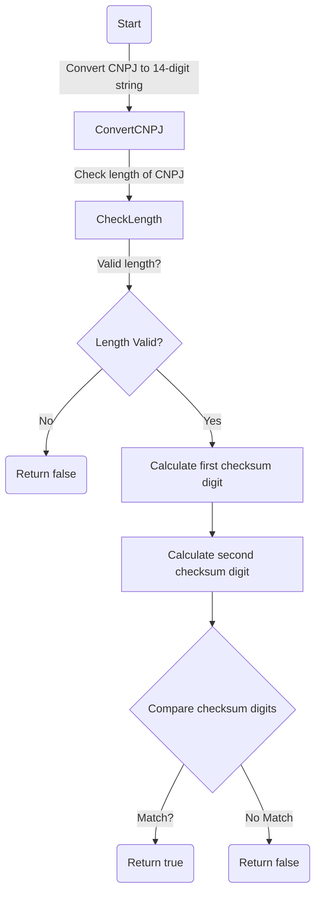

# CodigoUtil.java: Utility for CNPJ Validation

## Overview
The `CodigoUtil` class provides a utility method to validate Brazilian CNPJ (Cadastro Nacional da Pessoa Jurídica) numbers. It ensures the correctness of the CNPJ based on its checksum algorithm. The class also includes a `main` method for testing purposes.

## Process Flow
The validation process involves the following steps:
1. Convert the CNPJ number to a 14-digit string.
2. Check if the length of the CNPJ string is valid.
3. Calculate the first checksum digit using predefined weights.
4. Calculate the second checksum digit using another set of weights.
5. Compare the calculated checksum digits with the last two digits of the CNPJ string.
6. Return `true` if the CNPJ is valid; otherwise, return `false`.

### Mermaid Diagram

## Insights
- **Checksum Algorithm**: The validation uses two sets of weights (`weight1` and `weight2`) to calculate checksum digits, ensuring compliance with the CNPJ validation rules.
- **Error Handling**: The method includes a `try-catch` block to handle unexpected errors during validation, returning `false` in case of exceptions.
- **Edge Cases**: The method ensures that invalid lengths or malformed CNPJ numbers are handled gracefully.
- **Testing**: The `main` method provides a simple example to test the validation logic.

## Vulnerabilities
1. **No Input Validation for Negative Numbers**: The method assumes the input `cnpj` is a positive long value. Negative numbers could lead to unexpected behavior.
2. **Limited Error Handling**: The `catch` block does not log or provide details about the exception, which could make debugging difficult.
3. **Hardcoded Example in `main`**: The example CNPJ in the `main` method is hardcoded, which limits its flexibility for testing different cases.

## Dependencies (Optional)
No external dependencies are detected in this code.

## Data Manipulation (SQL) (Optional)
No SQL data manipulation is present in this code.
