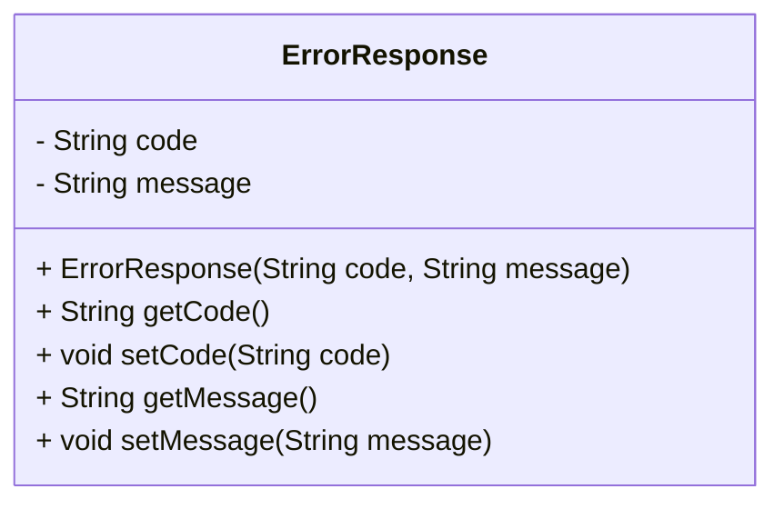

# ErrorResponse.java: Error Response Data Structure

## Overview
The `ErrorResponse` class is a simple data structure designed to encapsulate error information. It contains two attributes: `code` and `message`, which represent the error code and a descriptive message, respectively. This class is typically used to standardize error responses in applications, such as in REST APIs.

## Process Flow
The following diagram illustrates the structure of the `ErrorResponse` class:

## Insights
- The class is a **POJO (Plain Old Java Object)** with private fields and public getter and setter methods.
- It provides a constructor for initializing the `code` and `message` attributes.
- The class is designed to be reusable and can be used in various contexts where error information needs to be conveyed.

## Data Manipulation (SQL)
| Attribute | Type   | Description                          |
|-----------|--------|--------------------------------------|
| `code`    | String | Represents the error code.          |
| `message` | String | Descriptive message for the error.  |
