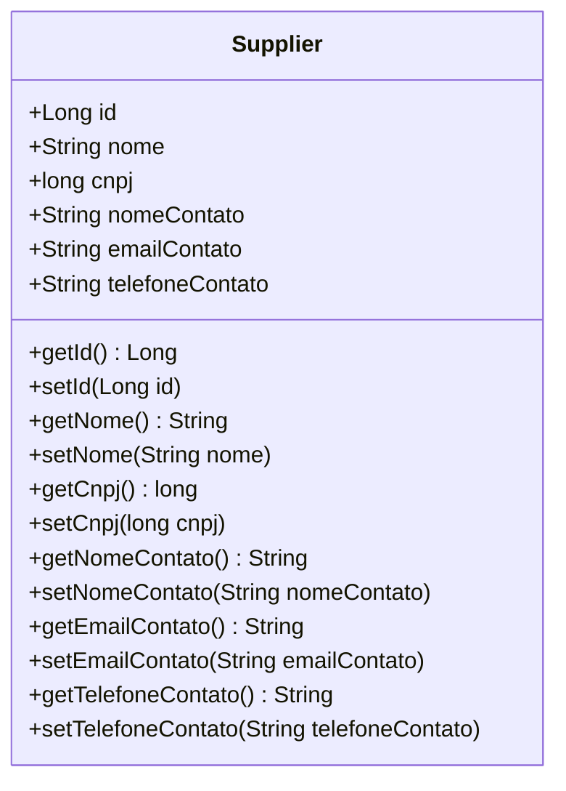
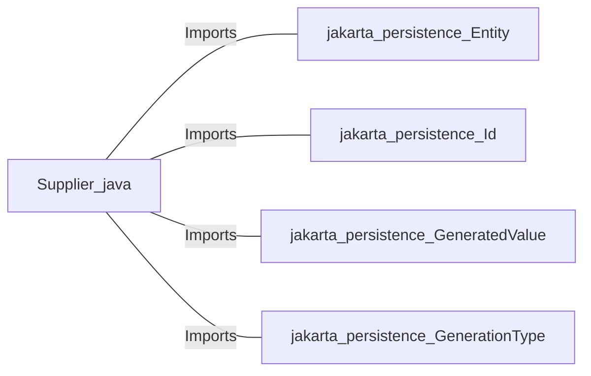

# Supplier.java: Supplier Entity Representation

## Overview
The `Supplier` class represents a data structure for managing supplier information in a system. It is annotated as a JPA entity, making it suitable for persistence in a relational database. The class includes attributes such as supplier name, contact details, and a unique identifier (CNPJ).

## Process Flow
The following diagram illustrates the structure of the `Supplier` class and its attributes:

## Insights
- The class is annotated with `@Entity`, indicating it is a JPA entity and will be mapped to a database table.
- The `id` field is annotated with `@Id` and `@GeneratedValue(strategy = GenerationType.IDENTITY)`, making it the primary key and enabling auto-increment behavior.
- The class includes fields for supplier name (`nome`), CNPJ (`cnpj`), and contact details (`nomeContato`, `emailContato`, `telefoneContato`).
- Getter and setter methods are provided for all attributes, ensuring encapsulation and ease of access.

## Dependencies

- `jakarta.persistence.Entity`: Marks the class as a JPA entity.
- `jakarta.persistence.Id`: Specifies the primary key of the entity.
- `jakarta.persistence.GeneratedValue`: Configures the generation strategy for the primary key.
- `jakarta.persistence.GenerationType`: Defines the generation strategies for primary keys.

## Data Manipulation (SQL)
The `Supplier` class maps to a database table with the following structure:

| Attribute         | Data Type   | Description                                      |
|--------------------|-------------|--------------------------------------------------|
| `id`              | Long        | Primary key, auto-generated.                    |
| `nome`            | String      | Name of the supplier.                           |
| `cnpj`            | long        | Unique identifier for the supplier (CNPJ).      |
| `nomeContato`     | String      | Name of the contact person.                     |
| `emailContato`    | String      | Email address of the contact person.            |
| `telefoneContato` | String      | Phone number of the contact person.             |
