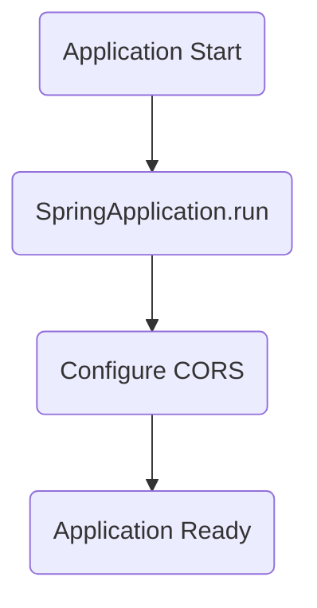
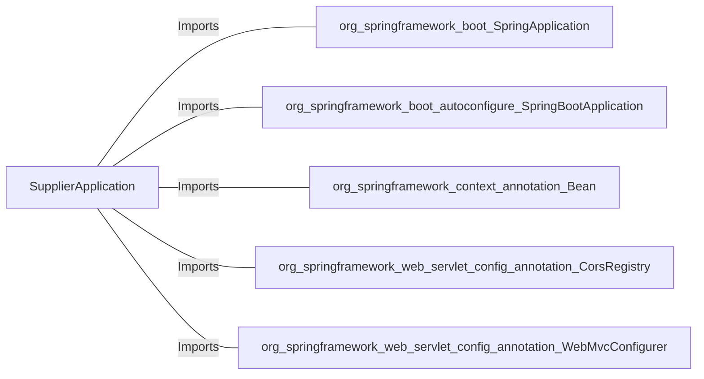

# SupplierApplication.java: Spring Boot Application for Supplier Management

## Overview
The `SupplierApplication` class is the entry point for a Spring Boot application designed for supplier management. It includes configuration for Cross-Origin Resource Sharing (CORS) to allow flexible interaction with external clients.

## Process Flow

## Insights
- The application is a Spring Boot application, indicated by the `@SpringBootApplication` annotation.
- The `main` method initializes the application using `SpringApplication.run`.
- A `WebMvcConfigurer` bean is defined to configure CORS settings, allowing all origins, headers, and specific HTTP methods (`GET`, `POST`, `PUT`, `DELETE`, `OPTIONS`).
- The commented-out `.allowCredentials(true)` line suggests that credentials could be allowed in the future but are currently disabled.

## Dependencies

- `org.springframework.boot.SpringApplication`: Used to bootstrap and launch the Spring Boot application.
- `org.springframework.boot.autoconfigure.SpringBootApplication`: Annotation to mark the main class of a Spring Boot application.
- `org.springframework.context.annotation.Bean`: Used to define a bean for CORS configuration.
- `org.springframework.web.servlet.config.annotation.CorsRegistry`: Provides methods to configure CORS mappings.
- `org.springframework.web.servlet.config.annotation.WebMvcConfigurer`: Interface for customizing Spring MVC configuration.

## Vulnerabilities
- **Overly Permissive CORS Configuration**: 
  - Allowing all origins (`allowedOrigins("*")`) and headers (`allowedHeaders("*")`) can expose the application to security risks, such as unauthorized access or exploitation by malicious actors.
  - Consider restricting origins and headers to trusted sources to mitigate risks.
- **Commented-out `.allowCredentials(true)`**:
  - If enabled in the future, it could introduce vulnerabilities by allowing credentials to be shared across origins. Ensure proper validation and security measures are in place before enabling this feature.
