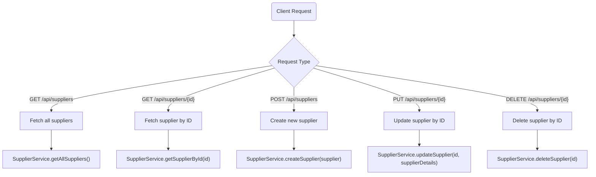
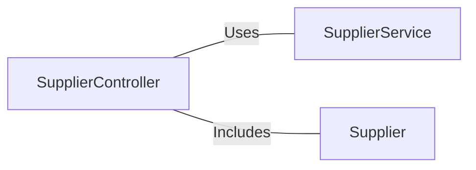

# SupplierController.java: Supplier Management REST Controller

## Overview
The `SupplierController` class is a REST controller that provides endpoints for managing supplier data. It allows clients to perform CRUD (Create, Read, Update, Delete) operations on supplier entities. The controller interacts with the `SupplierService` to handle business logic and data manipulation.

## Process Flow

## Insights
- The controller is annotated with `@RestController` and `@RequestMapping("/api/suppliers")`, making it a RESTful API endpoint for supplier-related operations.
- CRUD operations are implemented:
  - **GET** `/api/suppliers`: Fetches all suppliers.
  - **GET** `/api/suppliers/{id}`: Fetches a specific supplier by ID.
  - **POST** `/api/suppliers`: Creates a new supplier.
  - **PUT** `/api/suppliers/{id}`: Updates an existing supplier by ID.
  - **DELETE** `/api/suppliers/{id}`: Deletes a supplier by ID.
- The controller uses `ResponseEntity` to handle HTTP responses, ensuring proper status codes are returned (e.g., `200 OK`, `404 Not Found`, `204 No Content`).
- Dependency injection is used to include the `SupplierService` via the `@Autowired` annotation.
- The `Optional` class is used in `getSupplierById` to handle cases where a supplier with the given ID does not exist.

## Dependencies

- `SupplierService`: Handles the business logic for supplier operations.
- `Supplier`: Represents the supplier entity model.

## Data Manipulation (SQL)
The controller itself does not directly manipulate SQL or database entities. However, it delegates these operations to the `SupplierService`, which likely interacts with a data repository or database.
