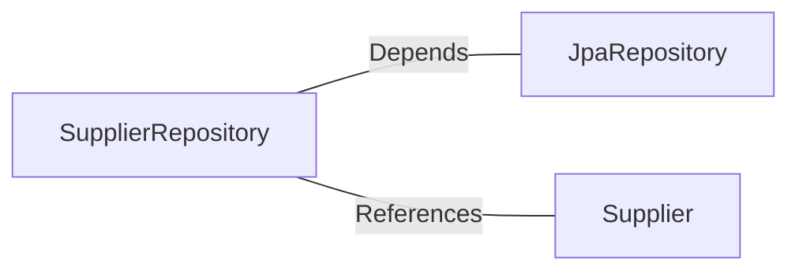

# SupplierRepository.java: Supplier Data Access Layer

## Overview
The `SupplierRepository` interface serves as the data access layer for managing `Supplier` entities. It extends the `JpaRepository` interface provided by Spring Data JPA, enabling CRUD operations and additional query capabilities for the `Supplier` entity.

## Process Flow
This is a data structure that defines a repository interface for the `Supplier` entity. Below is a class diagram representation of its structure:

```mermaid
classDiagram
    class SupplierRepository {
        <<interface>>
        +<T> save(entity: T): T
        +<T> findById(id: Long): Optional<T>
        +<T> delete(entity: T): void
        +<T> findAll(): List<T>
        +<T> deleteById(id: Long): void
    }
    SupplierRepository --> JpaRepository : Extends
    JpaRepository : +<T> save(entity: T): T
    JpaRepository : +<T> findById(id: ID): Optional<T>
    JpaRepository : +<T> delete(entity: T): void
    JpaRepository : +<T> findAll(): List<T>
    JpaRepository : +<T> deleteById(id: ID): void
```

## Insights
- The `SupplierRepository` interface is annotated with `@Repository`, marking it as a Spring-managed component for dependency injection.
- By extending `JpaRepository`, it inherits a wide range of methods for interacting with the database, such as `save`, `findById`, `delete`, and `findAll`.
- The generic parameters `<Supplier, Long>` specify that this repository manages `Supplier` entities and uses `Long` as the type for the primary key.
- No custom methods are defined in this interface, but additional query methods can be added as needed using Spring Data JPA's method naming conventions.

## Dependencies


- `JpaRepository`: Provides the base functionality for CRUD operations and query execution.
- `Supplier`: Represents the entity managed by this repository.

## Data Manipulation (SQL)
The `SupplierRepository` indirectly interacts with the database through the `JpaRepository` interface. The following operations are supported:
- **INSERT**: Adding new `Supplier` records.
- **SELECT**: Retrieving `Supplier` records by ID or other criteria.
- **UPDATE**: Modifying existing `Supplier` records.
- **DELETE**: Removing `Supplier` records by entity or ID.
