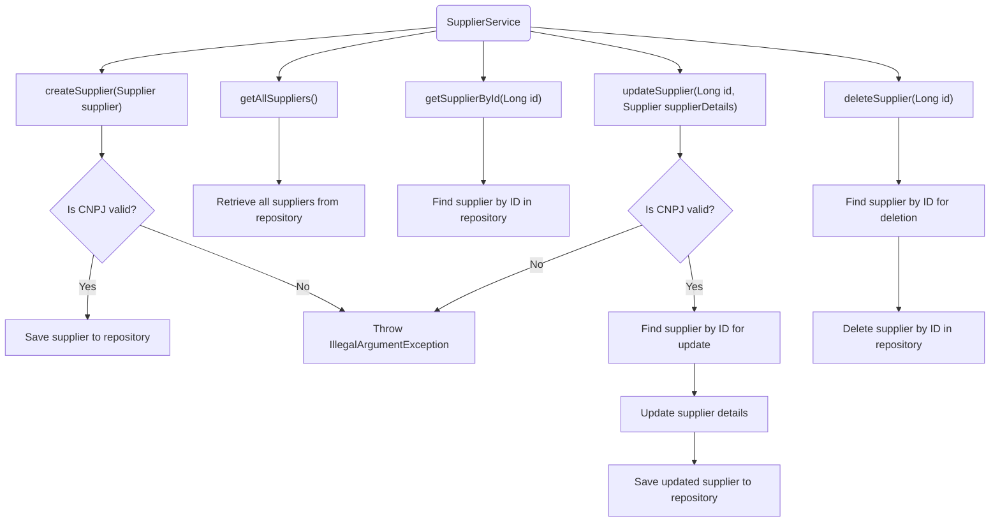
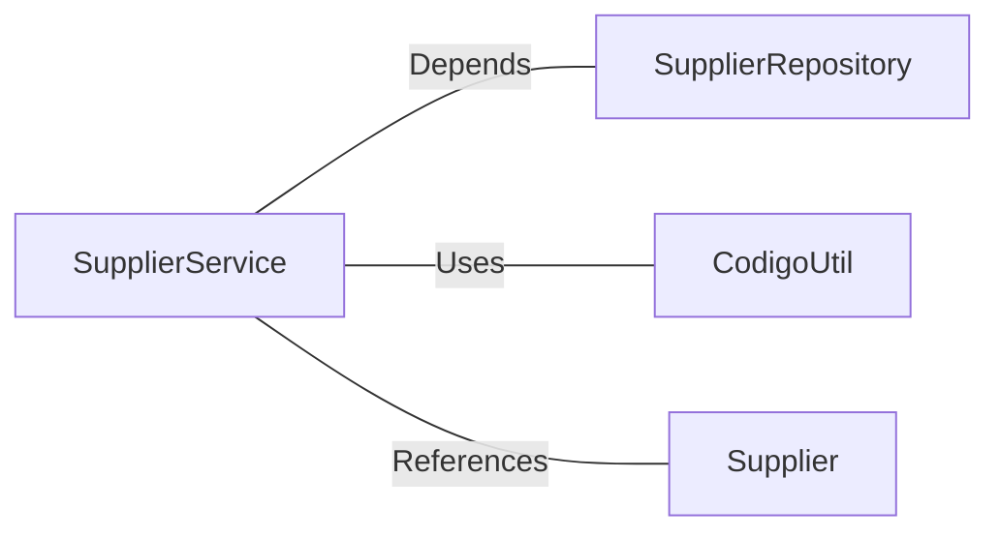

# SupplierService.java: Supplier Management Service

## Overview
The `SupplierService` class is a service layer responsible for managing supplier-related operations. It provides methods to create, retrieve, update, and delete supplier records, ensuring data validation and interaction with the underlying repository.

## Process Flow

## Insights
- **Validation of CNPJ**: The `createSupplier` and `updateSupplier` methods validate the supplier's CNPJ using `CodigoUtil.isValidCNPJ`. If invalid, an `IllegalArgumentException` is thrown.
- **Repository Interaction**: The class heavily relies on `SupplierRepository` for CRUD operations.
- **Error Handling**: The `updateSupplier` and `deleteSupplier` methods throw runtime exceptions if the supplier is not found by ID.
- **Atomic Updates**: The `updateSupplier` method retrieves the supplier, updates its attributes, and saves the updated entity back to the repository.
- **Optional Usage**: The `getSupplierById` method returns an `Optional<Supplier>` to handle cases where the supplier might not exist.

## Dependencies

- `SupplierRepository`: Handles database operations for the `Supplier` entity.
- `CodigoUtil`: Provides utility methods for validating CNPJ.
- `Supplier`: Represents the supplier entity with attributes like `nome`, `cnpj`, `nomeContato`, `emailContato`, and `telefoneContato`.

## Vulnerabilities
- **CNPJ Validation Dependency**: The validation logic depends on `CodigoUtil.isValidCNPJ`. If this utility is flawed or incomplete, invalid CNPJs might pass through.
- **Error Handling**: The use of `RuntimeException` for missing suppliers in `updateSupplier` and `deleteSupplier` could be improved by using custom exceptions for better clarity and control.
- **Hardcoded Exception Messages**: The exception messages for invalid CNPJ and missing suppliers are hardcoded, which might make localization or dynamic error handling challenging.
- **No Transaction Management**: The service does not explicitly manage transactions, which could lead to issues in case of partial failures during updates or deletions.

## Data Manipulation (SQL)
The class indirectly manipulates the `Supplier` entity through the `SupplierRepository`. Below is the assumed structure of the `Supplier` entity:

| Attribute         | Type         | Description                                      |
|--------------------|--------------|--------------------------------------------------|
| `id`              | Long         | Unique identifier for the supplier.             |
| `nome`            | String       | Name of the supplier.                           |
| `cnpj`            | String       | CNPJ (Brazilian company identifier).            |
| `nomeContato`     | String       | Name of the contact person.                     |
| `emailContato`    | String       | Email of the contact person.                    |
| `telefoneContato` | String       | Phone number of the contact person.             |
