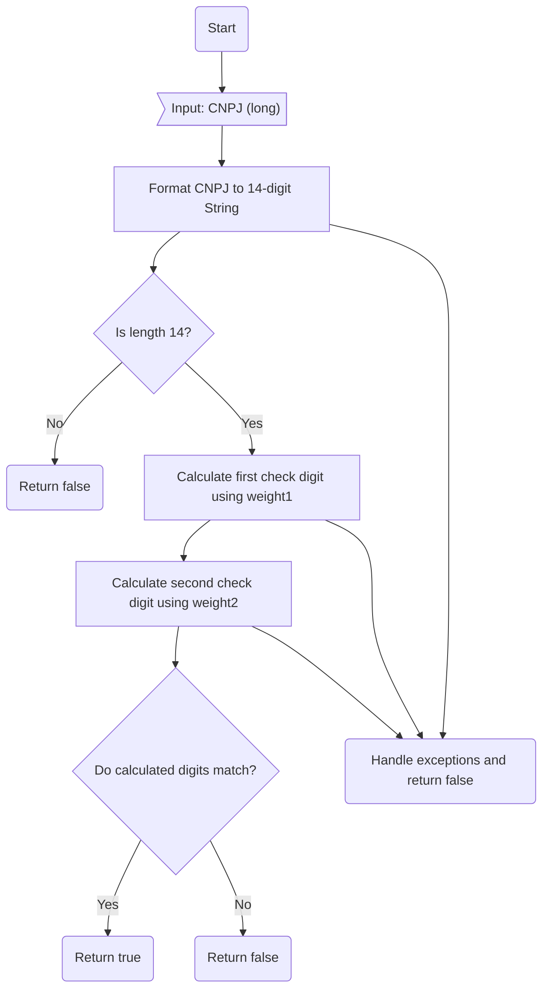

# CodigoUtil.java: Utility for CNPJ Validation

## Overview
The `CodigoUtil` class provides a utility method to validate Brazilian CNPJ (Cadastro Nacional da Pessoa Jurídica) numbers. The validation is based on the official algorithm, which involves calculating two check digits using specific weight arrays. The class also includes a `main` method for testing purposes.

## Process Flow

## Insights
- The method `isValidCNPJ` validates a CNPJ number by:
  1. Formatting the input to a 14-digit string.
  2. Checking if the length is exactly 14.
  3. Calculating the first and second check digits using predefined weight arrays.
  4. Comparing the calculated check digits with the actual digits in the CNPJ.
- The algorithm uses modular arithmetic (`mod 11`) to compute the check digits.
- The method handles exceptions gracefully by returning `false` in case of any errors.
- The `main` method demonstrates the usage of the `isValidCNPJ` method with a sample CNPJ.

## Dependencies

- This class does not depend on any external libraries, APIs, or data structures.

## Vulnerabilities
1. **Exception Handling**: The `catch` block in the `isValidCNPJ` method is too generic. It catches all exceptions, which may mask unexpected issues. A more specific exception handling approach is recommended.
2. **Input Validation**: The method assumes the input is a valid `long` representing a CNPJ. If the input is not sanitized or validated before being passed to this method, it could lead to unexpected behavior.
3. **Hardcoded Example in `main`**: The `main` method uses a hardcoded CNPJ value for testing. This is not a vulnerability per se but could lead to confusion if the example is not updated or removed in production code.
