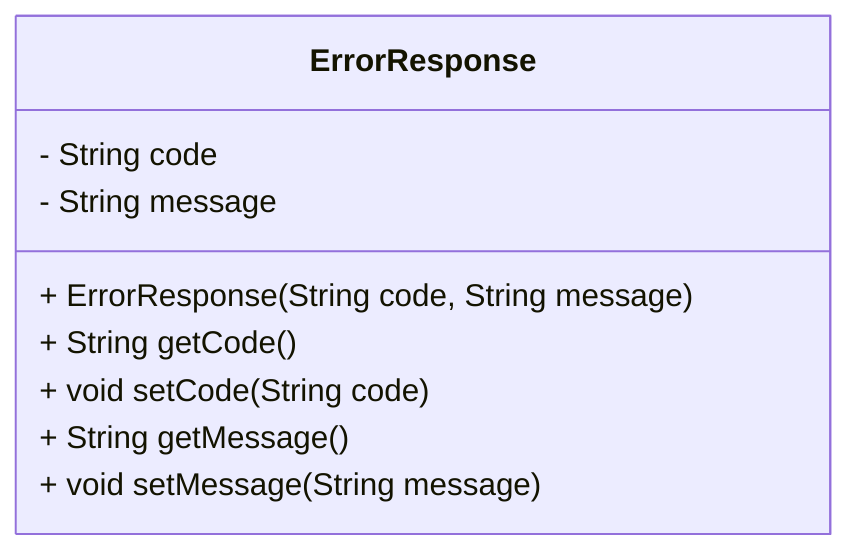

# ErrorResponse.java: Error Response Data Structure

## Overview
The `ErrorResponse` class is a simple data structure designed to encapsulate error information. It contains two attributes: `code` and `message`, which represent the error code and the corresponding error message, respectively. This class provides getter and setter methods for both attributes and a constructor for initialization.

## Process Flow
Since this is a data structure, the process flow is represented as a class diagram showing its attributes and methods.

## Insights
- The class is designed to store error-related information, making it useful for error handling and reporting.
- It provides encapsulation through private attributes and public getter/setter methods.
- The constructor ensures that both `code` and `message` can be initialized at the time of object creation.

## Dependencies (Optional)
No external dependencies are detected in this code.

## Data Manipulation (SQL) (Optional)
No SQL-related data manipulation is present in this code.
