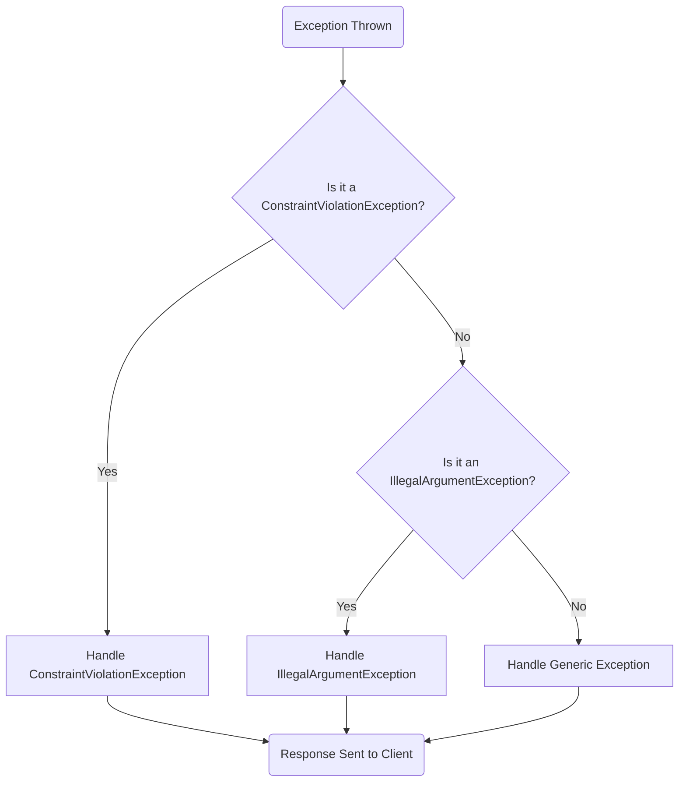
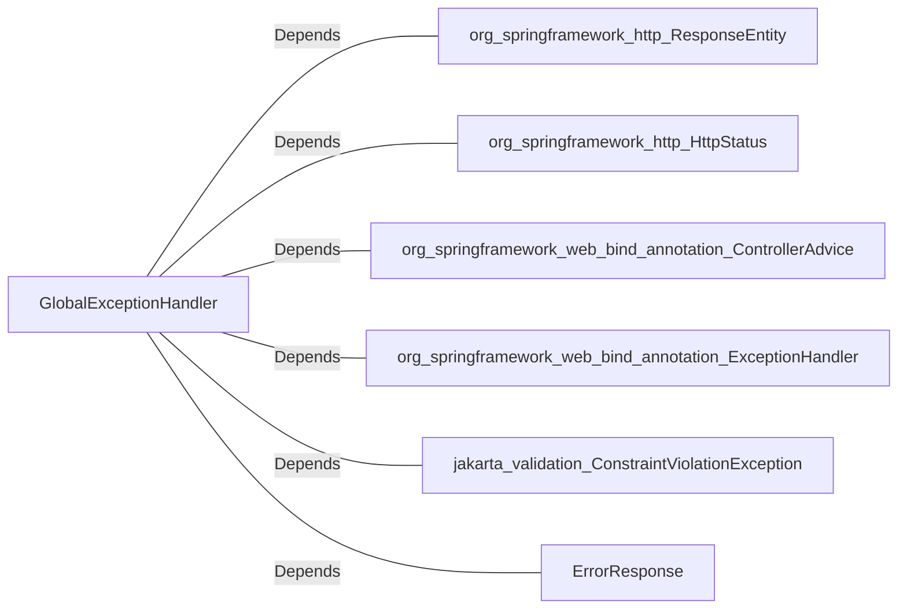

# GlobalExceptionHandler.java: Centralized Exception Handling for Spring Application

## Overview
The `GlobalExceptionHandler` class is a centralized exception handling mechanism for a Spring application. It uses the `@ControllerAdvice` annotation to intercept exceptions thrown by controllers and provide custom responses. This class handles three types of exceptions:
1. `ConstraintViolationException` - Typically occurs during validation failures.
2. `IllegalArgumentException` - Occurs when invalid arguments are passed to methods.
3. Generic `Exception` - Catches all other unhandled exceptions.

## Process Flow

## Insights
- **Centralized Exception Handling**: The use of `@ControllerAdvice` ensures that all exceptions are handled in a single place, improving code maintainability and readability.
- **Custom Error Responses**: Each exception handler returns a custom `ErrorResponse` object with a status code and a descriptive message, enhancing the user experience.
- **Error Logging**: The generic exception handler logs the stack trace using `e.printStackTrace()`, which can be useful for debugging but may not be ideal for production environments.
- **HTTP Status Codes**: The class uses appropriate HTTP status codes (`400 BAD_REQUEST` and `500 INTERNAL_SERVER_ERROR`) to indicate the nature of the error.

## Dependencies

- `org.springframework.http.ResponseEntity`: Used to construct HTTP responses with custom status codes and body.
- `org.springframework.http.HttpStatus`: Provides HTTP status codes for the responses.
- `org.springframework.web.bind.annotation.ControllerAdvice`: Marks the class as a centralized exception handler.
- `org.springframework.web.bind.annotation.ExceptionHandler`: Specifies the exceptions to be handled by each method.
- `jakarta.validation.ConstraintViolationException`: Represents validation errors.
- `ErrorResponse`: A custom class used to structure error responses.

## Vulnerabilities
- **Stack Trace Exposure**: The generic exception handler (`handleException`) prints the stack trace using `e.printStackTrace()`. This can expose sensitive information in production environments. It is recommended to use a logging framework with controlled access to logs instead.
- **Limited Exception Coverage**: The class only handles three specific types of exceptions. Additional exception types may need to be handled depending on the application's requirements.
- **Error Message Exposure**: The error messages returned to the client may contain sensitive information, especially for generic exceptions. Consider sanitizing error messages before sending them to the client.
