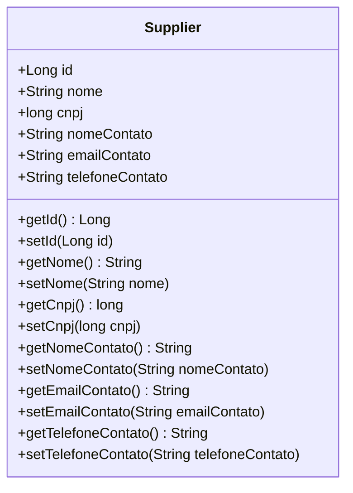

# Supplier.java: Supplier Entity Representation

## Overview
This file defines the `Supplier` entity, which represents a supplier in the system. It is annotated with JPA (`jakarta.persistence`) annotations to map it to a database table. The class includes attributes such as `id`, `nome`, `cnpj`, and contact details (`nomeContato`, `emailContato`, `telefoneContato`). It also provides getter and setter methods for each attribute.

## Process Flow
The `Supplier` class is a data structure with no logic or process flow. Below is a class diagram representation of its attributes:

## Insights
- The `Supplier` class is annotated with `@Entity`, making it a JPA entity mapped to a database table.
- The `id` field is the primary key and is auto-generated using the `GenerationType.IDENTITY` strategy.
- The class includes attributes for supplier details (`nome`, `cnpj`) and contact information (`nomeContato`, `emailContato`, `telefoneContato`).
- The class provides standard getter and setter methods for all attributes, adhering to the JavaBean convention.

## Dependencies

- `jakarta.persistence`: Provides annotations such as `@Entity`, `@Id`, and `@GeneratedValue` for mapping the class to a database table.

## Data Manipulation (SQL)
The `Supplier` entity maps to a database table with the following structure:

| Attribute         | Data Type   | Description                                      |
|--------------------|-------------|--------------------------------------------------|
| `id`              | Long        | Primary key, auto-generated.                    |
| `nome`            | String      | Name of the supplier.                           |
| `cnpj`            | long        | Unique identifier for the supplier (CNPJ).      |
| `nomeContato`     | String      | Name of the contact person.                     |
| `emailContato`    | String      | Email address of the contact person.            |
| `telefoneContato` | String      | Phone number of the contact person.             |
