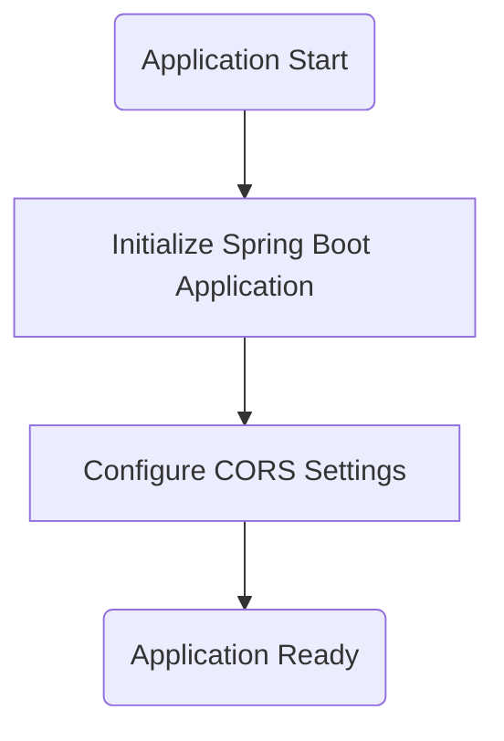
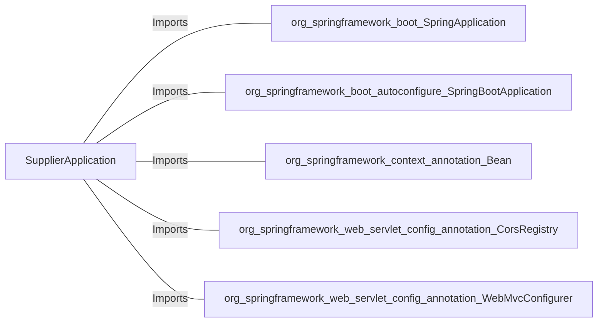

# SupplierApplication.java: Spring Boot Application for Supplier Management

## Overview
The `SupplierApplication` class is the entry point for a Spring Boot application designed for supplier management. It includes configuration for Cross-Origin Resource Sharing (CORS) to allow flexible interaction with external clients.

## Process Flow

## Insights
- The application is a Spring Boot application, indicated by the `@SpringBootApplication` annotation.
- The `main` method initializes the Spring Boot application using `SpringApplication.run`.
- A `WebMvcConfigurer` bean is defined to configure CORS settings, allowing all origins, headers, and specific HTTP methods (`GET`, `POST`, `PUT`, `DELETE`, `OPTIONS`).
- The commented-out `.allowCredentials(true)` line suggests that credentials could be allowed in CORS requests if uncommented.

## Dependencies

- `org.springframework.boot.SpringApplication`: Used to bootstrap and launch the Spring Boot application.
- `org.springframework.boot.autoconfigure.SpringBootApplication`: Indicates this is a Spring Boot application and enables auto-configuration.
- `org.springframework.context.annotation.Bean`: Used to define a bean for CORS configuration.
- `org.springframework.web.servlet.config.annotation.CorsRegistry`: Provides methods to configure CORS mappings.
- `org.springframework.web.servlet.config.annotation.WebMvcConfigurer`: Interface for customizing Spring MVC configuration.

## Vulnerabilities
- **Overly Permissive CORS Configuration**: 
  - Allowing all origins (`allowedOrigins("*")`) and headers (`allowedHeaders("*")`) can expose the application to security risks, such as unauthorized access or data leakage.
  - If `.allowCredentials(true)` is uncommented, it could lead to security vulnerabilities by allowing credentials to be sent from any origin.
  - Recommendation: Restrict `allowedOrigins` to trusted domains and avoid enabling credentials unless necessary.
