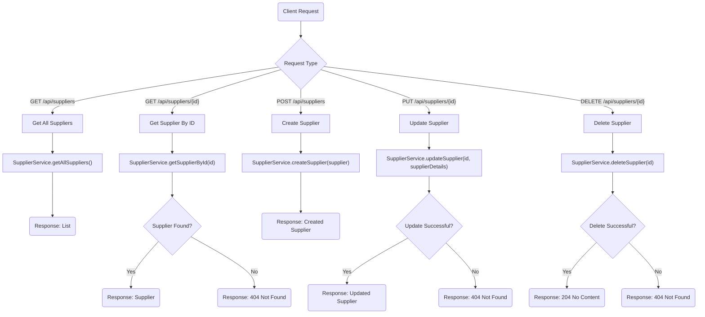
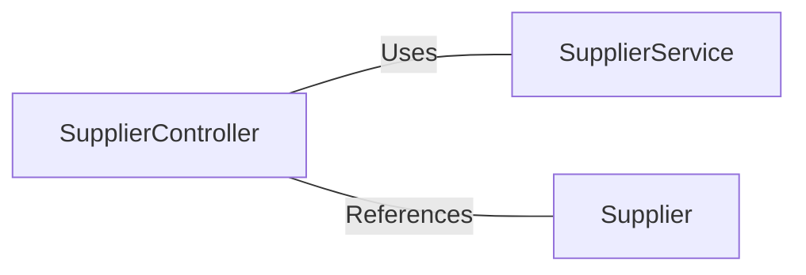

# SupplierController.java: Supplier Management REST Controller

## Overview

The `SupplierController` class is a REST controller that provides endpoints for managing supplier data. It allows clients to perform CRUD (Create, Read, Update, Delete) operations on supplier entities. The controller interacts with the `SupplierService` to handle business logic and data manipulation.

## Process Flow

## Insights

- The controller is annotated with `@RestController` and `@RequestMapping("/api/suppliers")`, making it a RESTful API endpoint for supplier management.
- CRUD operations are implemented:
  - **GET**: Retrieve all suppliers or a specific supplier by ID.
  - **POST**: Create a new supplier.
  - **PUT**: Update an existing supplier by ID.
  - **DELETE**: Remove a supplier by ID.
- The controller uses `ResponseEntity` to handle HTTP responses, ensuring proper status codes are returned (e.g., 200 OK, 404 Not Found, 204 No Content).
- Dependency injection is used to include the `SupplierService` for business logic.

## Dependencies

- `SupplierService`: Handles the business logic for supplier management.
- `Supplier`: Represents the supplier entity.

### List of Identified External References

- `SupplierService`: Provides methods for CRUD operations on suppliers (`getAllSuppliers`, `getSupplierById`, `createSupplier`, `updateSupplier`, `deleteSupplier`).
- `Supplier`: Represents the supplier data model used in the request and response payloads.
