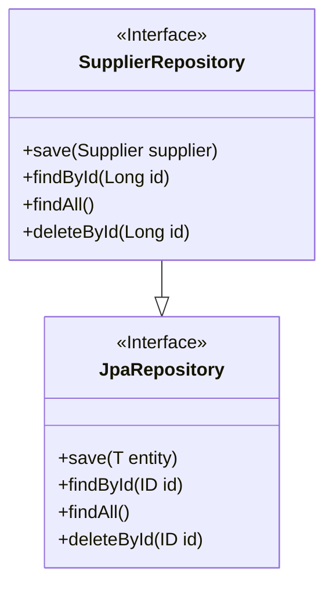
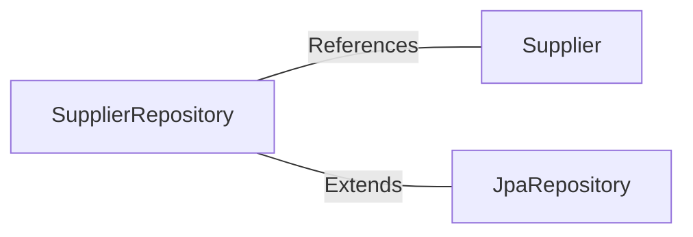

# SupplierRepository.java: Supplier Data Access Layer

## Overview
The `SupplierRepository` interface serves as the Data Access Layer for managing `Supplier` entities. It leverages Spring Data JPA to provide CRUD operations and database interaction capabilities without requiring explicit implementation. This repository is annotated with `@Repository`, marking it as a Spring-managed component.

## Process Flow
The `SupplierRepository` is primarily a data structure that extends `JpaRepository`. It inherits methods for performing operations such as saving, deleting, and querying `Supplier` entities. Below is a class diagram representing the relationship:

## Insights
- The `SupplierRepository` interface inherits all CRUD operations from `JpaRepository`, eliminating the need for boilerplate code.
- The `@Repository` annotation ensures that the interface is recognized as a Spring-managed bean, enabling dependency injection.
- The generic parameters `<Supplier, Long>` specify that this repository manages `Supplier` entities with a primary key of type `Long`.

## Dependencies

- `Supplier`: Represents the entity managed by this repository. It is referenced as the main data model.
- `JpaRepository`: Provides the base functionality for CRUD operations and database interaction.

## Data Manipulation (SQL)
The `SupplierRepository` indirectly interacts with the database through Spring Data JPA. The following table outlines the attributes of the `Supplier` entity, which are manipulated by the repository:

| Attribute Name | Data Type | Description |
|----------------|-----------|-------------|
| `id`           | `Long`    | Primary key of the supplier entity. |
| `name`         | `String`  | Name of the supplier. |
| `address`      | `String`  | Address of the supplier. |
| `email`        | `String`  | Contact email of the supplier. |

Note: The exact attributes of the `Supplier` entity are assumed based on typical use cases, as they are not provided in the code snippet.
