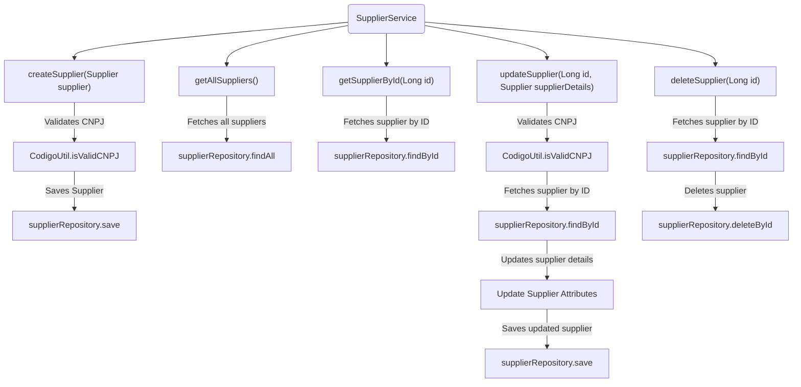
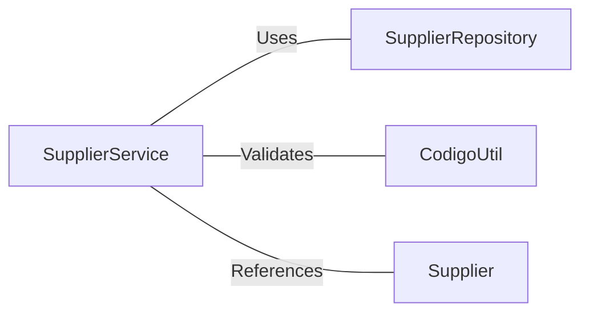

# SupplierService.java: Supplier Management Service

## Overview
The `SupplierService` class is a service layer responsible for managing supplier-related operations. It provides methods to create, retrieve, update, and delete supplier records, ensuring validation and interaction with the underlying repository.

## Process Flow

## Insights
- **Validation**: The `createSupplier` and `updateSupplier` methods validate the supplier's CNPJ using `CodigoUtil.isValidCNPJ` before proceeding.
- **Error Handling**: 
  - Throws `IllegalArgumentException` for invalid CNPJ.
  - Throws `RuntimeException` if a supplier is not found during update or delete operations.
- **CRUD Operations**:
  - `createSupplier`: Adds a new supplier to the repository.
  - `getAllSuppliers`: Retrieves all suppliers.
  - `getSupplierById`: Fetches a supplier by its ID.
  - `updateSupplier`: Updates supplier details after validation.
  - `deleteSupplier`: Deletes a supplier by its ID.
- **Repository Interaction**: The class heavily relies on `SupplierRepository` for database operations.

## Dependencies

- `SupplierRepository`: Handles database operations for supplier entities.
- `CodigoUtil`: Provides utility methods for validating CNPJ.
- `Supplier`: Represents the supplier entity with attributes like `nome`, `cnpj`, `nomeContato`, `emailContato`, and `telefoneContato`.

## Vulnerabilities
- **Validation Logic**: The validation of CNPJ relies on `CodigoUtil.isValidCNPJ`. If this utility method is flawed or incomplete, invalid CNPJs might pass through.
- **Error Handling**: 
  - The use of `RuntimeException` for supplier not found scenarios is generic and might not provide sufficient context for debugging.
  - No specific handling for database-related exceptions (e.g., connection issues, constraint violations).
- **Hardcoded Error Messages**: Error messages like "Supplier not found with id" are hardcoded, which might limit localization or customization.

## Data Manipulation (SQL)
The class interacts with the `Supplier` entity through the `SupplierRepository`. Below is the structure of the `Supplier` entity:

| Attribute         | Type         | Description                              |
|-------------------|--------------|------------------------------------------|
| `id`              | Long         | Unique identifier for the supplier.      |
| `nome`            | String       | Name of the supplier.                    |
| `cnpj`            | String       | CNPJ (Brazilian company identifier).     |
| `nomeContato`     | String       | Name of the contact person.              |
| `emailContato`    | String       | Email of the contact person.             |
| `telefoneContato` | String       | Phone number of the contact person.      |
