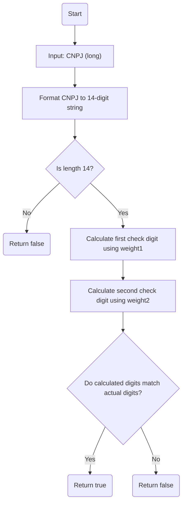
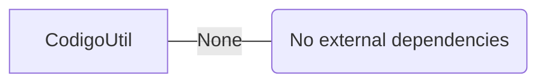

# CodigoUtil.java: Utility for CNPJ Validation

## Overview
The `CodigoUtil` class provides a utility method to validate Brazilian CNPJ (Cadastro Nacional da Pessoa Jurídica) numbers. It implements the algorithm for verifying the two check digits of a CNPJ based on specific weight factors. The class also includes a `main` method for testing the validation logic.

## Process Flow
The following diagram illustrates the process flow for validating a CNPJ:

## Insights
- **CNPJ Validation Logic**:
  - The method `isValidCNPJ` validates a CNPJ by calculating two check digits using predefined weight arrays (`weight1` and `weight2`).
  - The algorithm ensures the integrity of the CNPJ by comparing the calculated check digits with the actual digits in the input.

- **Error Handling**:
  - The method uses a `try-catch` block to handle potential exceptions, such as invalid input formats or out-of-bound errors.

- **Edge Cases**:
  - CNPJs with incorrect lengths are immediately invalidated.
  - The algorithm accounts for special cases where the modulus operation results in values less than 2.

- **Main Method**:
  - The `main` method provides a simple example to test the validation logic with a hardcoded CNPJ value.

## Dependencies (Optional)

## Vulnerabilities
1. **Input Validation**:
   - The method assumes the input is a valid `long` type. If the input is malformed or exceeds the range of `long`, it could lead to unexpected behavior.
   - The method does not validate whether the input CNPJ adheres to real-world formatting rules (e.g., non-numeric characters).

2. **Error Handling**:
   - The `catch` block is generic and does not log or provide detailed information about the exception. This could make debugging difficult.

3. **Hardcoded Example**:
   - The `main` method uses a hardcoded CNPJ value, which may not be suitable for production or dynamic testing scenarios.

## Data Manipulation (Optional)
No SQL or database-related operations are present in this code.
