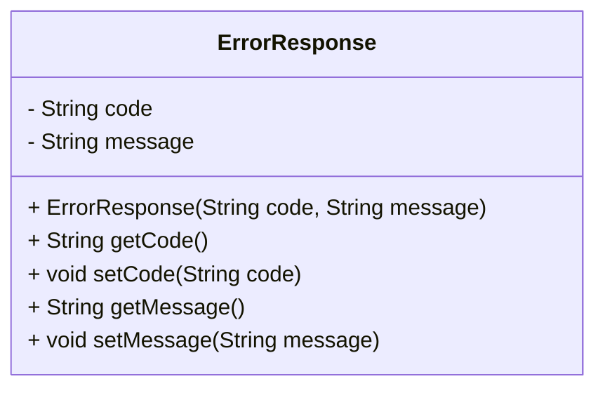

# ErrorResponse.java: Error Response Data Structure

## Overview
The `ErrorResponse` class is a simple data structure designed to encapsulate error information. It contains two attributes: `code` and `message`, which represent the error code and the corresponding error message, respectively. This class provides getter and setter methods for these attributes, allowing for easy manipulation and retrieval of error details.

## Process Flow

## Insights
- The class is a plain Java object (POJO) used to represent error details.
- It provides a constructor for initializing the `code` and `message` attributes.
- Getter and setter methods are available for both attributes, ensuring encapsulation and flexibility.
- This class is likely used in scenarios where error information needs to be communicated, such as in API responses or logging mechanisms.

## Data Manipulation (SQL)
| Attribute | Type   | Description                          |
|-----------|--------|--------------------------------------|
| `code`    | String | Represents the error code.          |
| `message` | String | Represents the error description.   |
