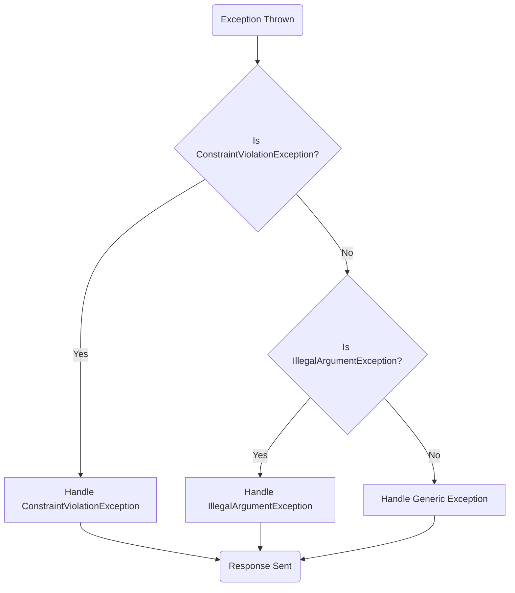
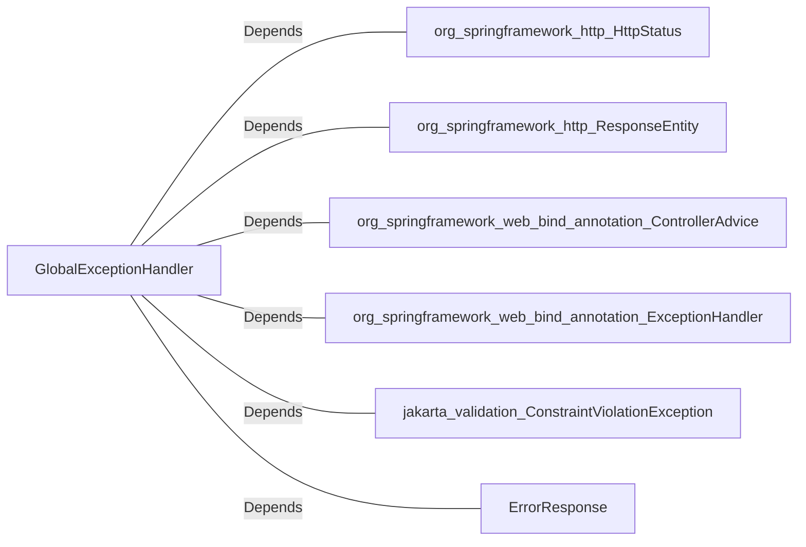

# GlobalExceptionHandler.java: Centralized Exception Handling

## Overview
The `GlobalExceptionHandler` class is a centralized exception handling mechanism for a Spring Boot application. It uses the `@ControllerAdvice` annotation to intercept exceptions thrown by controllers and provide custom responses. This class handles specific exceptions such as `ConstraintViolationException`, `IllegalArgumentException`, and generic `Exception`.

## Process Flow

## Insights
- The class uses `@ControllerAdvice` to apply exception handling globally across all controllers in the application.
- Each exception handler method returns a `ResponseEntity` containing an `ErrorResponse` object with a status code and error message.
- Specific exceptions (`ConstraintViolationException` and `IllegalArgumentException`) are handled with tailored responses, while a generic handler (`Exception`) is used for all other exceptions.
- The `handleException` method prints the stack trace of the exception, which can be useful for debugging but may expose sensitive information in production environments.

## Dependencies

- `org.springframework.http.HttpStatus`: Used to define HTTP status codes for responses.
- `org.springframework.http.ResponseEntity`: Used to construct HTTP responses.
- `org.springframework.web.bind.annotation.ControllerAdvice`: Marks the class as a global exception handler.
- `org.springframework.web.bind.annotation.ExceptionHandler`: Specifies the exceptions to be handled by each method.
- `jakarta.validation.ConstraintViolationException`: Represents validation errors.
- `ErrorResponse`: A custom class used to structure error responses.

## Vulnerabilities
- **Stack Trace Exposure**: The `handleException` method prints the stack trace of exceptions, which may expose sensitive information in production environments. It is recommended to log the stack trace securely instead of printing it to the console.
- **Generic Exception Handling**: The generic `Exception` handler may inadvertently catch exceptions that should be handled differently, potentially masking specific issues. Consider adding more specific exception handlers as needed.
