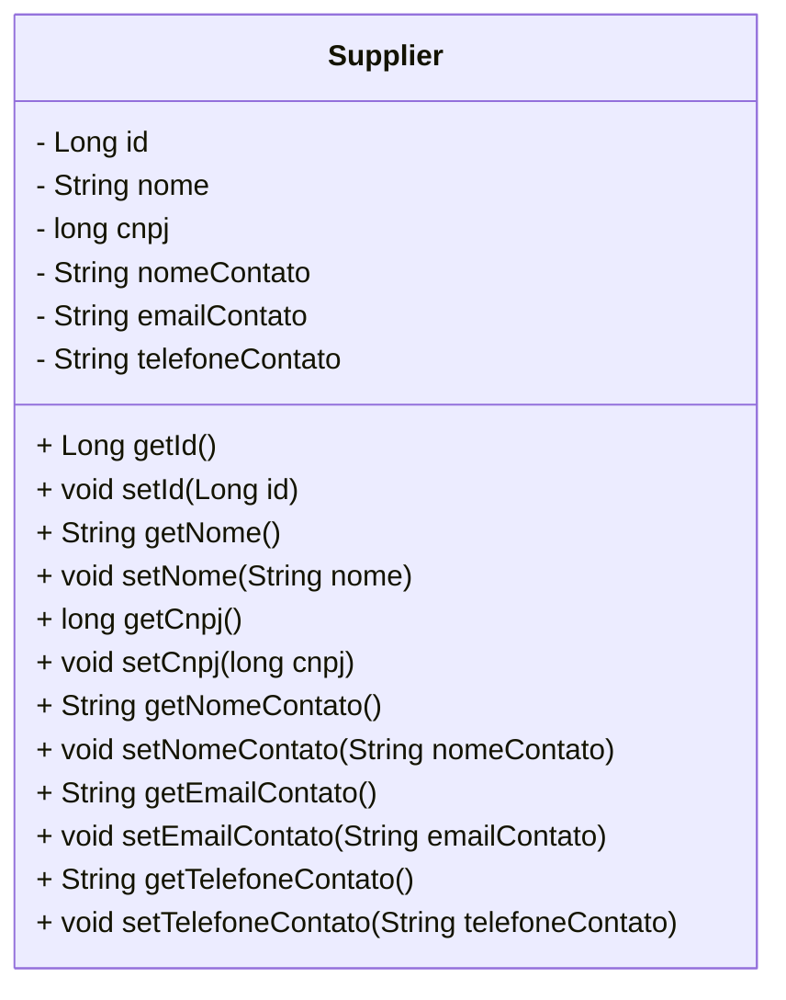
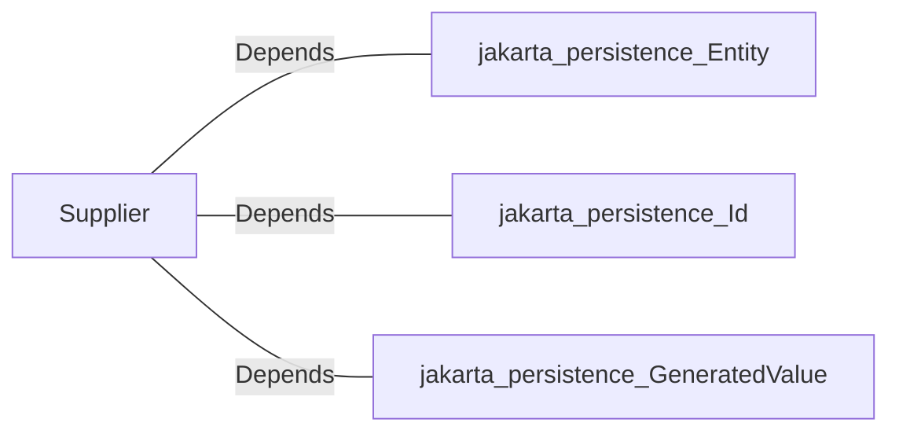

# Supplier.java: Supplier Entity Representation

## Overview
This code defines a `Supplier` entity class, which is part of a Java application using JPA (Jakarta Persistence API) for ORM (Object-Relational Mapping). The class represents a supplier with attributes such as ID, name, CNPJ (Brazilian company registration number), contact name, contact email, and contact phone number. It is annotated with `@Entity` to indicate that it maps to a database table.

## Process Flow
The `Supplier` class is primarily a data structure with attributes and their respective getter and setter methods. Below is a class diagram representation of its structure:

## Insights
- The class is annotated with `@Entity`, making it a JPA entity that maps to a database table.
- The `@Id` annotation marks the `id` field as the primary key.
- The `@GeneratedValue(strategy = GenerationType.IDENTITY)` annotation specifies that the `id` field is auto-generated by the database.
- The class provides getter and setter methods for all attributes, ensuring encapsulation and allowing controlled access to the fields.
- The `cnpj` field is of type `long`, which may not be ideal for storing formatted CNPJ values that include dots and dashes. Consider using `String` for better flexibility and validation.

## Dependencies

- `jakarta.persistence.Entity`: Used to mark the class as a JPA entity.
- `jakarta.persistence.Id`: Used to mark the `id` field as the primary key.
- `jakarta.persistence.GeneratedValue`: Used to specify the generation strategy for the primary key.

## Data Manipulation (SQL)
The `Supplier` entity maps to a database table with the following attributes:

| Attribute         | Data Type | Description                                                                 |
|--------------------|-----------|-----------------------------------------------------------------------------|
| `id`              | Long      | Primary key, auto-generated.                                                |
| `nome`            | String    | Name of the supplier.                                                       |
| `cnpj`            | long      | Brazilian company registration number. Consider using `String` for formatting. |
| `nomeContato`     | String    | Name of the contact person.                                                 |
| `emailContato`    | String    | Email of the contact person.                                                |
| `telefoneContato` | String    | Phone number of the contact person.                                         |

## Vulnerabilities
- **CNPJ Field Type**: The `cnpj` field is defined as `long`, which may lead to issues when handling formatted CNPJ values (e.g., "12.345.678/0001-99"). Using `String` would allow better flexibility and validation.
- **Validation Missing**: The class does not include any validation for fields such as `emailContato` or `telefoneContato`. This could lead to invalid data being stored in the database. Consider adding validation annotations like `@Email` or custom validation logic.
