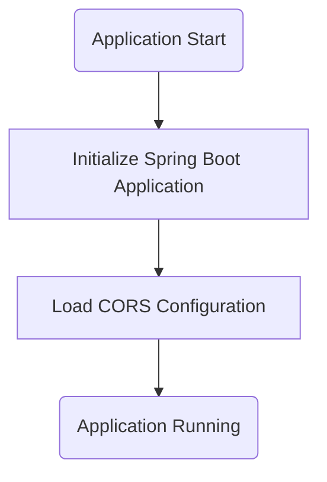
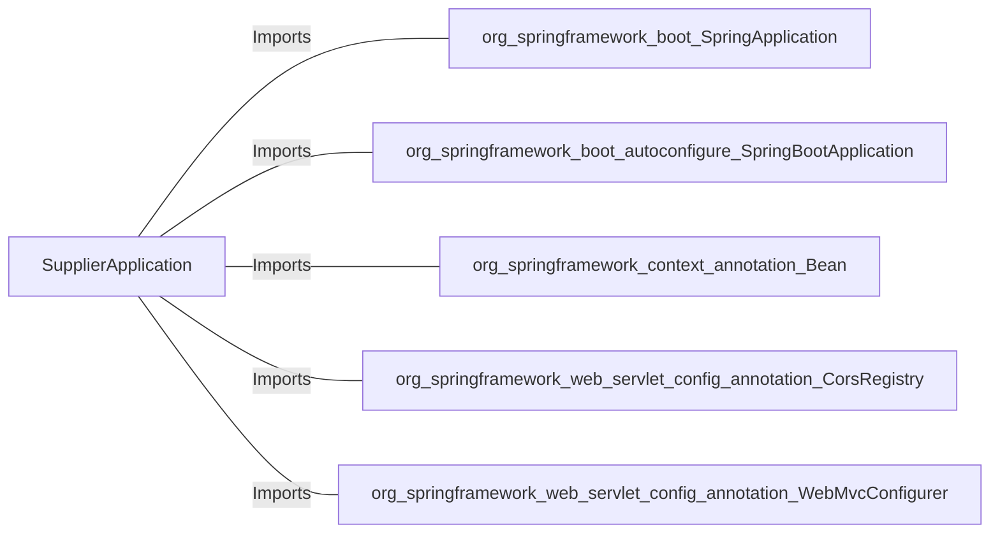

# SupplierApplication.java: Spring Boot Application for Supplier Management

## Overview
This Java file defines a Spring Boot application for managing supplier-related functionalities. It includes a main entry point for the application and a configuration for Cross-Origin Resource Sharing (CORS) to allow HTTP requests from different origins.

## Process Flow

## Insights
- The application is a Spring Boot application, as indicated by the `@SpringBootApplication` annotation.
- The `main` method serves as the entry point for the application.
- A `WebMvcConfigurer` bean is defined to configure CORS settings, allowing all origins, methods, and headers.
- The commented-out `.allowCredentials(true)` line suggests that credentials could be allowed in CORS requests if uncommented.

## Dependencies

- `org.springframework.boot.SpringApplication`: Used to bootstrap and launch the Spring Boot application.
- `org.springframework.boot.autoconfigure.SpringBootApplication`: Indicates that this is a Spring Boot application and enables auto-configuration.
- `org.springframework.context.annotation.Bean`: Used to define a bean for the application context.
- `org.springframework.web.servlet.config.annotation.CorsRegistry`: Provides methods to configure CORS mappings.
- `org.springframework.web.servlet.config.annotation.WebMvcConfigurer`: Interface for customizing Spring MVC configuration.

## Vulnerabilities
- **Overly Permissive CORS Configuration**: 
  - The current CORS configuration allows all origins (`allowedOrigins("*")`), methods, and headers. This can expose the application to Cross-Origin attacks if sensitive data is handled. 
  - Recommendation: Restrict the allowed origins, methods, and headers to only those necessary for the application. If credentials are required, uncomment `.allowCredentials(true)` and ensure origins are explicitly defined.
