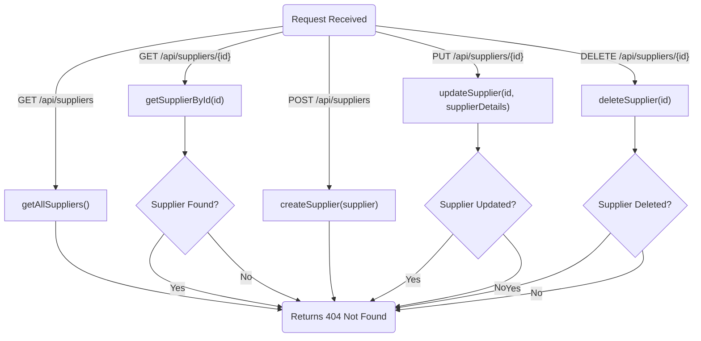
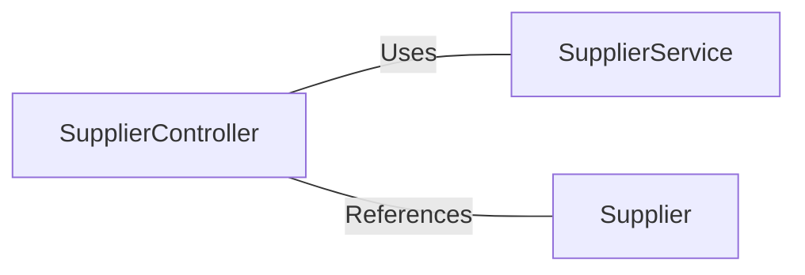

# SupplierController.java: Supplier Management REST Controller

## Overview
The `SupplierController` class is a REST controller responsible for managing supplier-related operations. It provides endpoints for CRUD (Create, Read, Update, Delete) operations on supplier entities. This controller interacts with the `SupplierService` to perform business logic and handle supplier data.

## Process Flow

## Insights
- The controller uses Spring's `@RestController` and `@RequestMapping` annotations to define REST endpoints.
- CRUD operations are implemented:
  - **GET** `/api/suppliers`: Fetches all suppliers.
  - **GET** `/api/suppliers/{id}`: Fetches a supplier by ID.
  - **POST** `/api/suppliers`: Creates a new supplier.
  - **PUT** `/api/suppliers/{id}`: Updates an existing supplier.
  - **DELETE** `/api/suppliers/{id}`: Deletes a supplier by ID.
- The controller uses `ResponseEntity` to handle HTTP responses, ensuring proper status codes are returned.
- Dependency injection is used to integrate the `SupplierService` for business logic.
- Optional handling is used for `getSupplierById` to manage cases where the supplier is not found.

## Dependencies

- `SupplierService`: Handles business logic for supplier operations.
- `Supplier`: Represents the supplier entity model.

## Vulnerabilities
- **Validation Missing**: The `createSupplier` and `updateSupplier` methods do not validate the input `Supplier` object. This could lead to invalid or incomplete data being stored in the database.
- **Error Handling**: The controller does not handle exceptions explicitly, such as database errors or service layer exceptions. This could result in unhandled errors being exposed to the client.
- **Security Concerns**: No authentication or authorization mechanisms are implemented, which could allow unauthorized access to sensitive supplier data.
- **Path Traversal**: The `@PathVariable` in `getSupplierById`, `updateSupplier`, and `deleteSupplier` methods could be exploited if proper validation is not enforced on the `id` parameter.

## Recommendations
- Implement input validation for `Supplier` objects using annotations like `@Valid` and custom validation logic.
- Add exception handling using `@ControllerAdvice` to manage errors gracefully.
- Integrate authentication and authorization mechanisms to secure endpoints.
- Validate `id` parameters to prevent potential path traversal or injection attacks.
