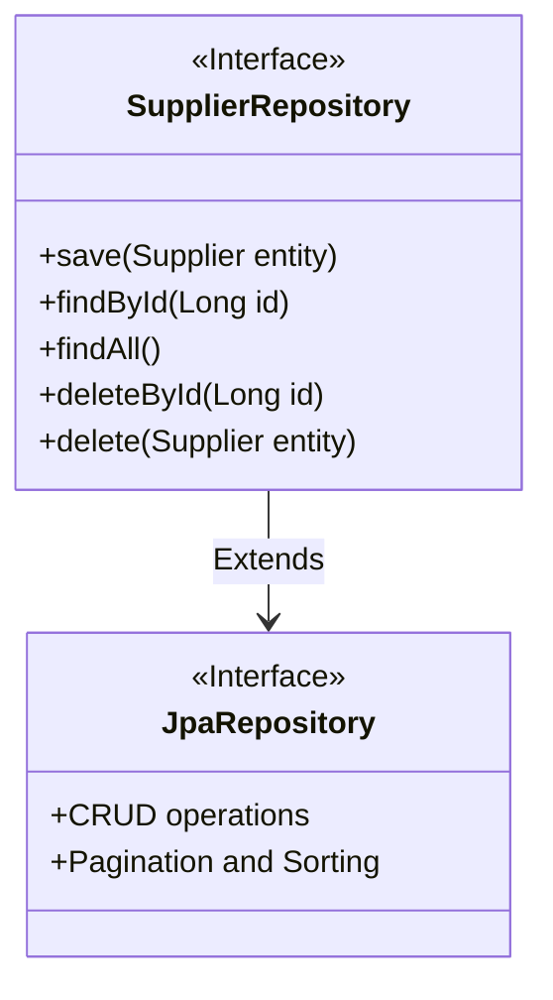
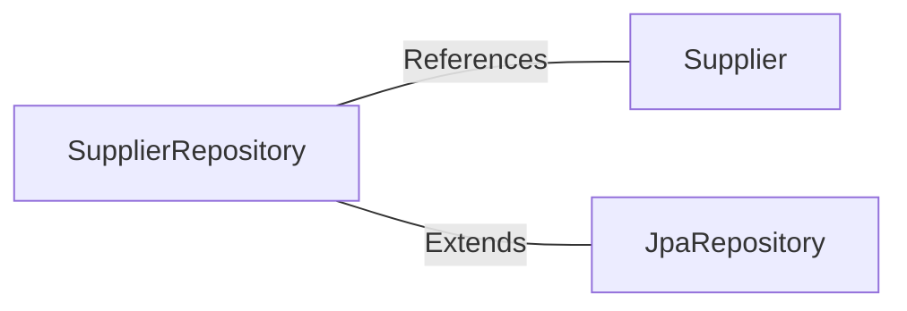

# SupplierRepository.java: Supplier Data Access Layer

## Overview
The `SupplierRepository` serves as the data access layer for managing `Supplier` entities. It leverages Spring Data JPA to provide CRUD operations and query capabilities for the `Supplier` entity, which is identified by a `Long` type primary key.

## Process Flow
The `SupplierRepository` is an interface that extends `JpaRepository`, inheriting methods for standard database operations such as saving, finding, deleting, and updating `Supplier` entities. Below is a class diagram representation of the relationship:

## Insights
- The `SupplierRepository` is annotated with `@Repository`, marking it as a Spring-managed component for persistence operations.
- By extending `JpaRepository`, it automatically inherits methods for CRUD operations, pagination, and sorting, reducing boilerplate code.
- The `Supplier` entity is the domain model managed by this repository, and its primary key is of type `Long`.

## Dependencies

- `Supplier`: Represents the domain model managed by the repository. It is referenced for CRUD operations.
- `JpaRepository`: Provides the base functionality for interacting with the database, including CRUD operations, pagination, and sorting.

## Data Manipulation (SQL)
The repository indirectly interacts with the database through the `JpaRepository` interface. The `Supplier` entity structure is crucial for understanding the database schema. Below is a table representation of the `Supplier` entity attributes (assuming typical attributes):

| Attribute Name | Data Type | Description |
|----------------|-----------|-------------|
| id             | Long      | Primary key of the supplier entity. |
| name           | String    | Name of the supplier. |
| address        | String    | Address of the supplier. |
| contactNumber  | String    | Contact number of the supplier. |
