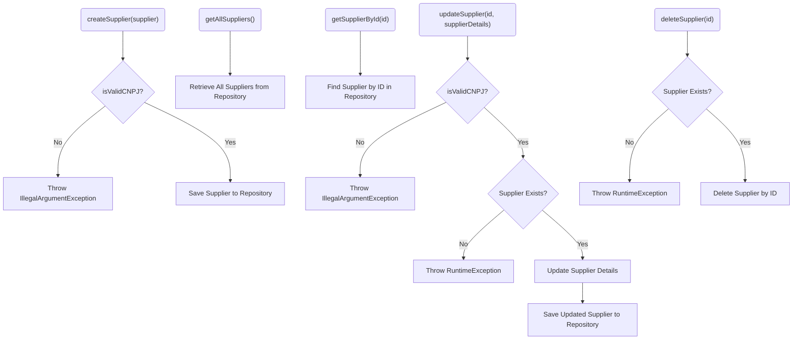
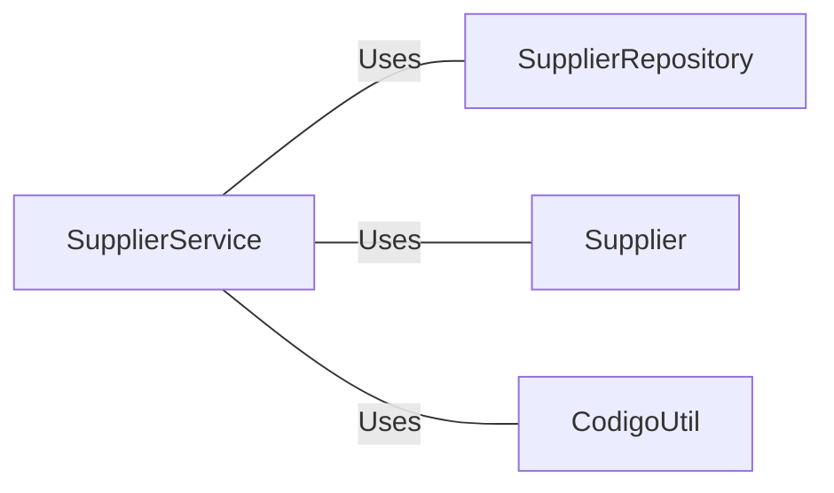

# SupplierService.java: Supplier Management Service

## Overview
The `SupplierService` class is a service layer responsible for managing supplier-related operations. It provides methods to create, retrieve, update, and delete supplier records while ensuring data validation and interaction with the underlying repository.

## Process Flow

## Insights
- **Validation**: The `createSupplier` and `updateSupplier` methods validate the supplier's CNPJ using the `CodigoUtil.isValidCNPJ` utility method.
- **Error Handling**: Throws exceptions (`IllegalArgumentException` or `RuntimeException`) for invalid data or when a supplier is not found.
- **CRUD Operations**:
  - **Create**: Adds a new supplier to the repository.
  - **Read**: Retrieves all suppliers or a specific supplier by ID.
  - **Update**: Updates supplier details if the supplier exists and the CNPJ is valid.
  - **Delete**: Deletes a supplier by ID if it exists.
- **Repository Interaction**: Relies on `SupplierRepository` for database operations.

## Dependencies

- `SupplierRepository`: Handles database operations for the `Supplier` entity.
- `Supplier`: Represents the supplier entity with attributes such as `nome`, `cnpj`, `nomeContato`, `emailContato`, and `telefoneContato`.
- `CodigoUtil`: Provides utility methods, including `isValidCNPJ`, for validating supplier data.

## Data Manipulation (SQL)
The `SupplierRepository` is assumed to handle the following operations:
- **INSERT**: Adds a new supplier to the database.
- **SELECT**: Retrieves supplier records (all or by ID).
- **UPDATE**: Updates existing supplier records.
- **DELETE**: Removes a supplier record by ID.
