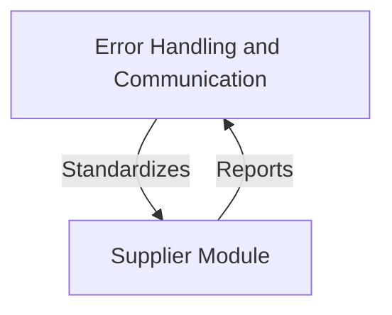
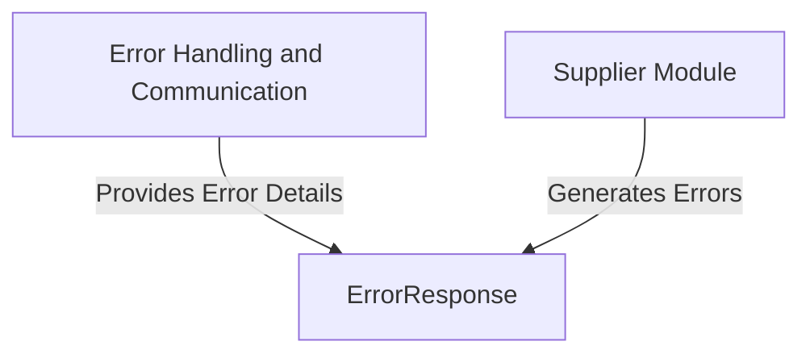
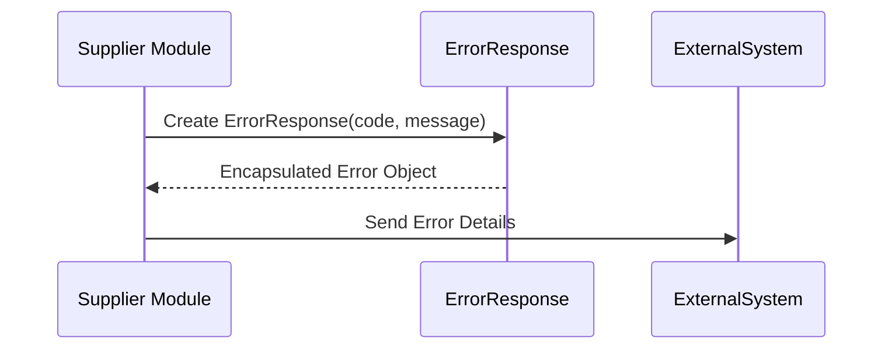

# Error Handling and Response Management in the Supplier Module

The provided context revolves around the `ErrorResponse` class, which is part of the `com.example.supplier` package. This class is designed to encapsulate error-related information, such as error codes and messages, and serves as a standardized way to communicate errors within the system. Its primary responsibility is to provide a structured representation of error details, enabling consistent error handling and reporting across the application.

## Key Components

### Error Handling and Communication
- **ErrorResponse**: *Encapsulates error details, including an error code and a descriptive message, to standardize error reporting and handling within the system.*

This component is foundational for error management in the supplier module, ensuring that errors are communicated in a clear and structured manner. It is likely leveraged by other components in the system to propagate error information, making it a critical part of the application's error-handling strategy.
## Component Relationships

### Context Diagram

### Explanation
- **Error Handling and Communication**: The `ErrorResponse` component encapsulates error details, such as error codes and messages, to standardize error reporting and handling. This ensures consistent communication of errors across the system.
- **Supplier Module**: The broader supplier module interacts with the error-handling category by reporting errors through the `ErrorResponse` component. This relationship ensures that any issues within the supplier module are communicated in a structured and predictable manner.
## Component Relationships

### Detailed Vision

### Explanation
- **ErrorResponse**: This component resides within the `Error Handling and Communication` category. It encapsulates error details, including an error code and a descriptive message, to standardize error reporting and handling. It provides structured error information to the supplier module when needed.
- **Supplier Module**: The supplier module interacts with the `ErrorResponse` component by generating errors and passing them to `ErrorResponse` for encapsulation. This ensures that errors originating from the supplier module are communicated in a consistent and structured manner.
## Integration Scenarios

### Standardized Error Reporting in the Supplier Module
This scenario describes how the `ErrorResponse` component is utilized within the supplier module to handle and report errors in a standardized manner. The process begins when an error occurs in the supplier module, and the `ErrorResponse` component is used to encapsulate the error details, ensuring consistent communication of the issue.

### Explanation
- **Supplier Module**: The process starts when an error occurs in the supplier module. The module creates an instance of the `ErrorResponse` component by passing the error code and message to its constructor.
- **ErrorResponse**: The `ErrorResponse` component encapsulates the provided error details into a structured object. This ensures that the error information is standardized and ready for further processing.
- **External System**: After the error is encapsulated, the supplier module sends the structured error details to an external system (e.g., a logging service, monitoring tool, or client application) for further handling or notification. This ensures that the error is communicated effectively outside the system.
