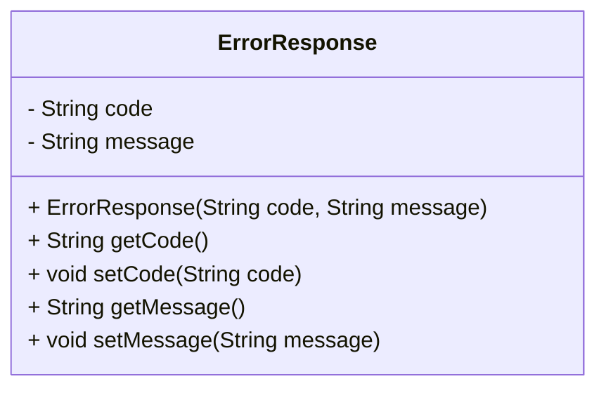
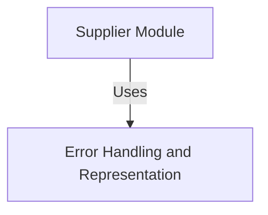
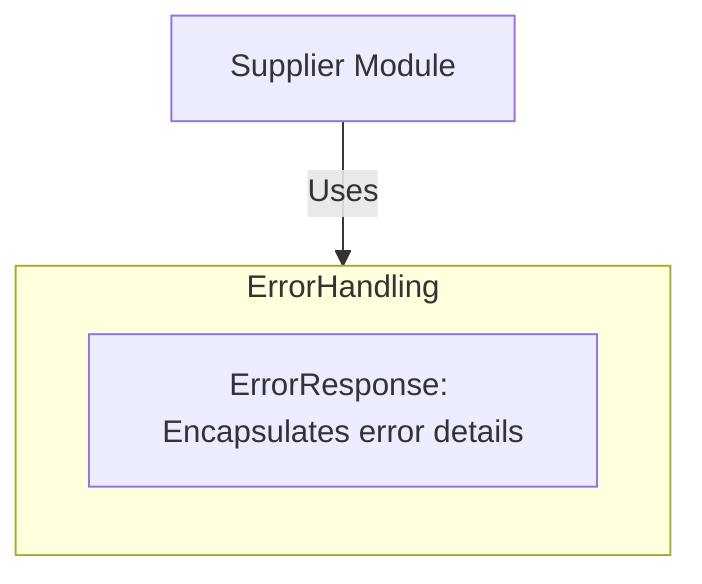
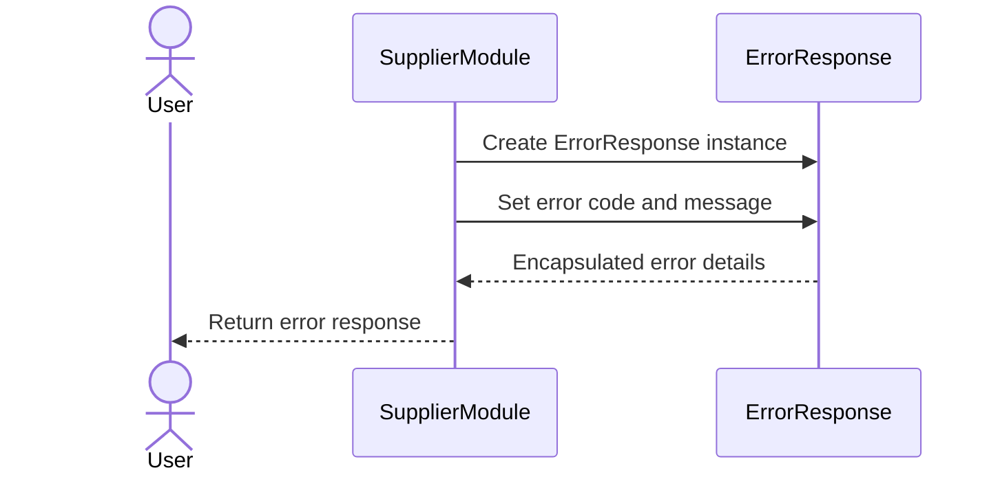

# Error Handling and Response Representation in the Supplier Module

The provided context and code snippet focus on the **ErrorResponse** class, which is part of the `com.example.supplier` package. This class is designed to encapsulate error-related information, such as error codes and messages, and is likely used to standardize error handling and communication within the system. Its primary responsibility is to provide a structured way to represent and propagate error details, ensuring consistency and clarity in error reporting.

## Key Components

### Error Handling and Representation
- **ErrorResponse**: *Encapsulates error details, including an error code and a descriptive message. This class is used to standardize the representation of errors across the system, making it easier to handle and communicate issues effectively.*

#### Responsibilities:
1. **Error Code Management**: The `code` attribute represents a unique identifier for the type of error, which can be used for categorization or programmatic handling.
2. **Error Message Management**: The `message` attribute provides a human-readable description of the error, aiding in debugging and user communication.
3. **Encapsulation and Access**: Provides getter and setter methods for both attributes, ensuring controlled access and modification of error details.

### Relationships and Interactions
- The **ErrorResponse** class is likely used by other components in the `com.example.supplier` module or beyond to handle and propagate error information. It serves as a foundational building block for error management, ensuring that error details are consistently formatted and easily accessible.

This diagram illustrates the structure of the **ErrorResponse** class, highlighting its attributes and methods. It encapsulates error-related information, providing a standardized way to manage and communicate errors within the system.
## Component Relationships

### Context Diagram

### Explanation
- **Supplier Module**: The `Supplier Module` is the broader context in which the `ErrorResponse` class operates. It likely contains various components responsible for managing supplier-related functionalities, such as data processing, communication, and business logic.
- **Error Handling and Representation**: The `ErrorResponse` class fulfills the responsibility of encapsulating error details, such as error codes and messages, ensuring consistent error reporting and communication. The `Supplier Module` uses this component to handle and propagate errors effectively, maintaining clarity and standardization across the system.
## Component Relationships

### Detailed Vision

### Explanation
- **Supplier Module**: The `Supplier Module` is the overarching context where supplier-related functionalities are implemented. It interacts with the `ErrorHandling` category to manage errors that occur during its operations.
- **Error Handling and Representation**: Within this category, the `ErrorResponse` component is responsible for encapsulating error details, such as error codes and descriptive messages. This ensures that errors are consistently represented and communicated across the system.
- **Interaction**: The `Supplier Module` uses the `ErrorResponse` component to handle and propagate errors. For example, when an error occurs during supplier-related operations, the module creates an instance of `ErrorResponse` to encapsulate the error details and pass them to other parts of the system or external consumers. This interaction ensures clarity and standardization in error reporting.
## Integration Scenarios

### Error Reporting in Supplier Module
This scenario describes how the `Supplier Module` integrates with the `ErrorHandling` category, specifically the `ErrorResponse` component, to manage and propagate errors during supplier-related operations. The goal is to ensure that errors are consistently encapsulated and communicated across the system.

### Explanation
- **User**: Represents an external actor interacting with the `Supplier Module`. This could be a system user or another system component triggering supplier-related operations.
- **Supplier Module**: When an error occurs during its operations, the `Supplier Module` creates an instance of the `ErrorResponse` component to encapsulate the error details. It sets the error code and message to provide structured information about the issue.
- **ErrorResponse**: The `ErrorResponse` component encapsulates the error details, ensuring that they are consistently formatted and accessible. It acts as a standardized container for error information.
- **Interaction Flow**:
  - The `Supplier Module` creates an `ErrorResponse` instance when an error occurs.
  - It sets the error code and message to describe the issue.
  - The encapsulated error details are returned to the `Supplier Module`.
  - Finally, the `Supplier Module` propagates the error response back to the `User`, ensuring that the error is communicated effectively.
