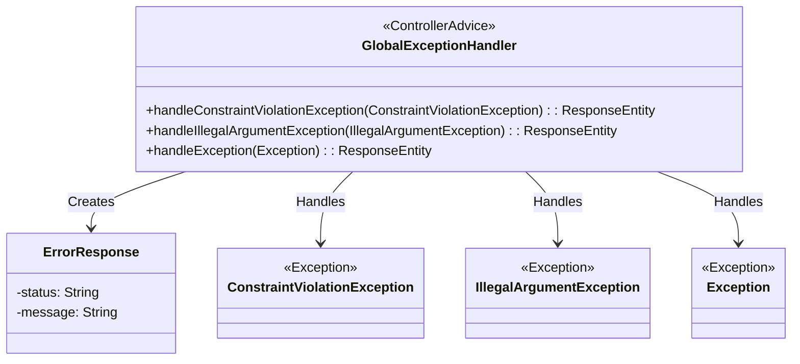
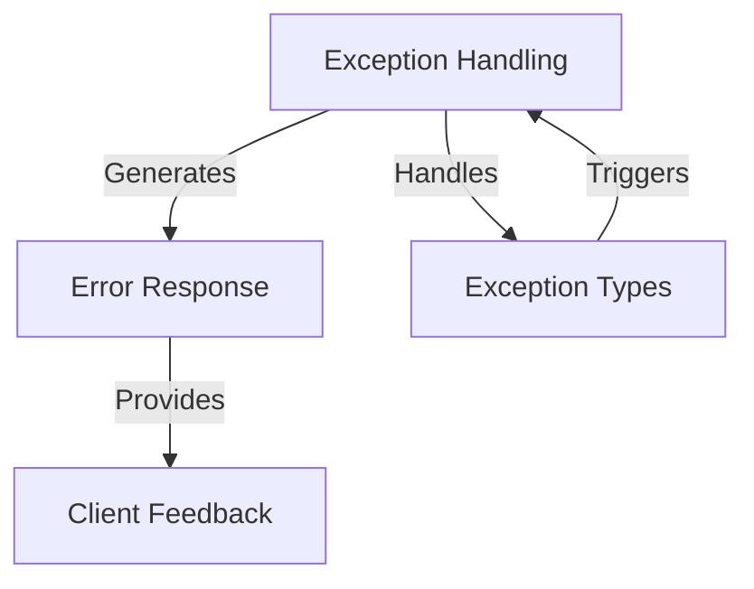
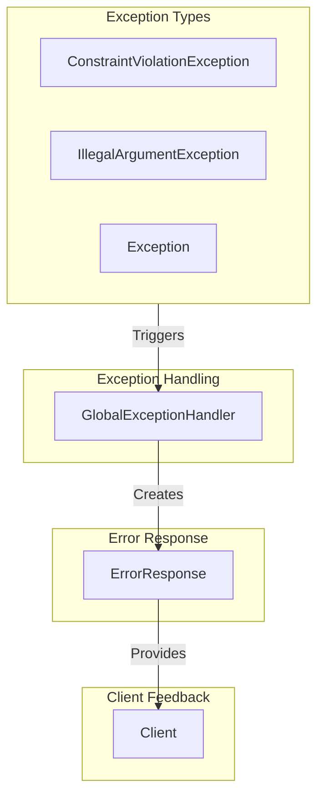
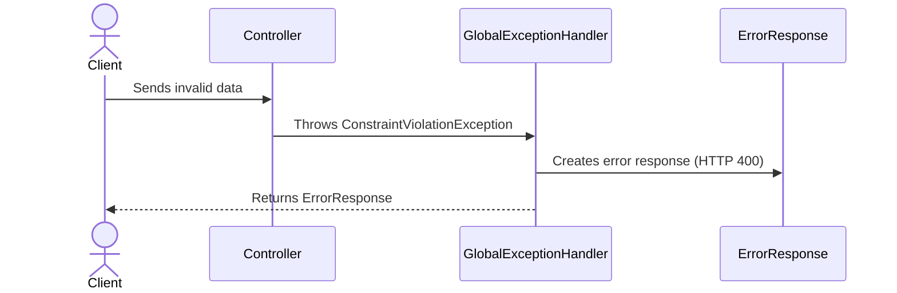
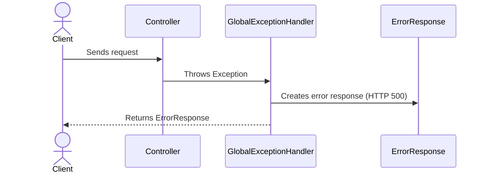

# Global Exception Handling in the Supplier Module

The provided code snippet represents a **Global Exception Handler** for the `Supplier` module in a Spring-based application. Its primary responsibility is to centralize the handling of exceptions across the application, ensuring consistent error responses and improving maintainability. This component is critical for managing application errors gracefully and providing meaningful feedback to clients consuming the API.

The `GlobalExceptionHandler` leverages Spring's `@ControllerAdvice` annotation to intercept exceptions thrown by controllers and map them to appropriate HTTP responses. It handles specific exceptions such as `ConstraintViolationException` and `IllegalArgumentException`, as well as generic exceptions, ensuring that the application remains robust and user-friendly even in the face of unexpected errors.

## Key Components

### Exception Handling
- **GlobalExceptionHandler**: *Centralizes exception handling for the Supplier module, ensuring consistent error responses for validation errors, illegal arguments, and unexpected exceptions.*

### Error Response
- **ErrorResponse**: *Represents the structure of error messages returned to the client, including HTTP status codes and descriptive error messages.*

### Exception Types
- **ConstraintViolationException**: *Handles validation errors, typically arising from constraints defined in the application (e.g., `@NotNull`, `@Size`).*
- **IllegalArgumentException**: *Handles errors related to invalid arguments passed to methods.*
- **Exception**: *Acts as a catch-all for unexpected errors, ensuring the application does not crash and provides meaningful feedback.*

## Interaction Diagram

## Summary

The `GlobalExceptionHandler` is a pivotal component in the `Supplier` module, ensuring that exceptions are handled uniformly and gracefully. By intercepting exceptions and mapping them to structured error responses, it enhances the robustness and user experience of the application. The `ErrorResponse` class plays a supporting role by encapsulating error details, while the exception types (`ConstraintViolationException`, `IllegalArgumentException`, and `Exception`) represent the various error scenarios the handler addresses.
## Component Relationships

### Context Diagram

### Explanation

- **Exception Handling**: The `GlobalExceptionHandler` is responsible for intercepting exceptions thrown by controllers and mapping them to appropriate responses. It ensures consistent handling of errors across the application.
  
- **Error Response**: The `ErrorResponse` component is generated by the `GlobalExceptionHandler` to encapsulate error details, including HTTP status codes and descriptive messages. This structure is sent back to the client.

- **Exception Types**: The `GlobalExceptionHandler` handles specific exception types such as `ConstraintViolationException`, `IllegalArgumentException`, and generic `Exception`. These exceptions trigger the handler to process and respond accordingly.

- **Client Feedback**: The `ErrorResponse` provides meaningful feedback to the client, ensuring that they understand the nature of the error and can take appropriate action. This improves the user experience and API usability.
### Detailed Vision

### Explanation

- **Exception Handling (GlobalExceptionHandler)**:
  - The `GlobalExceptionHandler` is the central component responsible for handling exceptions. It listens for exceptions triggered by the application (e.g., `ConstraintViolationException`, `IllegalArgumentException`, and generic `Exception`) and processes them to generate appropriate responses.

- **Error Response (ErrorResponse)**:
  - The `ErrorResponse` is created by the `GlobalExceptionHandler` to encapsulate error details, such as the HTTP status code and a descriptive error message. This ensures that the client receives structured and meaningful feedback.

- **Exception Types (ConstraintViolationException, IllegalArgumentException, Exception)**:
  - These are the specific exceptions that trigger the `GlobalExceptionHandler`. Each exception type represents a different error scenario:
    - `ConstraintViolationException`: Triggered by validation errors, such as violations of constraints defined in the application.
    - `IllegalArgumentException`: Triggered when invalid arguments are passed to methods.
    - `Exception`: Acts as a catch-all for unexpected errors.

- **Client Feedback (Client)**:
  - The `ErrorResponse` is sent to the client, providing them with clear and actionable feedback about the error. This improves the user experience and helps the client understand the issue.
## Integration Scenarios

### Handling Validation Errors

This scenario describes how the system handles validation errors triggered by constraints defined in the application, such as `@NotNull` or `@Size`. When a validation error occurs, the `ConstraintViolationException` is thrown, and the `GlobalExceptionHandler` processes it to generate an appropriate `ErrorResponse` that is sent back to the client.

#### Explanation

- **Client**: Initiates the process by sending invalid data to the application, such as violating constraints defined in the model.
- **Controller**: Attempts to process the request but encounters a validation error, triggering a `ConstraintViolationException`.
- **GlobalExceptionHandler**: Intercepts the exception and processes it to create an `ErrorResponse` with a `400 Bad Request` status and a descriptive error message.
- **ErrorResponse**: Encapsulates the error details, including the HTTP status code and the validation error message, which is then returned to the client.
- **Client**: Receives the `ErrorResponse` and understands the nature of the validation error, allowing them to correct the input data.

---

### Handling Unexpected Errors

This scenario describes how the system handles unexpected errors that occur during the application's execution. When an unanticipated exception is thrown, the `GlobalExceptionHandler` processes it to generate a generic `ErrorResponse` with an `HTTP 500 Internal Server Error` status, ensuring the application remains robust and provides meaningful feedback to the client.

#### Explanation

- **Client**: Sends a request to the application, expecting a response.
- **Controller**: Processes the request but encounters an unexpected error, triggering a generic `Exception`.
- **GlobalExceptionHandler**: Intercepts the exception and processes it to create an `ErrorResponse` with a `500 Internal Server Error` status and a generic error message.
- **ErrorResponse**: Encapsulates the error details, including the HTTP status code and a generic error message, which is then returned to the client.
- **Client**: Receives the `ErrorResponse` and understands that an unexpected error occurred, allowing them to take appropriate action or retry the request.
