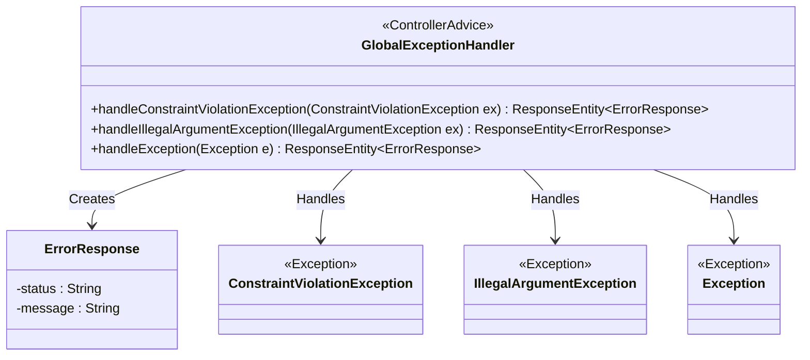
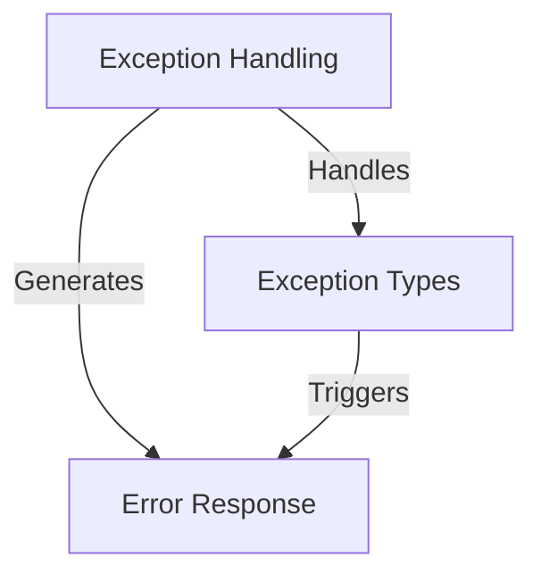
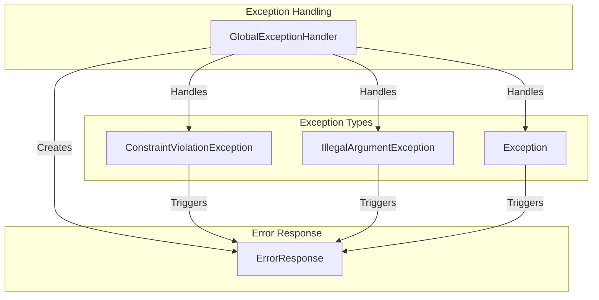
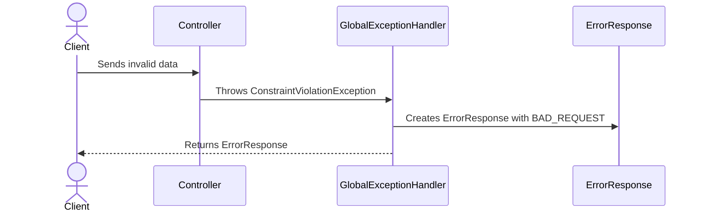
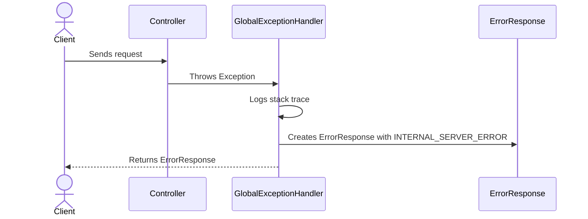

# Global Exception Handling in the Supplier Module

The provided code snippet represents a **Global Exception Handler** for the `Supplier` module in a Spring-based application. Its primary responsibility is to centralize the handling of exceptions across the application, ensuring consistent error responses and improving maintainability. This component is critical for managing application errors gracefully and providing meaningful feedback to clients consuming the API.

The `GlobalExceptionHandler` leverages Spring's `@ControllerAdvice` annotation to intercept exceptions thrown by controllers and map them to appropriate HTTP responses. It handles specific exceptions like `ConstraintViolationException` and `IllegalArgumentException`, as well as generic exceptions, ensuring that the application remains robust and user-friendly even in the face of unexpected errors.

## Key Components

### Exception Handling
- **GlobalExceptionHandler**: *Centralizes exception handling for the Supplier module, ensuring consistent error responses and improving maintainability. It leverages Spring's `@ControllerAdvice` to intercept exceptions and map them to appropriate HTTP responses.*

### Error Response
- **ErrorResponse**: *Represents the structure of error messages sent to clients. It encapsulates the HTTP status and a descriptive error message, ensuring clarity and consistency in error reporting.*

### Exception Types
- **ConstraintViolationException**: *Handles validation errors, typically arising from constraints defined in the application (e.g., field-level validation). Returns a `400 BAD REQUEST` response with a descriptive error message.*
- **IllegalArgumentException**: *Handles cases where invalid arguments are passed to methods. Returns a `400 BAD REQUEST` response with the specific error message.*
- **Exception**: *Acts as a catch-all for unhandled exceptions, ensuring that the application responds with a `500 INTERNAL SERVER ERROR` and logs the stack trace for debugging.*

## Interaction Diagram

This diagram illustrates the relationships between the `GlobalExceptionHandler`, the exceptions it handles, and the `ErrorResponse` it generates. The `GlobalExceptionHandler` acts as the central hub for exception handling, ensuring that all errors are processed uniformly and returned to the client in a structured format.
## Component Relationships

### Context Diagram

### Explanation of the Flowchart

- **Exception Handling → Generates → Error Response**:  
  The `GlobalExceptionHandler` component centralizes exception handling and generates structured error responses (`ErrorResponse`) to ensure consistent communication with API clients. This process encapsulates the HTTP status and descriptive error messages.

- **Exception Handling → Handles → Exception Types**:  
  The `GlobalExceptionHandler` is responsible for handling specific exception types, such as `ConstraintViolationException`, `IllegalArgumentException`, and generic `Exception`. Each type is mapped to an appropriate HTTP response code and message.

- **Exception Types → Triggers → Error Response**:  
  When exceptions occur, they trigger the creation of an `ErrorResponse` object. This object is then returned to the client, providing clarity on the nature of the error and the corresponding HTTP status.
### Detailed Vision

### Explanation of the Flowchart

- **GlobalExceptionHandler → Creates → ErrorResponse**:  
  The `GlobalExceptionHandler` generates an `ErrorResponse` object for every exception it handles. This object encapsulates the HTTP status and a descriptive error message, ensuring consistent communication with API clients.

- **GlobalExceptionHandler → Handles → ConstraintViolationException**:  
  The `GlobalExceptionHandler` intercepts `ConstraintViolationException` instances, which typically arise from validation errors. It maps these exceptions to a `400 BAD REQUEST` response and generates an appropriate `ErrorResponse`.

- **GlobalExceptionHandler → Handles → IllegalArgumentException**:  
  The `GlobalExceptionHandler` processes `IllegalArgumentException` instances, which occur when invalid arguments are passed to methods. It maps these exceptions to a `400 BAD REQUEST` response and creates a corresponding `ErrorResponse`.

- **GlobalExceptionHandler → Handles → Exception**:  
  The `GlobalExceptionHandler` acts as a catch-all for unhandled exceptions. It maps these to a `500 INTERNAL SERVER ERROR` response, logs the stack trace for debugging, and generates an `ErrorResponse` with a generic error message.

- **ConstraintViolationException → Triggers → ErrorResponse**:  
  When a `ConstraintViolationException` is thrown, it triggers the creation of an `ErrorResponse` object by the `GlobalExceptionHandler`. This response provides details about the validation error.

- **IllegalArgumentException → Triggers → ErrorResponse**:  
  When an `IllegalArgumentException` is thrown, it triggers the creation of an `ErrorResponse` object by the `GlobalExceptionHandler`. This response includes the specific error message related to the invalid argument.

- **Exception → Triggers → ErrorResponse**:  
  When a generic `Exception` is thrown, it triggers the creation of an `ErrorResponse` object by the `GlobalExceptionHandler`. This response includes a generic error message and a `500 INTERNAL SERVER ERROR` status.
## Integration Scenarios

### Handling Validation Errors in the Supplier Module

This scenario describes how the system handles validation errors triggered by constraints defined in the application. When a validation error occurs, the `GlobalExceptionHandler` intercepts the exception (`ConstraintViolationException`) and generates an appropriate `ErrorResponse` to communicate the issue to the client. This ensures that invalid data is handled gracefully and the client receives meaningful feedback.

#### Explanation of the Diagram

- **Client → Controller: Sends invalid data**  
  The client sends a request to the application with invalid data that violates predefined constraints (e.g., field validation rules).

- **Controller → GlobalExceptionHandler: Throws ConstraintViolationException**  
  The controller detects the validation error and throws a `ConstraintViolationException`. This exception is automatically intercepted by the `GlobalExceptionHandler`.

- **GlobalExceptionHandler → ErrorResponse: Creates ErrorResponse with BAD_REQUEST**  
  The `GlobalExceptionHandler` processes the `ConstraintViolationException` and creates an `ErrorResponse` object. This object includes the HTTP status (`400 BAD REQUEST`) and a descriptive error message explaining the validation issue.

- **GlobalExceptionHandler → Client: Returns ErrorResponse**  
  The `GlobalExceptionHandler` sends the `ErrorResponse` back to the client, ensuring that the client is informed about the validation error in a structured and consistent manner.

---

### Handling Generic Exceptions in the Supplier Module

This scenario illustrates how the system handles unexpected errors or generic exceptions (`Exception`). When an unhandled exception occurs, the `GlobalExceptionHandler` ensures that the error is logged and an appropriate `ErrorResponse` is returned to the client with a `500 INTERNAL SERVER ERROR` status.

#### Explanation of the Diagram

- **Client → Controller: Sends request**  
  The client sends a request to the application, which results in an unexpected error or unhandled exception.

- **Controller → GlobalExceptionHandler: Throws Exception**  
  The controller encounters an unhandled exception and throws a generic `Exception`. This exception is intercepted by the `GlobalExceptionHandler`.

- **GlobalExceptionHandler → GlobalExceptionHandler: Logs stack trace**  
  The `GlobalExceptionHandler` logs the stack trace of the exception for debugging purposes, ensuring that developers can investigate and resolve the issue.

- **GlobalExceptionHandler → ErrorResponse: Creates ErrorResponse with INTERNAL_SERVER_ERROR**  
  The `GlobalExceptionHandler` creates an `ErrorResponse` object with a `500 INTERNAL SERVER ERROR` status and a generic error message indicating that an unexpected error occurred.

- **GlobalExceptionHandler → Client: Returns ErrorResponse**  
  The `GlobalExceptionHandler` sends the `ErrorResponse` back to the client, ensuring that the client is informed about the error in a structured and consistent manner.
