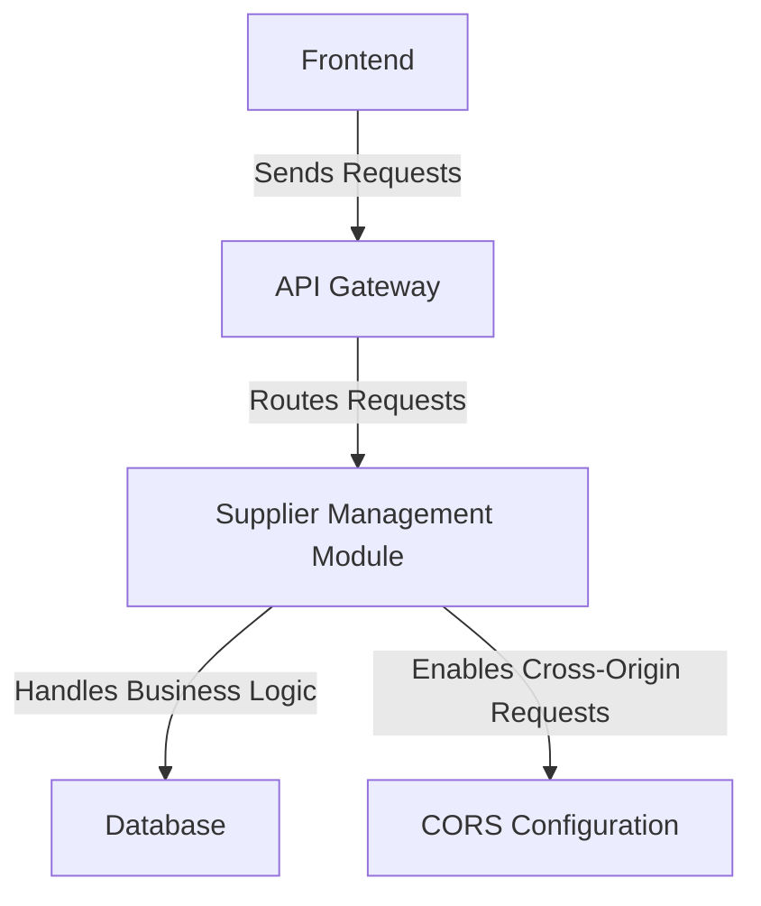

To create a meaningful architecture overview, I need the context (# MEANING) and the JSON file containing the analyzed components. Please provide these inputs so I can proceed with the documentation.
## Component Relationships

### Context Diagram

### Explanation
- **Frontend**: Represents the client-side application that interacts with the backend. It sends HTTP requests to the backend to perform operations related to supplier management.
- **API Gateway**: Acts as the entry point for all client requests. It routes these requests to the appropriate backend components, such as the Supplier Management Module.
- **Supplier Management Module**: This is the core backend module responsible for handling the business logic related to supplier operations. It processes the requests routed by the API Gateway and interacts with the database to fetch or store data.
- **Database**: Stores all the supplier-related data. The Supplier Management Module interacts with the database to perform CRUD operations.
- **CORS Configuration**: Ensures that cross-origin requests from the frontend are allowed. This is critical for enabling communication between the frontend and backend when they are hosted on different domains.
To proceed with the detailed vision, I need the `##Key Components` section and the JSON file containing the analyzed components. Please provide these inputs so I can create the detailed diagram and explanation.
To create the `## Integration Scenarios` section, I need the JSON file containing the analyzed components and the `##Key Components` section. Please provide these inputs so I can craft meaningful integration scenarios and diagrams.
