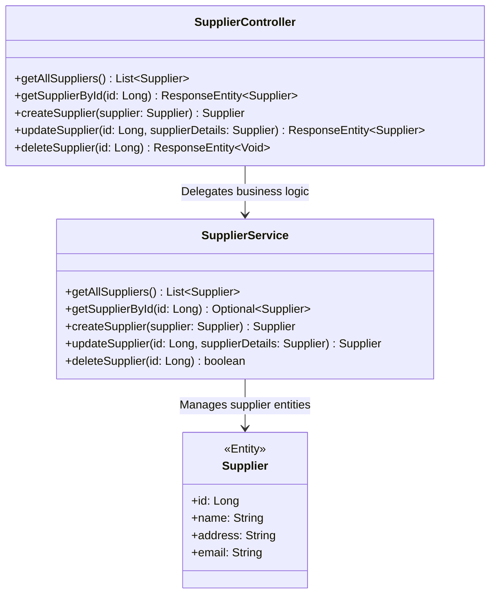
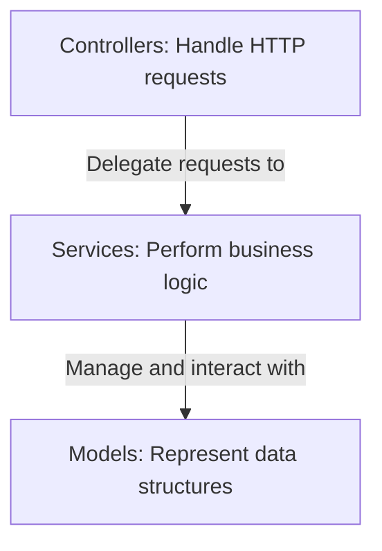
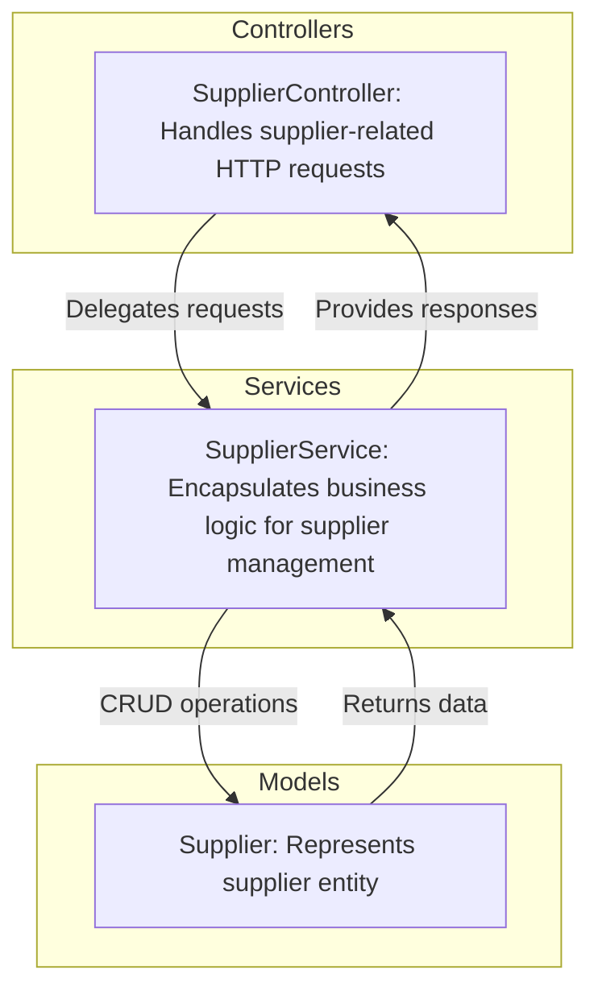
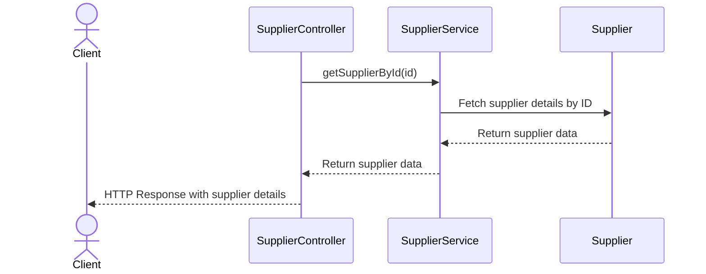
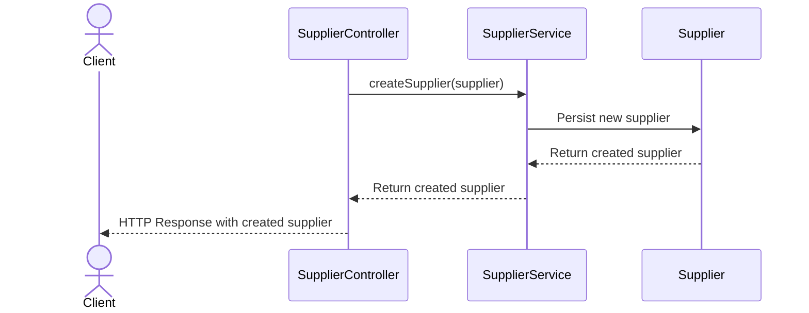

# Supplier Management System: Controller and Service Interaction

The provided code represents a key component of a Supplier Management System, specifically focusing on the `SupplierController`. This controller acts as the entry point for handling HTTP requests related to supplier data. It leverages the `SupplierService` to perform business logic and interact with the underlying data model (`Supplier`). The system is designed to manage suppliers, including operations such as retrieval, creation, updating, and deletion.

The architecture is built using the Spring Framework, with RESTful principles guiding the design of the API. The controller ensures that client requests are appropriately routed to the service layer, which encapsulates the business logic. This separation of concerns promotes maintainability and scalability.

## Key Components

### Controllers
- **SupplierController**: *Handles HTTP requests for supplier-related operations, including retrieving all suppliers, fetching a supplier by ID, creating a new supplier, updating an existing supplier, and deleting a supplier. It delegates business logic to the SupplierService.*

### Services
- **SupplierService**: *Encapsulates the business logic for managing suppliers. It interacts with the data layer to perform CRUD operations and ensures that the controller receives the necessary data or status updates.*

### Models
- **Supplier**: *Represents the data structure for a supplier entity. It is used across the controller and service layers to transfer data.*

### Relationships
- The `SupplierController` depends on the `SupplierService` to perform all operations. The `SupplierService`, in turn, interacts with the data layer (not shown in the provided code) to manage `Supplier` entities.

### Diagram

This high-level overview demonstrates how the `SupplierController` interacts with the `SupplierService` to manage supplier data, ensuring a clean separation of concerns and adherence to RESTful API design principles.
## Component Relationships

### Context Diagram

### Explanation
- **Controllers**: The `SupplierController` is responsible for handling HTTP requests from clients. It acts as the entry point for supplier-related operations, such as retrieving, creating, updating, and deleting suppliers. It delegates all business logic to the `SupplierService`.
  
- **Services**: The `SupplierService` encapsulates the business logic for supplier management. It processes the requests received from the controller and interacts with the data layer to perform CRUD operations on `Supplier` entities. This ensures that the controller remains focused on request handling and response generation.

- **Models**: The `Supplier` model represents the data structure for supplier entities. It is used by the service layer to manage supplier data and transfer it back to the controller for client responses. This abstraction ensures that the data layer is decoupled from the controller.
## Component Relationships

### Detailed Vision

### Explanation
- **SupplierController**: 
  - Acts as the entry point for HTTP requests related to supplier management. It handles operations such as retrieving all suppliers, fetching a supplier by ID, creating a new supplier, updating an existing supplier, and deleting a supplier.
  - Delegates all business logic to the `SupplierService`, ensuring a clean separation of concerns.

- **SupplierService**: 
  - Encapsulates the business logic for supplier management. It processes requests from the `SupplierController` and interacts with the `Supplier` model to perform CRUD operations.
  - Ensures that the controller receives the necessary data or status updates to generate appropriate HTTP responses.

- **Supplier**: 
  - Represents the data structure for supplier entities. It is used by the `SupplierService` to manage supplier data and transfer it back to the controller.
  - Acts as the core entity for CRUD operations, ensuring that supplier-related data is properly structured and maintained.

- **Data Flow**:
  - The `SupplierController` delegates requests to the `SupplierService`, which performs the necessary business logic and interacts with the `Supplier` model for data operations.
  - The `Supplier` model returns data to the `SupplierService`, which then provides responses back to the `SupplierController` for client communication.
## Integration Scenarios

### Retrieving Supplier Details by ID
This scenario describes the process of retrieving the details of a specific supplier by its ID. The flow begins with a client making an HTTP GET request to the `SupplierController`. The controller delegates the request to the `SupplierService`, which interacts with the `Supplier` model to fetch the required data. The retrieved data is then returned to the client as part of the HTTP response.

#### Explanation
- **Client**: Initiates the process by making an HTTP GET request to retrieve supplier details by ID.
- **SupplierController**: Receives the request and delegates the business logic to the `SupplierService`.
- **SupplierService**: Processes the request and interacts with the `Supplier` model to fetch the supplier details.
- **Supplier**: Represents the supplier entity and provides the requested data to the service layer.
- **Data Flow**:
  - The `SupplierController` forwards the request to the `SupplierService`.
  - The `SupplierService` queries the `Supplier` model for the required data.
  - The `Supplier` model returns the data to the service layer, which then passes it back to the controller.
  - Finally, the `SupplierController` sends the data as an HTTP response to the client.

---

### Creating a New Supplier
This scenario describes the process of creating a new supplier. The flow begins with a client making an HTTP POST request to the `SupplierController` with the supplier details in the request body. The controller delegates the request to the `SupplierService`, which validates and processes the data before interacting with the `Supplier` model to persist the new supplier. The created supplier is then returned to the client.

#### Explanation
- **Client**: Initiates the process by making an HTTP POST request with the supplier details in the request body.
- **SupplierController**: Receives the request and delegates the business logic to the `SupplierService`.
- **SupplierService**: Validates and processes the supplier data, then interacts with the `Supplier` model to persist the new supplier.
- **Supplier**: Represents the supplier entity and stores the new supplier data in the system.
- **Data Flow**:
  - The `SupplierController` forwards the request to the `SupplierService`.
  - The `SupplierService` validates the data and sends it to the `Supplier` model for persistence.
  - The `Supplier` model returns the created supplier data to the service layer.
  - The `SupplierService` passes the created supplier data back to the controller.
  - Finally, the `SupplierController` sends the data as an HTTP response to the client.
