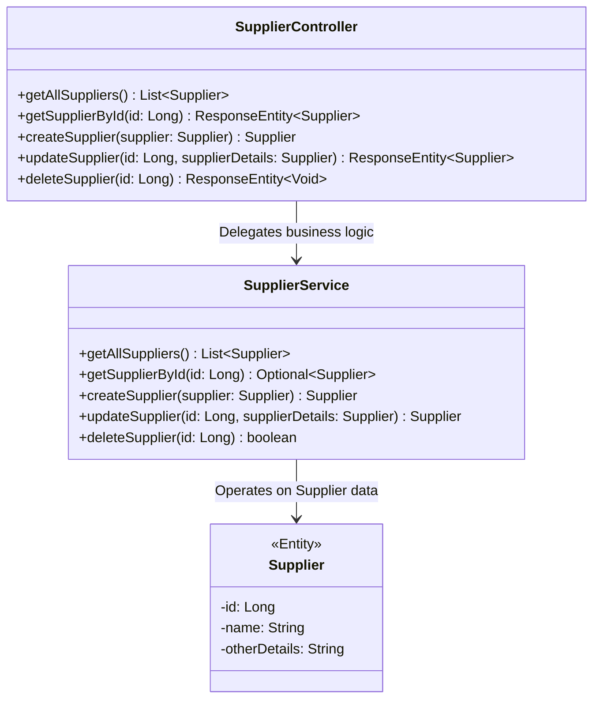
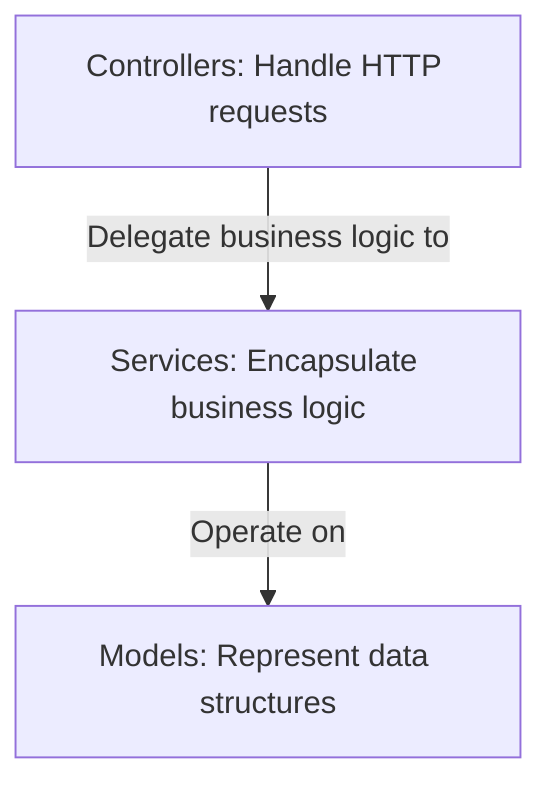
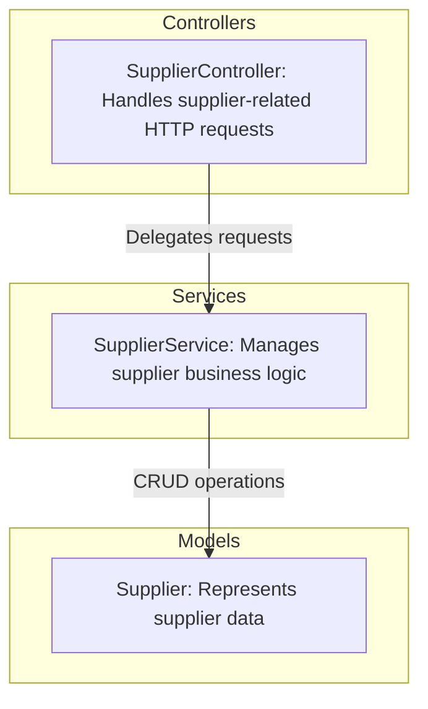
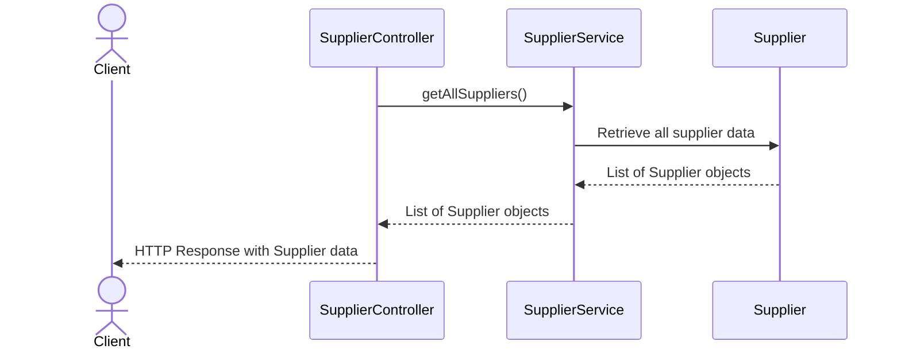
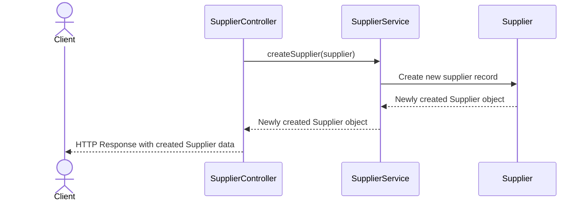

# Supplier Management System: Controller and Service Interaction

The provided code snippet represents the **SupplierController**, a key component in a Supplier Management System. This controller is responsible for handling HTTP requests related to supplier operations, such as retrieving, creating, updating, and deleting supplier records. It acts as the entry point for client interactions and delegates business logic to the **SupplierService**. The system is designed to manage supplier data efficiently, ensuring proper separation of concerns between the controller and service layers.

## Key Components

### Controllers
- **SupplierController**: *Handles HTTP requests for supplier-related operations, including retrieving all suppliers, fetching a supplier by ID, creating a new supplier, updating an existing supplier, and deleting a supplier. It delegates business logic to the SupplierService and ensures appropriate HTTP responses are returned.*

### Services
- **SupplierService**: *Encapsulates the business logic for supplier management. It interacts with the data layer (not shown in the provided code) to perform CRUD operations on supplier records. The service ensures data integrity and provides reusable methods for the controller.*

### Models
- **Supplier**: *Represents the supplier entity with attributes such as ID, name, and other relevant details. It serves as the data structure for supplier-related operations.*

## Component Relationships

### Explanation of Relationships
1. **SupplierController → SupplierService**: The controller delegates all business logic to the service layer, ensuring that the controller remains focused on handling HTTP requests and responses.
2. **SupplierService → Supplier**: The service layer operates directly on the Supplier model, performing CRUD operations and ensuring data integrity.

This architecture promotes separation of concerns, making the system modular, testable, and maintainable. The controller handles client interactions, while the service encapsulates business logic, and the model represents the data structure.
## Component Relationships

### Context Diagram

### Explanation of the Flowchart

- **Controllers → Services**: The **SupplierController** handles HTTP requests from clients and delegates the business logic to the **SupplierService**. This ensures that the controller focuses solely on request handling and response generation, adhering to the principle of separation of concerns.

- **Services → Models**: The **SupplierService** operates directly on the **Supplier** model, performing CRUD operations. It encapsulates the business logic required to manage supplier data, ensuring data integrity and reusability across the application.

This flowchart illustrates the high-level interaction between the categories of components, emphasizing their roles and responsibilities within the Supplier Management System.
### Detailed Vision

### Explanation of the Flowchart

- **SupplierController → SupplierService**: 
  - The **SupplierController** is responsible for handling HTTP requests related to suppliers. It delegates these requests to the **SupplierService** for processing. For example:
    - When a client requests all suppliers, the controller calls the `getAllSuppliers()` method in the service.
    - When a client submits a new supplier, the controller calls the `createSupplier()` method in the service.
    - Similarly, update and delete operations are routed through the controller to the service.

- **SupplierService → Supplier**: 
  - The **SupplierService** encapsulates the business logic for managing suppliers. It interacts directly with the **Supplier** model to perform CRUD operations. For instance:
    - The service retrieves supplier data from the data layer (not shown) and maps it to the **Supplier** model.
    - It validates and processes data before creating or updating a **Supplier** instance.
    - It ensures the integrity of the data when deleting a supplier.

This detailed vision provides a clear understanding of how the components collaborate to fulfill their responsibilities, ensuring a modular and maintainable architecture.
## Integration Scenarios

### Retrieving All Suppliers

This scenario describes the process of retrieving all supplier records from the system. It starts with a client making an HTTP GET request to the **SupplierController**, which delegates the request to the **SupplierService**. The service retrieves the supplier data and returns it to the controller, which then sends the response back to the client.

#### Explanation of the Diagram

- **Client → SupplierController**: The process begins with the client making an HTTP GET request to the **SupplierController** to retrieve all suppliers.
- **SupplierController → SupplierService**: The controller delegates the request to the **SupplierService** by calling the `getAllSuppliers()` method.
- **SupplierService → Supplier**: The service interacts with the **Supplier** model (and potentially the data layer, not shown) to retrieve all supplier records.
- **Supplier → SupplierService**: The **Supplier** model returns a list of supplier objects to the service.
- **SupplierService → SupplierController**: The service passes the list of supplier objects back to the controller.
- **SupplierController → Client**: The controller sends an HTTP response containing the supplier data to the client.

This integration scenario demonstrates the seamless collaboration between the components to fulfill the "Retrieve All Suppliers" use case, ensuring data is fetched and returned efficiently.

---

### Creating a New Supplier

This scenario describes the process of creating a new supplier record. It starts with a client making an HTTP POST request to the **SupplierController** with the supplier data. The controller delegates the request to the **SupplierService**, which validates and processes the data before creating a new supplier record.

#### Explanation of the Diagram

- **Client → SupplierController**: The process begins with the client making an HTTP POST request to the **SupplierController**, providing the supplier data in the request body.
- **SupplierController → SupplierService**: The controller delegates the request to the **SupplierService** by calling the `createSupplier()` method and passing the supplier data.
- **SupplierService → Supplier**: The service interacts with the **Supplier** model (and potentially the data layer, not shown) to create a new supplier record.
- **Supplier → SupplierService**: The **Supplier** model returns the newly created supplier object to the service.
- **SupplierService → SupplierController**: The service passes the newly created supplier object back to the controller.
- **SupplierController → Client**: The controller sends an HTTP response containing the created supplier data to the client.

This integration scenario highlights the interaction between components to fulfill the "Create New Supplier" use case, ensuring data is validated, processed, and stored correctly.
