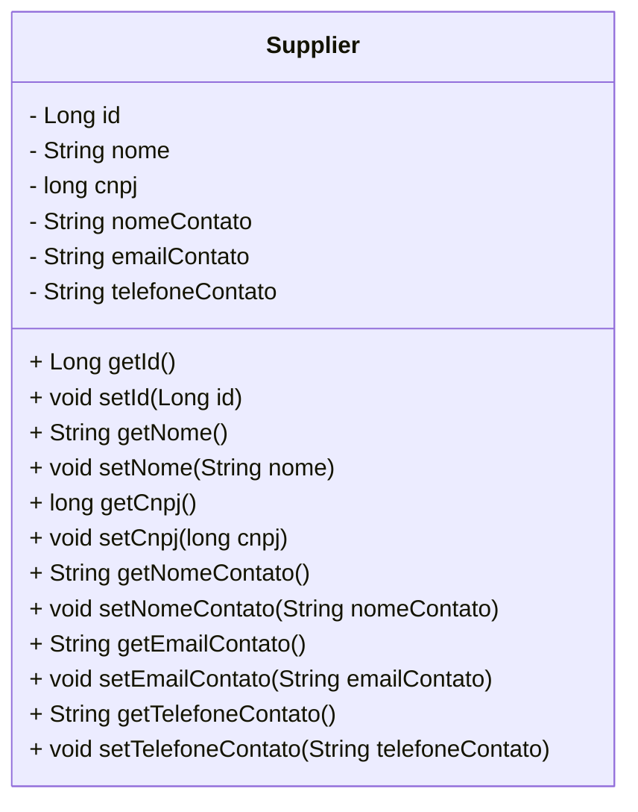
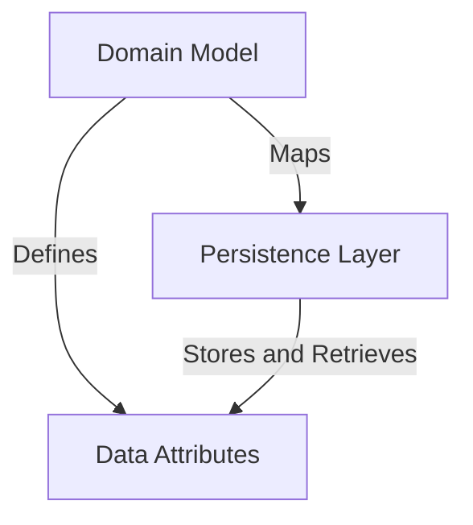
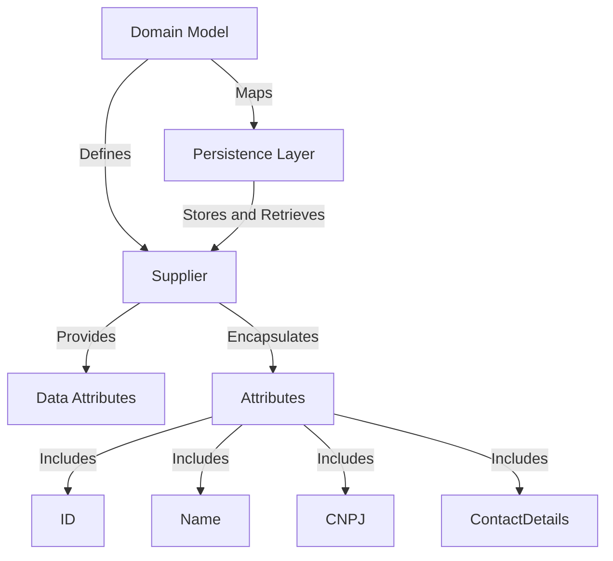
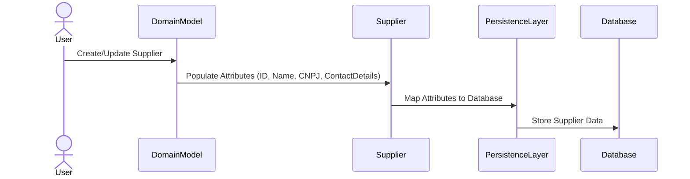

# Supplier Management Component Overview

The provided context revolves around the `Supplier` entity, which is a core component of a supplier management system. This entity is responsible for representing supplier information, including identification, contact details, and business registration data. The `Supplier` class is designed to interact with a persistence layer, leveraging JPA annotations to map its attributes to a relational database. This document provides a high-level architectural overview of the `Supplier` component and its interactions within the system.

## Key Components

### Domain Model
- **Supplier**: *Represents a supplier entity with attributes such as ID, name, CNPJ (business registration number), and contact details (name, email, phone). It serves as the foundational data structure for supplier-related operations and is mapped to a database table using JPA annotations.*

### Persistence Layer
- **Entity Management**: *The `Supplier` class is annotated with `@Entity`, indicating that it is a JPA entity. The `@Id` and `@GeneratedValue` annotations define the primary key and its auto-generation strategy, ensuring seamless integration with the database.*

### Data Attributes
- **Supplier Attributes**:
  - *ID*: Unique identifier for the supplier.
  - *Name*: Name of the supplier.
  - *CNPJ*: Business registration number.
  - *Contact Name*: Name of the contact person.
  - *Contact Email*: Email address of the contact person.
  - *Contact Phone*: Phone number of the contact person.

### Relationships and Interactions
- **Supplier Entity**: *Acts as the central data model for supplier-related operations. It interacts with the persistence layer to store and retrieve supplier information. Other components in the system, such as services and controllers, will likely depend on this entity to perform business logic and expose supplier data to external systems.*

### Diagram Representation

This diagram illustrates the `Supplier` entity, its attributes, and the getter/setter methods used to access and modify its data. The `Supplier` class is a standalone entity in this context, but it is expected to interact with other layers of the application, such as services and controllers, to fulfill its role in the supplier management system.
## Component Relationships

### Context Diagram

### Explanation

- **Domain Model**:
  - The `Domain Model` category, represented by the `Supplier` entity, defines the structure and behavior of supplier-related data. It encapsulates attributes such as ID, name, CNPJ, and contact details.
  - It maps these attributes to the `Persistence Layer` using JPA annotations, ensuring seamless integration with the database.

- **Persistence Layer**:
  - The `Persistence Layer` is responsible for storing and retrieving supplier data. It interacts with the `Domain Model` to persist the attributes defined in the `Data Attributes` category.
  - The `Supplier` entity leverages JPA annotations like `@Entity`, `@Id`, and `@GeneratedValue` to facilitate this interaction.

- **Data Attributes**:
  - The `Data Attributes` category includes the individual pieces of information that define a supplier, such as ID, name, CNPJ, and contact details.
  - These attributes are defined by the `Domain Model` and are stored and retrieved by the `Persistence Layer` during database operations.
### Detailed Vision

### Explanation

- **Domain Model**:
  - The `Domain Model` contains the `Supplier` entity, which is the central component responsible for encapsulating supplier-related data. It defines the structure of the `Attributes` category, including:
    - **ID**: A unique identifier for the supplier.
    - **Name**: The name of the supplier.
    - **CNPJ**: The business registration number.
    - **ContactDetails**: Includes the contact name, email, and phone number.
  - The `Supplier` entity maps these attributes to the `Persistence Layer` using JPA annotations, ensuring that the data can be stored and retrieved from the database.

- **Persistence Layer**:
  - The `Persistence Layer` interacts with the `Supplier` entity to store and retrieve supplier data. It leverages the mappings defined in the `Domain Model` to persist the attributes in the database.
  - The `Supplier` entity acts as the bridge between the `Domain Model` and the `Persistence Layer`, ensuring that the data structure defined in the `Domain Model` is correctly translated into database operations.

- **Data Attributes**:
  - The `Data Attributes` category represents the individual pieces of information that define a supplier. These attributes are encapsulated within the `Supplier` entity and include:
    - **ID**: Used as the primary key for database operations.
    - **Name**: Represents the supplier's name.
    - **CNPJ**: Ensures compliance with business registration requirements.
    - **ContactDetails**: Provides essential contact information for communication.
  - The `Supplier` entity provides these attributes to the `Persistence Layer` for storage and retrieval, ensuring that the data remains consistent and accessible.
## Integration Scenarios

### Supplier Data Persistence Workflow

This scenario describes the process of persisting supplier data into the database. It highlights the interaction between the `Supplier` entity, the `Persistence Layer`, and the attributes encapsulated within the `Supplier` entity. The workflow begins with the creation or update of a supplier record and ends with the data being stored in the database.

### Explanation

- **User**:
  - The process begins with a user action, such as creating or updating a supplier record. This triggers the interaction with the `Domain Model`.

- **Domain Model**:
  - The `Domain Model` receives the user input and initializes the `Supplier` entity. It populates the attributes of the `Supplier` entity, including ID, Name, CNPJ, and ContactDetails.

- **Supplier**:
  - The `Supplier` entity encapsulates the attributes and prepares them for persistence. It maps these attributes to the `Persistence Layer` using JPA annotations.

- **Persistence Layer**:
  - The `Persistence Layer` takes the mapped attributes from the `Supplier` entity and interacts with the database to store the supplier data.

- **Database**:
  - The database is the final destination for the supplier data. It stores the attributes provided by the `Persistence Layer`, ensuring that the data is available for future retrieval and operations.
