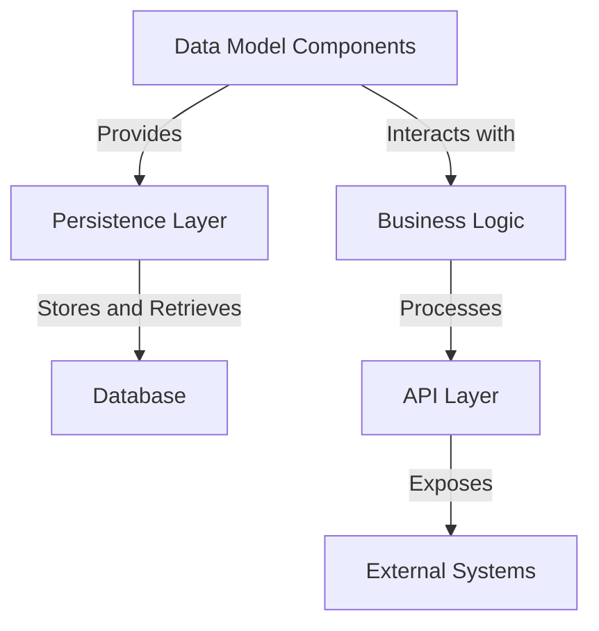
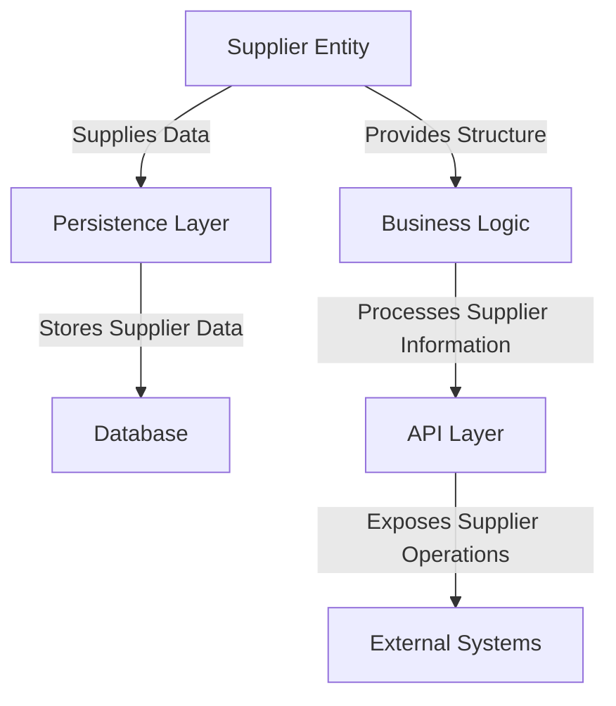
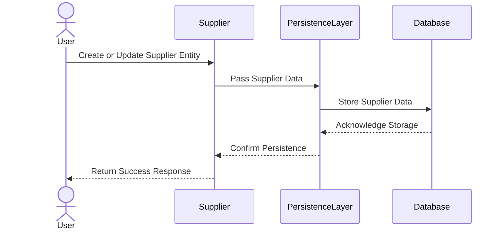
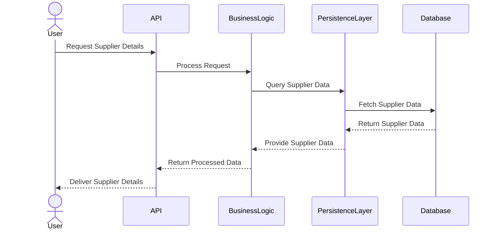

# Supplier Management Component Overview

The provided context revolves around a `Supplier` entity, which is part of a supplier management system. This entity is designed to represent suppliers in the system, encapsulating their key attributes such as identification, contact details, and business information. The primary responsibility of this component is to serve as a data model for suppliers, enabling persistence and retrieval of supplier-related information in a database. It leverages JPA annotations to integrate seamlessly with the persistence layer.

## Key Components

### Data Model Components
- **Supplier**: *Represents a supplier entity in the system, encapsulating attributes such as ID, name, CNPJ (business identifier), and contact details (name, email, phone). It is responsible for persisting supplier data and providing getter and setter methods for accessing and modifying these attributes.*

### Relationships and Responsibilities
The `Supplier` component is a standalone entity in this context, with no explicit relationships to other components provided in the current scope. However, it is likely to interact with other components in the system, such as repositories for database operations, services for business logic, and controllers for API exposure. Its primary role is to act as a foundational building block for supplier-related operations.
## Component Relationships

### Context Diagram

### Explanation of the Flowchart
- **Data Model Components**: The `Supplier` entity serves as the foundational data model, encapsulating supplier-related attributes. It provides the structure for persisting supplier data and interacts with the persistence layer to store and retrieve information.
- **Persistence Layer**: This layer is responsible for managing database operations, such as saving, updating, and querying supplier data. The `Supplier` entity leverages JPA annotations to integrate seamlessly with this layer.
- **Database**: The persistence layer communicates with the database to store and retrieve supplier information. The database acts as the central repository for all supplier-related data.
- **Business Logic**: The `Supplier` entity interacts with the business logic layer, which processes supplier-related operations, such as validation, transformation, and application of business rules.
- **API Layer**: The business logic layer exposes supplier-related functionalities through the API layer, enabling external systems to interact with the supplier management system.
- **External Systems**: External systems, such as client applications or third-party integrations, consume the API to perform operations related to suppliers, such as querying supplier details or updating contact information.
## Component Relationships

### Detailed Vision

### Explanation of the Flowchart
- **Supplier Entity**: 
  - Acts as the core data model for supplier-related information, encapsulating attributes such as ID, name, CNPJ, and contact details.
  - Supplies structured data to the persistence layer for storage and retrieval operations.
  - Provides a well-defined structure for the business logic layer to process supplier-related operations.

- **Persistence Layer**: 
  - Receives supplier data from the `Supplier` entity and performs database operations such as saving, updating, and querying supplier information.
  - Ensures the integrity and consistency of supplier data within the database.

- **Database**: 
  - Serves as the central repository for supplier-related data, storing all information provided by the persistence layer.

- **Business Logic**: 
  - Utilizes the `Supplier` entity to process supplier-related operations, such as validation, transformation, and application of business rules.
  - Acts as the intermediary between the data model and the API layer, ensuring that supplier data is correctly processed before being exposed.

- **API Layer**: 
  - Exposes supplier-related functionalities to external systems, such as querying supplier details or updating contact information.
  - Facilitates interaction between external systems and the supplier management system by providing endpoints for supplier operations.

- **External Systems**: 
  - Consume the API to perform supplier-related operations, leveraging the functionalities exposed by the supplier management system.
## Integration Scenarios

### Supplier Data Persistence Scenario
This scenario describes the process of persisting supplier data into the database. It begins with the creation or update of a `Supplier` entity, followed by its interaction with the persistence layer to store the data in the database. This scenario highlights the collaboration between the `Supplier` entity, the persistence layer, and the database.

#### Explanation of the Diagram
- **User**: 
  - Initiates the process by creating or updating a supplier entity through the system interface.
  - Provides the necessary supplier details, such as name, CNPJ, and contact information.

- **Supplier Entity**: 
  - Acts as the data model for the supplier, encapsulating the provided details.
  - Passes the structured supplier data to the persistence layer for storage.

- **Persistence Layer**: 
  - Receives the supplier data from the `Supplier` entity and performs the necessary operations to store it in the database.
  - Ensures the integrity and consistency of the data during the storage process.

- **Database**: 
  - Stores the supplier data provided by the persistence layer.
  - Acknowledges the successful storage of the data back to the persistence layer.

- **Response Flow**: 
  - The persistence layer confirms the successful storage of the supplier data to the `Supplier` entity.
  - The `Supplier` entity returns a success response to the user, indicating that the supplier data has been persisted successfully.

---

### Supplier Data Retrieval Scenario
This scenario describes the process of retrieving supplier data from the database. It begins with a user request to fetch supplier details, followed by the interaction between the `Supplier` entity, the persistence layer, and the database to retrieve the requested data.

#### Explanation of the Diagram
- **User**: 
  - Initiates the process by requesting supplier details through the system interface.

- **API Layer**: 
  - Receives the user request and forwards it to the business logic layer for processing.

- **Business Logic**: 
  - Processes the user request and queries the persistence layer for supplier data.
  - Applies any necessary business rules or transformations to the retrieved data.

- **Persistence Layer**: 
  - Queries the database to fetch the requested supplier data.
  - Ensures the integrity and accuracy of the data during retrieval.

- **Database**: 
  - Retrieves the supplier data based on the query provided by the persistence layer.
  - Returns the requested data to the persistence layer.

- **Response Flow**: 
  - The persistence layer provides the retrieved supplier data to the business logic layer.
  - The business logic layer processes the data and returns it to the API layer.
  - The API layer delivers the supplier details to the user, fulfilling the request.
