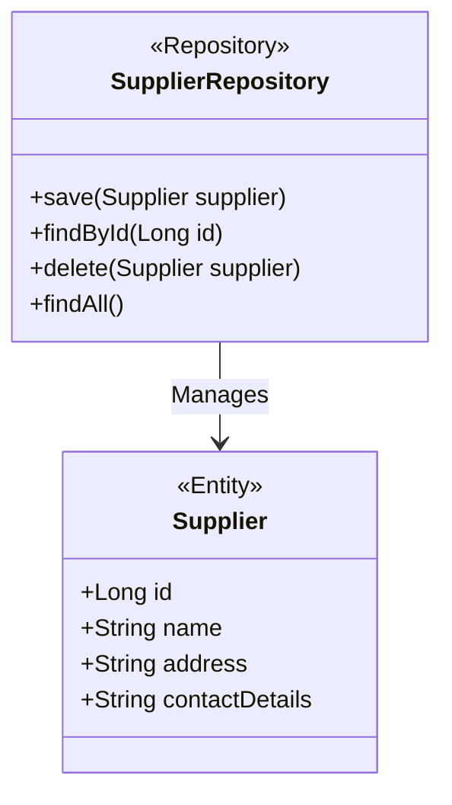
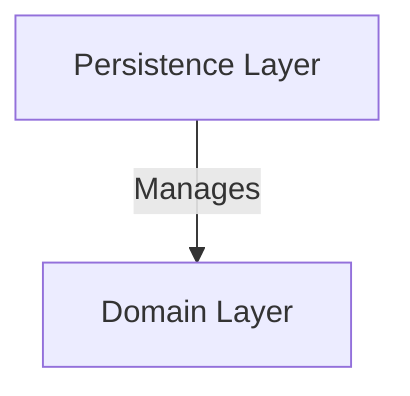
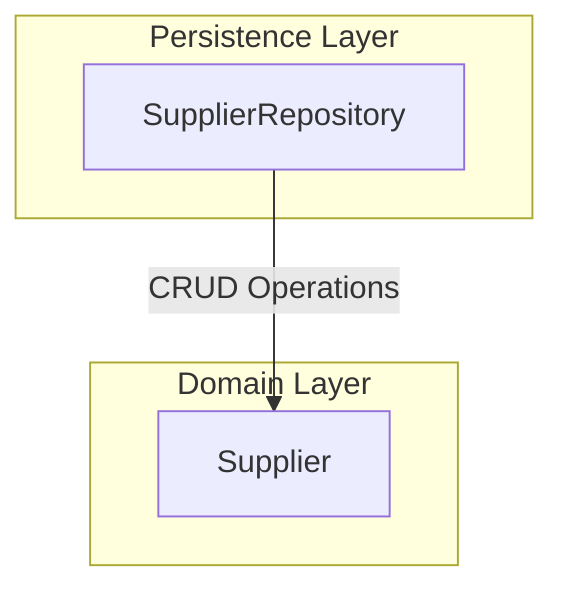
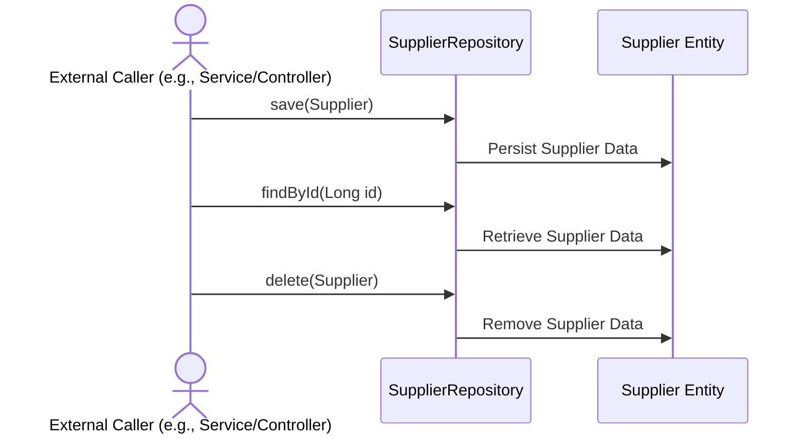

# Supplier Repository: High-Level Architecture Overview

The provided context revolves around the `SupplierRepository` component, which is part of a system designed to manage supplier-related data. This repository acts as a bridge between the application and the database, enabling CRUD (Create, Read, Update, Delete) operations on `Supplier` entities. It leverages Spring Data JPA to abstract database interactions, simplifying the implementation of data access layers. The repository is annotated with `@Repository`, indicating its role in the persistence layer.

## Key Components

### Persistence Layer
- **SupplierRepository**: *Responsible for providing an interface to perform CRUD operations on `Supplier` entities. It leverages Spring Data JPA to abstract database interactions, ensuring efficient and standardized data access.*

### Domain Layer
- **Supplier**: *Represents the core domain entity for suppliers. It encapsulates supplier-related attributes and behaviors, serving as the primary data model for the repository.*

## Component Relationships

The `SupplierRepository` interacts directly with the `Supplier` entity, enabling operations such as saving, updating, deleting, and querying supplier data. This relationship is crucial for maintaining the integrity and consistency of supplier-related information within the system.

The diagram above illustrates the relationship between the `SupplierRepository` and the `Supplier` entity. The repository acts as a manager for supplier data, providing methods to interact with the database while abstracting the underlying implementation details.
## Component Relationships

### Context Diagram

### Explanation
- **Persistence Layer**: The `SupplierRepository` resides in this layer and is responsible for managing the interaction between the application and the database. It abstracts CRUD operations for the `Supplier` entity, ensuring efficient and standardized data access.
- **Domain Layer**: The `Supplier` entity is part of this layer and represents the core domain model for supplier-related data. It encapsulates supplier attributes and behaviors, serving as the primary data structure managed by the repository.
### Detailed Vision

### Explanation
- **SupplierRepository**: Resides in the **Persistence Layer** and is responsible for performing CRUD operations on the `Supplier` entity. It abstracts database interactions, ensuring that the application can manage supplier data without directly dealing with SQL or database-specific logic.
- **Supplier**: Resides in the **Domain Layer** and represents the core domain model for supplier-related data. It encapsulates supplier attributes such as `id`, `name`, `address`, and `contactDetails`. The `SupplierRepository` interacts with this entity to perform operations like saving, updating, deleting, and querying supplier data.
- **Data Flow**: The arrow labeled "CRUD Operations" indicates the flow of data between the `SupplierRepository` and the `Supplier` entity. The repository manages supplier data by performing operations on the domain model, ensuring consistency and integrity in the persistence layer.
## Integration Scenarios

### Managing Supplier Data
This scenario describes how the system integrates to manage supplier data, including creating, reading, updating, and deleting supplier information. The process begins with an external caller (e.g., a service or controller) invoking the `SupplierRepository` to perform operations on the `Supplier` entity. This integration ensures that supplier data is consistently stored and retrieved from the database.

### Explanation
- **External Caller**: Represents an external system, service, or controller that initiates operations on supplier data. It interacts with the `SupplierRepository` to perform CRUD operations.
- **SupplierRepository**: Acts as the intermediary between the external caller and the database. It provides methods such as `save`, `findById`, and `delete` to manage supplier data. These methods abstract the underlying database operations.
- **Supplier Entity**: Represents the domain model for supplier data. The `SupplierRepository` interacts with this entity to persist, retrieve, or delete supplier information in the database.
- **Flow of Operations**:
  - The external caller invokes the `save` method on the `SupplierRepository` to persist supplier data. The repository then interacts with the `Supplier` entity to store the data in the database.
  - The external caller invokes the `findById` method to retrieve supplier data. The repository queries the database and returns the corresponding `Supplier` entity.
  - The external caller invokes the `delete` method to remove supplier data. The repository interacts with the `Supplier` entity to delete the data from the database.
