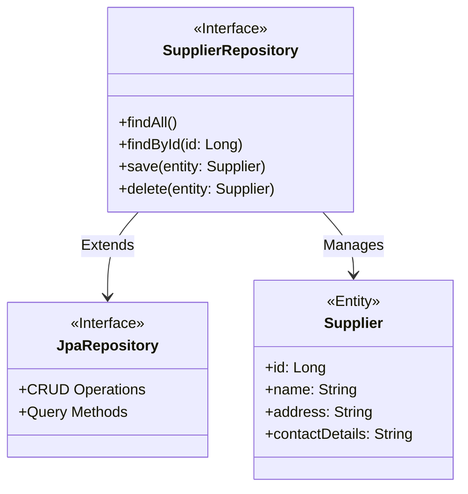
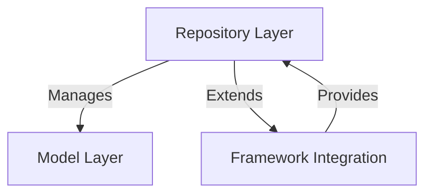
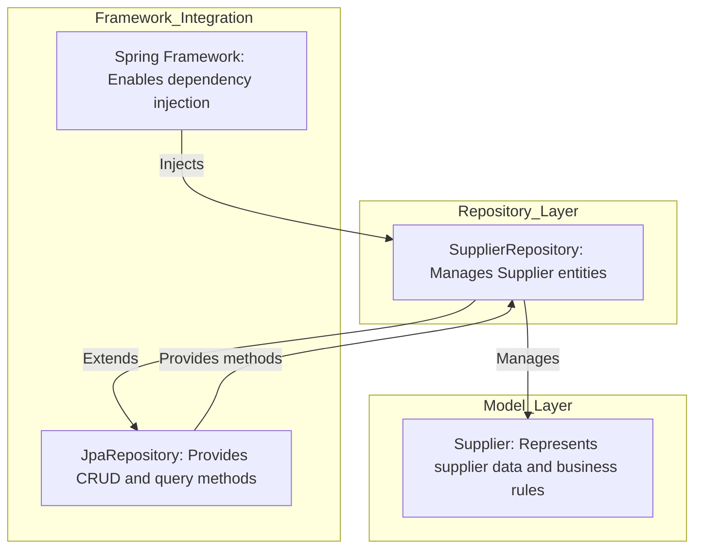
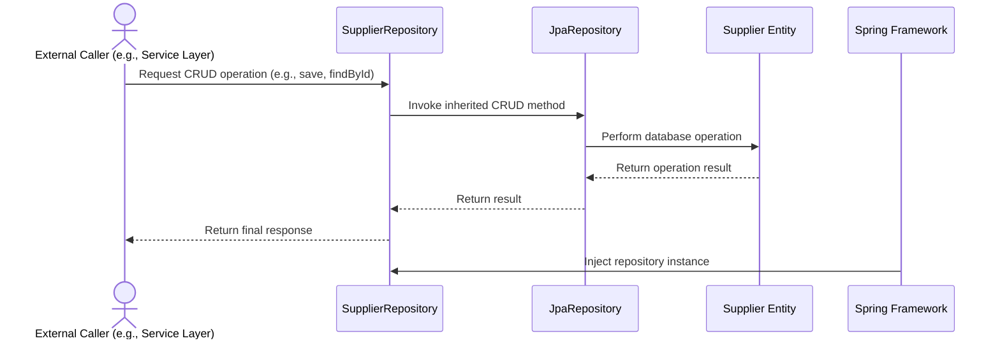

# Supplier Repository: High-Level Architecture Overview

The provided code snippet represents a **SupplierRepository** interface, which is a critical component in the data access layer of a system. It leverages Spring Data JPA to interact with the database and manage **Supplier** entities. This repository is responsible for abstracting database operations, such as CRUD (Create, Read, Update, Delete) operations, and provides a seamless way to query and persist data related to suppliers. By extending `JpaRepository`, it inherits a wide range of pre-defined methods, reducing boilerplate code and improving maintainability.

## Key Components

### Repository Layer
- **SupplierRepository**: *Acts as the data access layer for managing Supplier entities. It provides built-in methods for CRUD operations and allows custom query definitions if needed. This component is annotated with `@Repository`, indicating its role in the persistence layer.*

### Model Layer
- **Supplier**: *Represents the domain entity for suppliers. It is the central object managed by the repository, encapsulating supplier-related data and business rules.*

### Framework Integration
- **JpaRepository**: *A Spring Data JPA interface that provides generic CRUD operations and query methods. By extending this interface, SupplierRepository inherits these functionalities, enabling efficient database interaction.*

### Dependency Injection
- **Spring Framework**: *The repository is integrated into the Spring ecosystem, allowing it to be injected into other components, such as services, for seamless interaction with the database.*

## Relationships and Interactions

### Explanation of Diagram
- **SupplierRepository** extends **JpaRepository**, inheriting its methods for database operations.
- **SupplierRepository** interacts with the **Supplier** entity, which represents the data model for suppliers in the system.
- The **Supplier** entity encapsulates supplier-related attributes, such as `id`, `name`, `address`, and `contactDetails`.

This architecture ensures a clean separation of concerns, with the repository focusing solely on data access logic, while the entity represents the domain model. The use of Spring Data JPA simplifies development and enhances maintainability.
## Component Relationships

### Context Diagram

### Explanation of Flowchart

- **Repository Layer → Model Layer**: The **SupplierRepository** in the repository layer manages the **Supplier** entity in the model layer. This relationship ensures that the repository handles all database operations related to suppliers, such as CRUD operations, while the model layer encapsulates the supplier's data and business rules.

- **Repository Layer → Framework Integration**: The **SupplierRepository** extends **JpaRepository**, which is part of the Spring Data JPA framework. This integration provides pre-defined methods for database operations, reducing boilerplate code and enabling efficient interaction with the database.

- **Framework Integration → Repository Layer**: The Spring Framework provides dependency injection and lifecycle management for the **SupplierRepository**, ensuring it is seamlessly integrated into the application and can be used by other components, such as services, without manual instantiation.
### Detailed Vision

### Explanation of Flowchart

- **SupplierRepository → Supplier**: The **SupplierRepository** in the repository layer manages the **Supplier** entity in the model layer. It performs CRUD operations and interacts with the database to persist and retrieve supplier data. This relationship ensures that the repository is the central point for handling supplier-related data.

- **SupplierRepository → JpaRepository**: The **SupplierRepository** extends **JpaRepository**, inheriting its pre-defined methods for CRUD operations and custom query capabilities. This extension reduces boilerplate code and provides a robust mechanism for database interaction.

- **JpaRepository → SupplierRepository**: The **JpaRepository** provides the necessary methods and functionalities to the **SupplierRepository**, enabling it to perform database operations efficiently.

- **SpringFramework → SupplierRepository**: The **Spring Framework** injects the **SupplierRepository** into other components, such as services, ensuring seamless integration and lifecycle management. This allows the repository to be used without manual instantiation, adhering to the principles of dependency injection.
## Integration Scenarios

### Managing Supplier Data in the Repository Layer

This scenario describes how the **SupplierRepository** interacts with the **Supplier** entity and the Spring Framework to manage supplier data. The process begins with an external caller (e.g., a service layer or controller) initiating a request to perform CRUD operations on supplier data. The **SupplierRepository** leverages the functionalities provided by **JpaRepository** and the Spring Framework to fulfill the request.

### Explanation of Diagram

- **External Caller → SupplierRepository**: The process begins with an external caller, such as a service layer or controller, requesting a CRUD operation (e.g., saving a new supplier or retrieving supplier details). The **SupplierRepository** acts as the entry point for handling these requests.

- **SupplierRepository → JpaRepository**: The **SupplierRepository** delegates the requested operation to the **JpaRepository**, which provides pre-defined methods for performing CRUD operations. This delegation ensures efficient and standardized database interaction.

- **JpaRepository → Supplier**: The **JpaRepository** interacts directly with the **Supplier** entity to perform the requested database operation, such as persisting or retrieving supplier data.

- **Supplier → JpaRepository**: The **Supplier** entity returns the result of the database operation (e.g., the saved supplier object or retrieved supplier details) to the **JpaRepository**.

- **JpaRepository → SupplierRepository**: The **JpaRepository** passes the operation result back to the **SupplierRepository**, which acts as the intermediary between the external caller and the database.

- **SupplierRepository → External Caller**: The **SupplierRepository** returns the final response to the external caller, completing the operation.

- **SpringFramework → SupplierRepository**: The **Spring Framework** injects the **SupplierRepository** instance into the application, ensuring it is available for use by other components. This dependency injection simplifies the integration and lifecycle management of the repository.
