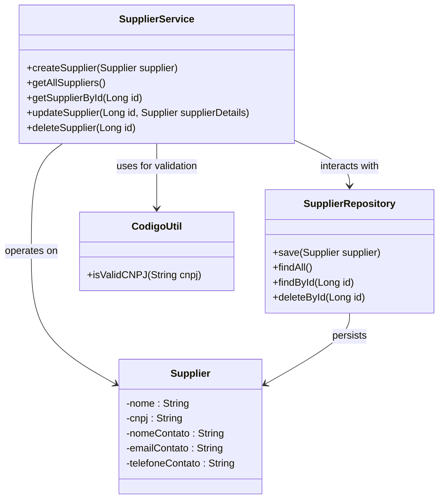
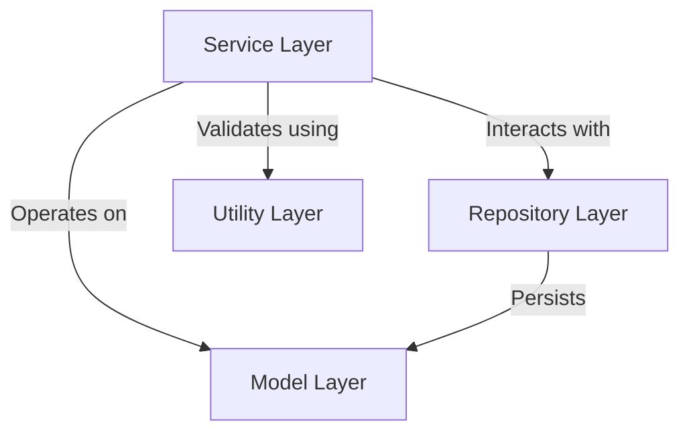
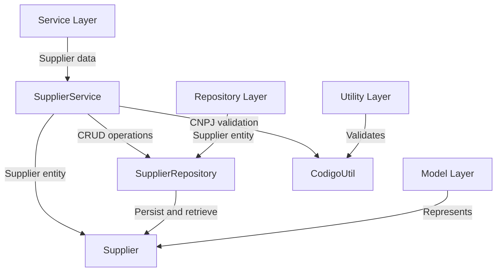
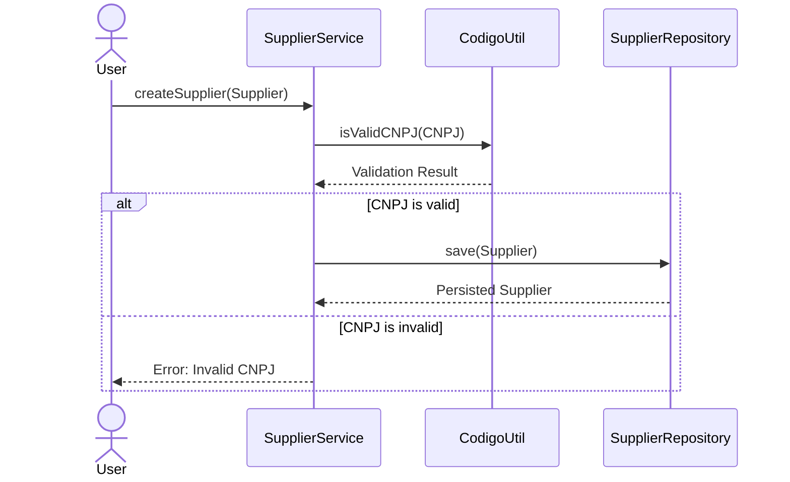
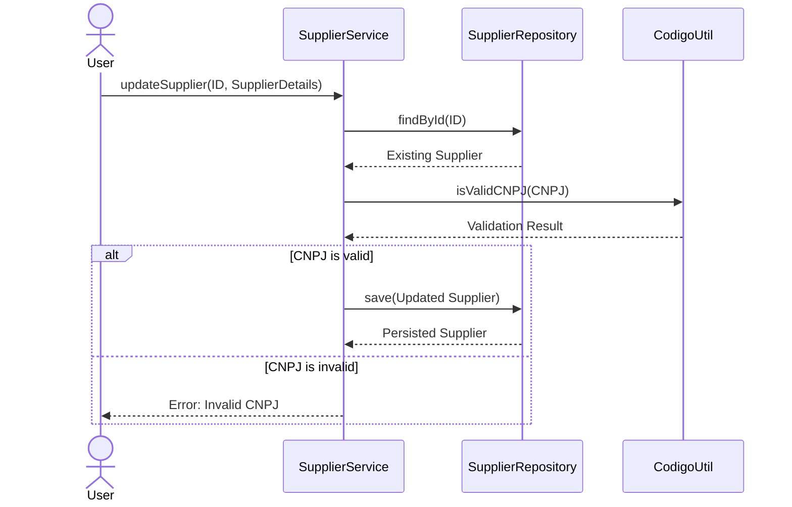

# Supplier Management Service Architecture Overview

The Supplier Management Service is a core component of the system responsible for managing supplier-related operations. It provides functionalities to create, retrieve, update, and delete supplier records while ensuring data integrity and validation. This service interacts with the repository layer for data persistence and utilizes utility classes for validation purposes. The overarching goal of this service is to streamline supplier management processes and ensure compliance with business rules, such as validating supplier identifiers (CNPJ).

## Key Components

### Service Layer
- **SupplierService**: *Handles business logic for supplier management, including creating, retrieving, updating, and deleting supplier records. It ensures data validation (e.g., CNPJ validation) and interacts with the repository layer for data persistence.*

### Repository Layer
- **SupplierRepository**: *Provides data access methods for supplier entities, such as saving, retrieving, and deleting supplier records. It acts as the bridge between the service layer and the database.*

### Model Layer
- **Supplier**: *Represents the supplier entity with attributes such as name, CNPJ, contact name, email, and phone number. This model encapsulates the data structure for supplier records.*

### Utility Layer
- **CodigoUtil**: *Provides utility methods for validating supplier identifiers (e.g., CNPJ). It ensures that business rules related to supplier data are enforced.*

## Component Relationships

### Summary of Interactions
- **SupplierService** acts as the central orchestrator, leveraging **SupplierRepository** for data persistence and **CodigoUtil** for validation.
- **SupplierRepository** directly interacts with the **Supplier** model to perform CRUD operations.
- **CodigoUtil** ensures that supplier identifiers (CNPJ) comply with business rules before any operation is performed.

This architecture ensures modularity, separation of concerns, and adherence to business rules, making the Supplier Management Service robust and maintainable.
## Component Relationships

### Context Diagram

### Explanation of the Flowchart

- **Service Layer → Repository Layer**: The `SupplierService` component in the Service Layer interacts with the `SupplierRepository` in the Repository Layer to perform CRUD operations on supplier data. This ensures that all supplier-related business logic is executed before data is persisted or retrieved.

- **Service Layer → Model Layer**: The `SupplierService` operates on the `Supplier` model, which represents the structure of supplier data. This includes reading and updating attributes such as name, CNPJ, and contact details.

- **Service Layer → Utility Layer**: The `SupplierService` uses the `CodigoUtil` component in the Utility Layer to validate supplier identifiers (e.g., CNPJ). This ensures compliance with business rules before any operation is performed.

- **Repository Layer → Model Layer**: The `SupplierRepository` directly interacts with the `Supplier` model to persist, retrieve, and delete supplier records in the database. It acts as the bridge between the Service Layer and the data storage.
### Detailed Vision

### Explanation of the Flowchart

- **Service Layer → SupplierService**: The `SupplierService` is the core component of the Service Layer, responsible for handling supplier-related business logic. It processes supplier data and ensures validation before interacting with other layers.

- **SupplierService → SupplierRepository**: The `SupplierService` interacts with the `SupplierRepository` to perform CRUD operations on supplier data. This includes saving new suppliers, retrieving existing ones, updating supplier details, and deleting supplier records.

- **SupplierService → Supplier**: The `SupplierService` operates on the `Supplier` model, which encapsulates the structure of supplier data. It modifies attributes such as name, CNPJ, and contact details during update operations.

- **SupplierService → CodigoUtil**: The `SupplierService` uses the `CodigoUtil` utility class to validate supplier identifiers (CNPJ). This ensures that only valid supplier data is processed and persisted.

- **Repository Layer → SupplierRepository**: The `SupplierRepository` is the main component of the Repository Layer, responsible for persisting and retrieving supplier data. It acts as the intermediary between the Service Layer and the database.

- **SupplierRepository → Supplier**: The `SupplierRepository` directly interacts with the `Supplier` model to perform data persistence and retrieval operations.

- **Model Layer → Supplier**: The `Supplier` model represents the structure of supplier data, including attributes such as name, CNPJ, and contact details. It is the central entity being operated on by the Service and Repository layers.

- **Utility Layer → CodigoUtil**: The `CodigoUtil` utility class validates supplier identifiers (CNPJ) to ensure compliance with business rules. It is a critical component for maintaining data integrity.
## Integration Scenarios

### Creating a Supplier

This scenario describes the process of creating a new supplier in the system. The flow begins with the `SupplierService` receiving a supplier entity from an external caller (e.g., a user or another system). The service validates the supplier's CNPJ using the `CodigoUtil` utility class and, if valid, persists the supplier data using the `SupplierRepository`.

#### Explanation of the Diagram

- **User → SupplierService**: The process starts with a user or external system calling the `createSupplier` method in the `SupplierService` to create a new supplier. The supplier entity is passed as input.

- **SupplierService → CodigoUtil**: The `SupplierService` calls the `isValidCNPJ` method in the `CodigoUtil` utility class to validate the supplier's CNPJ. This ensures compliance with business rules.

- **CodigoUtil → SupplierService**: The `CodigoUtil` returns the validation result to the `SupplierService`. If the CNPJ is valid, the process continues; otherwise, an error is returned to the user.

- **SupplierService → SupplierRepository**: If the CNPJ is valid, the `SupplierService` calls the `save` method in the `SupplierRepository` to persist the supplier data.

- **SupplierRepository → SupplierService**: The `SupplierRepository` returns the persisted supplier entity to the `SupplierService`, confirming the operation's success.

- **SupplierService → User**: If the CNPJ is invalid, the `SupplierService` returns an error message to the user, indicating the issue.

---

### Updating a Supplier

This scenario describes the process of updating an existing supplier's details. The flow begins with the `SupplierService` receiving updated supplier details and the supplier's ID from an external caller. The service retrieves the existing supplier from the `SupplierRepository`, validates the updated CNPJ using `CodigoUtil`, and persists the changes if the validation is successful.

#### Explanation of the Diagram

- **User → SupplierService**: The process starts with a user or external system calling the `updateSupplier` method in the `SupplierService`, passing the supplier's ID and updated details.

- **SupplierService → SupplierRepository**: The `SupplierService` calls the `findById` method in the `SupplierRepository` to retrieve the existing supplier record.

- **SupplierRepository → SupplierService**: The `SupplierRepository` returns the existing supplier entity to the `SupplierService`.

- **SupplierService → CodigoUtil**: The `SupplierService` calls the `isValidCNPJ` method in the `CodigoUtil` utility class to validate the updated CNPJ.

- **CodigoUtil → SupplierService**: The `CodigoUtil` returns the validation result to the `SupplierService`. If the CNPJ is valid, the process continues; otherwise, an error is returned to the user.

- **SupplierService → SupplierRepository**: If the CNPJ is valid, the `SupplierService` calls the `save` method in the `SupplierRepository` to persist the updated supplier data.

- **SupplierRepository → SupplierService**: The `SupplierRepository` returns the persisted supplier entity to the `SupplierService`, confirming the operation's success.

- **SupplierService → User**: If the CNPJ is invalid, the `SupplierService` returns an error message to the user, indicating the issue.
