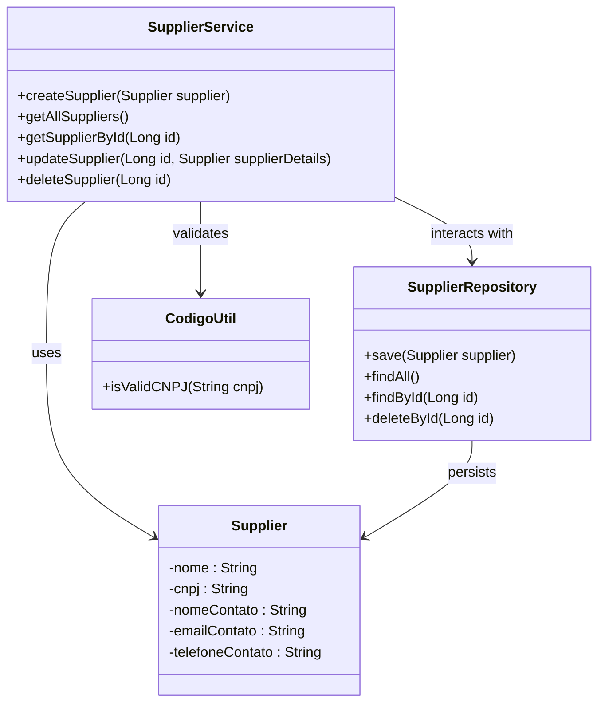
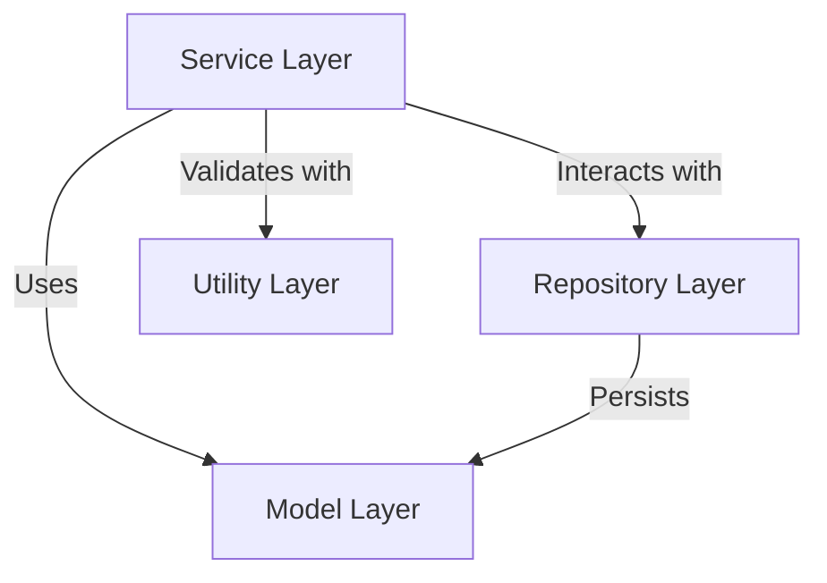
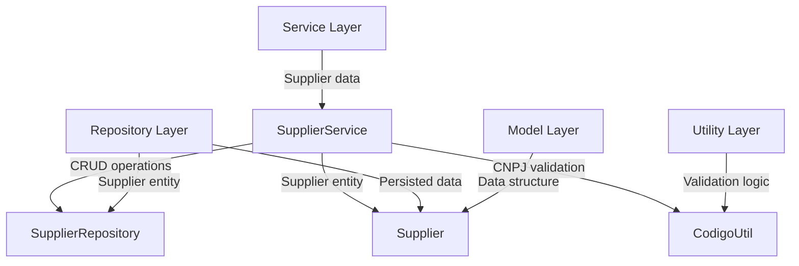
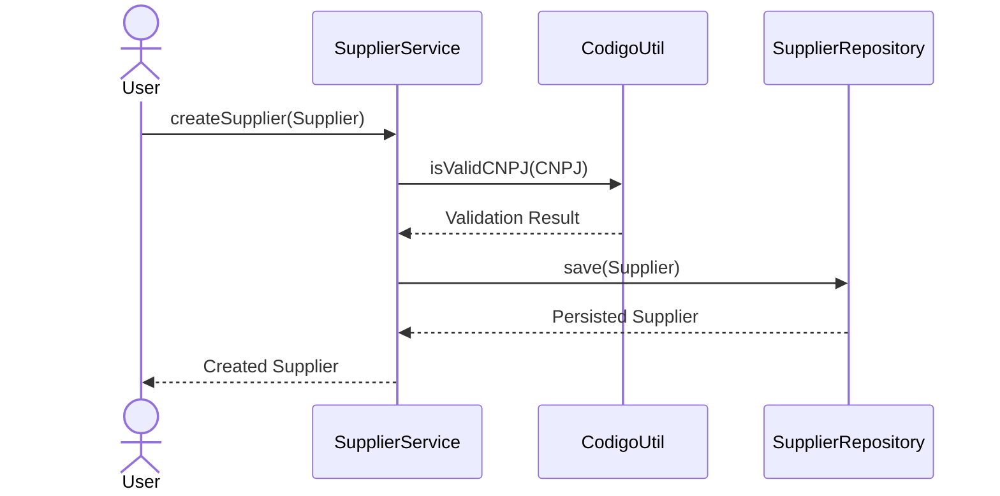

# Supplier Management Service Architecture Overview

The Supplier Management Service is a core component of the system responsible for managing supplier-related operations. It provides functionalities to create, retrieve, update, and delete supplier records while ensuring data integrity and validation. This service interacts with the repository layer for data persistence and utilizes utility classes for validation purposes. The overarching goal is to maintain a clean and efficient supplier management workflow.

## Key Components

### Service Layer
- **SupplierService**: *Handles business logic for supplier management, including creation, retrieval, updating, and deletion of supplier records. It ensures data validation (e.g., CNPJ validation) and interacts with the repository layer for data persistence.*

### Repository Layer
- **SupplierRepository**: *Provides data access methods for supplier entities, including saving, retrieving, and deleting supplier records. It acts as the bridge between the service layer and the database.*

### Model Layer
- **Supplier**: *Represents the supplier entity with attributes such as name, CNPJ, contact name, email, and phone number. This model is used across the service and repository layers.*

### Utility Layer
- **CodigoUtil**: *Provides utility methods for validation, such as checking the validity of a CNPJ. It ensures that only valid data is processed by the service layer.*

## Component Relationships

### Summary of Responsibilities
- **SupplierService**: *Central component for supplier management, orchestrating interactions between the repository, model, and utility layers.*
- **SupplierRepository**: *Handles data persistence for supplier entities.*
- **Supplier**: *Defines the structure and attributes of a supplier entity.*
- **CodigoUtil**: *Ensures data validation, specifically for CNPJ values.*

This architecture ensures modularity, separation of concerns, and maintainability, making it easier to extend or modify the supplier management functionalities in the future.
## Component Relationships

### Context Diagram

### Explanation of the Flowchart

- **Service Layer → Repository Layer**: The `SupplierService` interacts with the `SupplierRepository` to perform CRUD operations on supplier data. This ensures that the business logic is decoupled from the data persistence layer.

- **Service Layer → Model Layer**: The `SupplierService` uses the `Supplier` model to represent supplier entities during operations such as creation, retrieval, updating, and deletion. The model acts as the data structure shared across layers.

- **Service Layer → Utility Layer**: The `SupplierService` validates supplier data, such as CNPJ values, using the `CodigoUtil` utility class. This ensures that only valid data is processed and stored.

- **Repository Layer → Model Layer**: The `SupplierRepository` persists supplier entities (`Supplier`) to the database. It directly interacts with the model layer to save, retrieve, and delete supplier records.

This flowchart and explanation provide a high-level understanding of how the components interact and fulfill their responsibilities within the Supplier Management Service.
### Detailed Vision

### Explanation of the Flowchart

- **Service Layer → SupplierService**: The `SupplierService` is the central component in the service layer, responsible for orchestrating supplier management operations. It handles supplier data and ensures business logic is applied.

- **SupplierService → SupplierRepository**: The `SupplierService` interacts with the `SupplierRepository` to perform CRUD operations on supplier data. This includes saving new suppliers, retrieving existing ones, updating supplier details, and deleting supplier records.

- **SupplierService → Supplier**: The `SupplierService` uses the `Supplier` model to represent supplier entities during operations. The model acts as the data structure that flows between the service and repository layers.

- **SupplierService → CodigoUtil**: The `SupplierService` relies on the `CodigoUtil` utility class to validate supplier data, specifically the CNPJ values. This ensures that only valid supplier data is processed.

- **Repository Layer → SupplierRepository**: The `SupplierRepository` is the core component in the repository layer, responsible for persisting supplier entities (`Supplier`) to the database. It provides methods for saving, retrieving, and deleting supplier records.

- **RepositoryLayer → Supplier**: The `SupplierRepository` directly interacts with the `Supplier` model to persist supplier data. The model represents the structure of the data stored in the database.

- **Model Layer → Supplier**: The `Supplier` model defines the attributes and structure of a supplier entity, such as name, CNPJ, contact details, etc. It is used across the service and repository layers.

- **Utility Layer → CodigoUtil**: The `CodigoUtil` utility class provides validation logic, such as checking the validity of CNPJ values. It ensures that supplier data adheres to the required standards before being processed by the service layer.

This detailed vision provides a comprehensive understanding of how the components interact within their respective layers to fulfill their responsibilities in the Supplier Management Service.
## Integration Scenarios

### Supplier Creation Workflow

The supplier creation workflow is a critical integration scenario where a new supplier is added to the system. This process involves validating the supplier's CNPJ, saving the supplier data to the database, and ensuring the integrity of the data. The workflow starts with the `SupplierService` and integrates with the `CodigoUtil` for validation and the `SupplierRepository` for persistence.

#### Explanation of the Diagram

- **User → SupplierService**: The process begins when a user invokes the `createSupplier` method in the `SupplierService` to add a new supplier. The user provides the supplier details, including the CNPJ.

- **SupplierService → CodigoUtil**: The `SupplierService` calls the `isValidCNPJ` method in the `CodigoUtil` utility class to validate the provided CNPJ. This ensures that the supplier data adheres to the required standards.

- **CodigoUtil → SupplierService**: The `CodigoUtil` returns the validation result to the `SupplierService`. If the CNPJ is invalid, an exception is thrown, and the process terminates.

- **SupplierService → SupplierRepository**: If the CNPJ is valid, the `SupplierService` calls the `save` method in the `SupplierRepository` to persist the supplier data to the database.

- **SupplierRepository → SupplierService**: The `SupplierRepository` returns the persisted supplier entity to the `SupplierService`, confirming that the data has been successfully saved.

- **SupplierService → User**: Finally, the `SupplierService` returns the created supplier entity to the user, completing the workflow.

This scenario highlights the collaboration between the `SupplierService`, `CodigoUtil`, and `SupplierRepository` to ensure the successful creation of a supplier while maintaining data integrity and validation.
