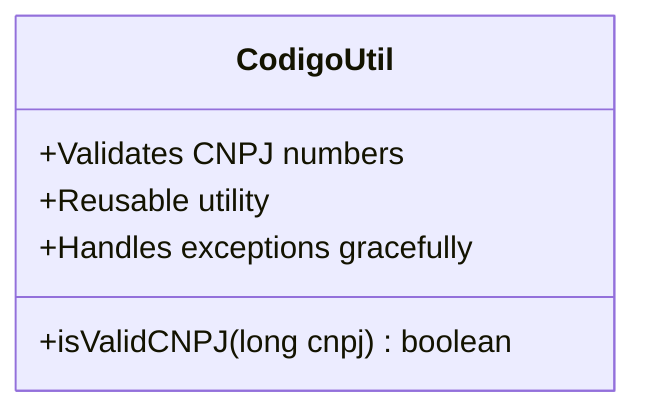
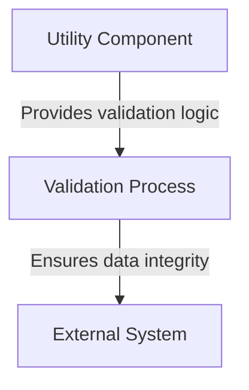
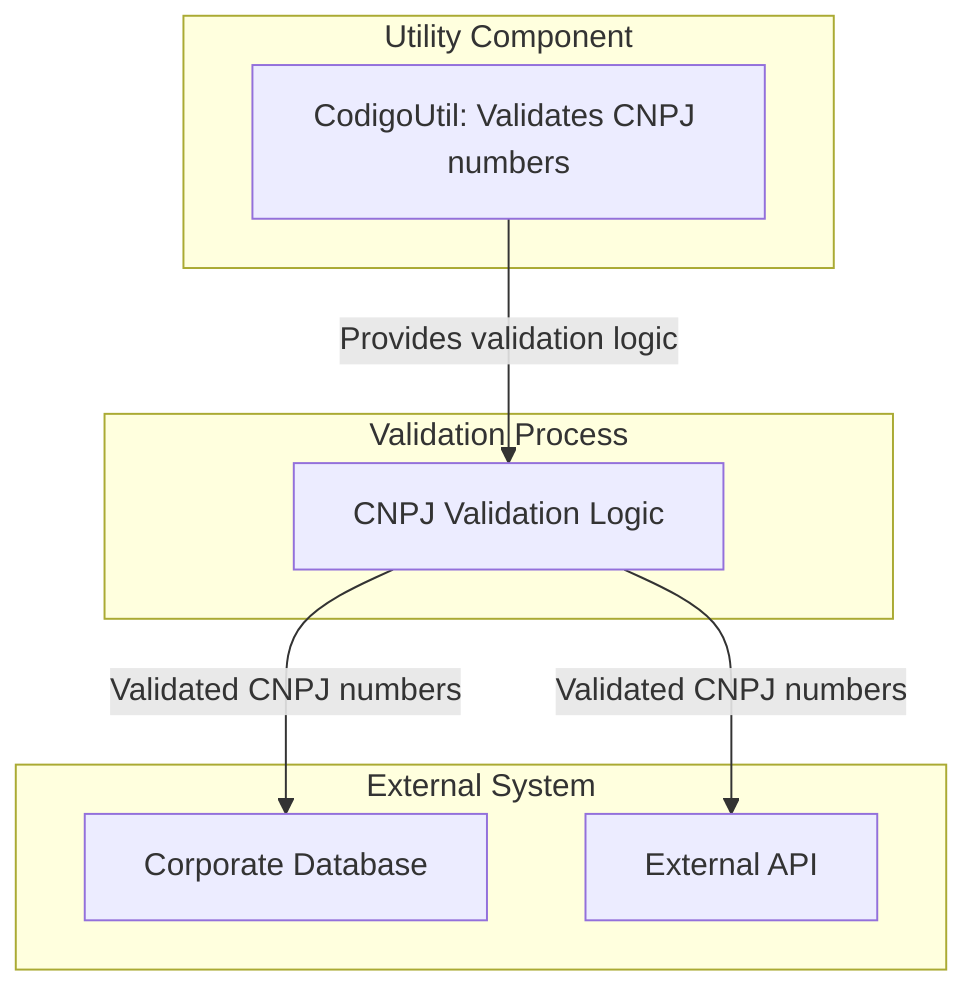
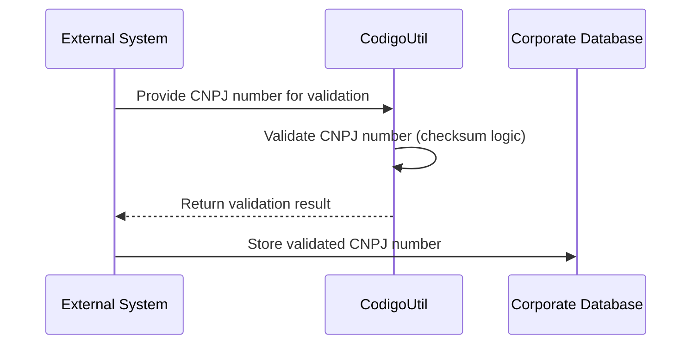
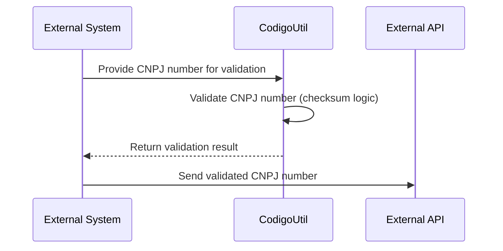

# High-Level Architecture Overview of `CodigoUtil` Component

The `CodigoUtil` class is a utility component designed to validate Brazilian CNPJ (Cadastro Nacional da Pessoa Jurídica) numbers. CNPJ is a unique identifier assigned to companies in Brazil, and its validation is critical for ensuring data integrity in systems that handle corporate information. This utility class encapsulates the logic for validating CNPJ numbers based on specific mathematical rules, making it reusable across different parts of the system.

The primary responsibility of `CodigoUtil` is to provide a method for validating CNPJ numbers (`isValidCNPJ`). This method ensures that the input adheres to the CNPJ format and performs checksum calculations to verify its validity. The utility is designed to be stateless and self-contained, focusing solely on the validation logic.

## Key Components

### Utility Component
- **`CodigoUtil`: _Provides a reusable method for validating CNPJ numbers based on Brazilian legal standards. It ensures that the input is correctly formatted and performs checksum calculations to verify the validity of the CNPJ._**

### Responsibilities
1. **CNPJ Validation Logic**:
   - The `isValidCNPJ` method implements the validation rules for CNPJ numbers, including:
     - Formatting the input number to a 14-digit string.
     - Calculating checksum digits using predefined weight arrays.
     - Comparing the calculated checksum digits with the input's checksum digits to determine validity.
   - The method is robust, handling exceptions gracefully to ensure the system's stability.

2. **Reusability**:
   - The utility is designed to be stateless and can be used across multiple modules or systems that require CNPJ validation.

3. **Error Handling**:
   - The method includes exception handling to manage unexpected input or calculation errors, returning `false` in such cases.

### Diagram: Component Overview

This diagram illustrates the `CodigoUtil` class as a standalone utility component with a single public method, `isValidCNPJ`, which encapsulates the CNPJ validation logic.

---

By encapsulating the CNPJ validation logic in a dedicated utility class, the system achieves better modularity, reusability, and maintainability. This approach ensures that the validation logic is centralized, reducing duplication and potential errors in other parts of the system.
## Component Relationships

### Context Diagram

### Explanation of the Flowchart

- **Utility Component (`CodigoUtil`)**:
  - The `CodigoUtil` class acts as the **Utility Component**, providing reusable validation logic for CNPJ numbers. It encapsulates the mathematical rules and checksum calculations required for validation.
  - This component is stateless and self-contained, making it ideal for integration into various systems that require CNPJ validation.

- **Validation Process**:
  - The validation process leverages the logic provided by the `Utility Component` to ensure that CNPJ numbers are correctly formatted and valid according to Brazilian legal standards.
  - This process is critical for maintaining data integrity and ensuring that only valid CNPJ numbers are processed further.

- **External System**:
  - The validated CNPJ numbers are then passed to external systems, such as databases, APIs, or other modules, which rely on accurate and valid corporate identifiers for their operations.
  - The validation process ensures that these external systems receive reliable data, reducing errors and improving overall system reliability.
### Detailed Vision

### Explanation of the Flowchart

- **Utility Component (`CodigoUtil`)**:
  - The `CodigoUtil` class is the core of the **Utility Component**. It encapsulates the logic for validating CNPJ numbers, ensuring that the input adheres to the required format and performs checksum calculations to verify validity.
  - This component provides the validation logic to the **Validation Process**, enabling it to perform its duties effectively.

- **Validation Process (`CNPJValidation`)**:
  - The **Validation Process** represents the logic that uses the `CodigoUtil` component to validate CNPJ numbers. It ensures that the numbers are correctly formatted and valid according to Brazilian legal standards.
  - Once the validation is complete, the process passes the validated CNPJ numbers to external systems for further use.

- **External System (`CorporateDatabase` and `ExternalAPI`)**:
  - The **Corporate Database** stores validated CNPJ numbers for internal use, such as record-keeping or reporting.
  - The **External API** receives validated CNPJ numbers for integration with external services, ensuring that only valid corporate identifiers are shared with third-party systems.
  - Both external systems rely on the **Validation Process** to ensure the integrity of the data they receive.
## Integration Scenarios

### Validating and Storing CNPJ Numbers in a Corporate Database

This scenario describes the process of validating a CNPJ number and storing it in a corporate database. The flow begins with an external system or user providing a CNPJ number, which is then validated using the `CodigoUtil` component. Once validated, the CNPJ number is stored in the corporate database for further use, such as record-keeping or reporting.

#### Explanation of the Diagram

- **External System**:
  - The process begins with an external system (or user) providing a CNPJ number to be validated. This could be part of a larger workflow, such as registering a company or verifying corporate information.

- **CodigoUtil**:
  - The `CodigoUtil` component receives the CNPJ number and performs validation using its `isValidCNPJ` method. This includes formatting the input, calculating checksum digits, and verifying the validity of the CNPJ number.
  - Once the validation is complete, the result (valid or invalid) is returned to the external system.

- **Corporate Database**:
  - If the CNPJ number is valid, the external system proceeds to store it in the corporate database. This ensures that only valid corporate identifiers are recorded, maintaining data integrity and reliability.

---

### Validating CNPJ Numbers for External API Integration

This scenario illustrates the process of validating a CNPJ number and passing it to an external API for integration with third-party services. The flow starts with an external system providing a CNPJ number, which is validated using the `CodigoUtil` component. Once validated, the CNPJ number is sent to the external API for further processing.

#### Explanation of the Diagram

- **External System**:
  - The process begins with an external system providing a CNPJ number to be validated. This could be part of a workflow involving integration with third-party services.

- **CodigoUtil**:
  - The `CodigoUtil` component validates the CNPJ number using its `isValidCNPJ` method. This includes formatting the input, performing checksum calculations, and verifying the validity of the CNPJ number.
  - Once the validation is complete, the result is returned to the external system.

- **External API**:
  - If the CNPJ number is valid, the external system sends it to the external API for integration with third-party services. This ensures that only valid corporate identifiers are shared, improving the reliability of external integrations.
