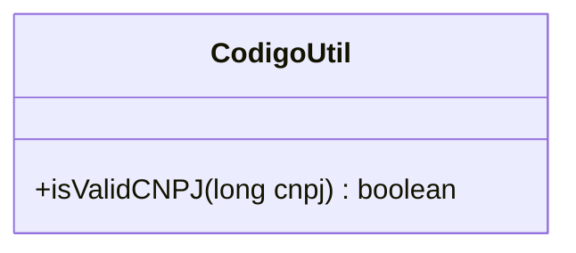
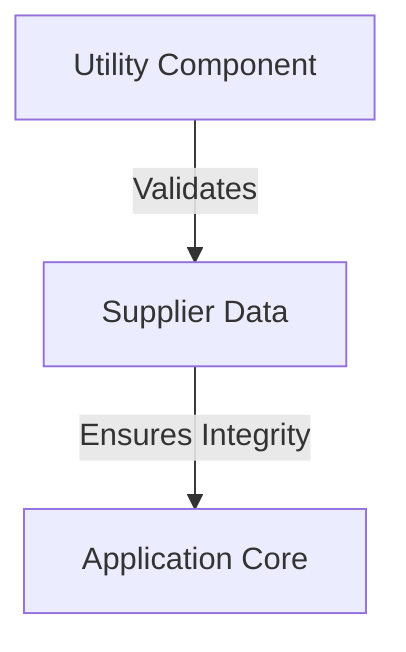
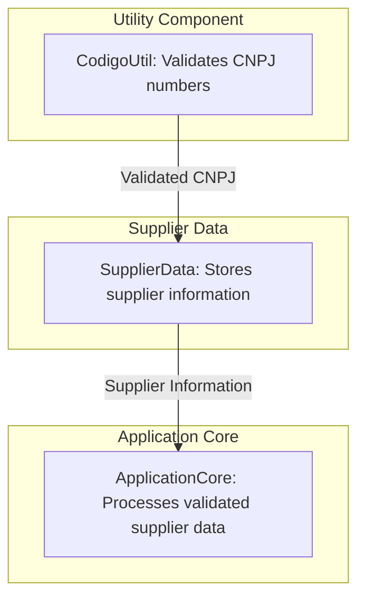
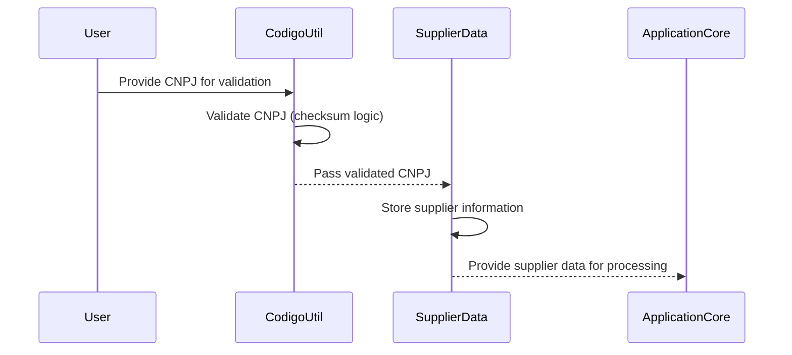

# High-Level Architecture Overview: CodigoUtil Component

The `CodigoUtil` class is a utility component designed to validate Brazilian CNPJ numbers, which are unique identifiers for companies in Brazil. This validation process ensures that the provided CNPJ adheres to the official format and checksum rules. The class encapsulates the logic for calculating and verifying the two check digits of a CNPJ, leveraging mathematical operations and predefined weight arrays.

The primary responsibility of this component is to provide a reusable and reliable mechanism for CNPJ validation, which can be integrated into larger systems dealing with supplier or company data. It plays a critical role in ensuring data integrity and compliance with Brazilian regulations.

## Key Components

### Utility Component
- **CodigoUtil**: *Responsible for validating CNPJ numbers by calculating and verifying their check digits using predefined weights and mathematical operations. It ensures that the provided CNPJ adheres to the official format and checksum rules.*

### Relationships and Context
- The `CodigoUtil` class operates independently and does not interact with external components or systems. It is a standalone utility designed for internal use within the application or module it resides in. Its functionality can be leveraged by other components dealing with supplier or company data validation.

## System Interaction Diagram

The diagram illustrates the `CodigoUtil` class as a standalone utility component with a single public method, `isValidCNPJ`, which performs the CNPJ validation logic.
## Component Relationships

### Context Diagram

### Explanation
- **Utility Component**: The `CodigoUtil` class, categorized as a utility component, is responsible for validating CNPJ numbers. It ensures that the provided CNPJ adheres to the official format and checksum rules.
- **Supplier Data**: The validation performed by the utility component is applied to supplier or company data, ensuring that only valid CNPJ numbers are processed.
- **Application Core**: The validated supplier data is then used by the application core, which relies on the integrity of this data for further processing, decision-making, or compliance purposes.
### Detailed Vision

### Explanation
- **Utility Component (`CodigoUtil`)**: The `CodigoUtil` class is responsible for validating CNPJ numbers. It performs the validation logic and ensures that the CNPJ adheres to the official format and checksum rules. The validated CNPJ is then passed to the `SupplierData` component.
- **Supplier Data (`SupplierData`)**: This component stores supplier information, including the validated CNPJ numbers. It acts as a repository for supplier-related data, ensuring that only valid CNPJ numbers are stored and used in subsequent processes.
- **Application Core (`ApplicationCore`)**: The `ApplicationCore` component processes the supplier information stored in `SupplierData`. It relies on the integrity of the validated CNPJ numbers to perform operations such as compliance checks, reporting, or decision-making.
## Integration Scenarios

### Validating and Storing Supplier CNPJ Numbers

This scenario describes the process of validating a supplier's CNPJ number and storing it in the system. The flow begins with the `CodigoUtil` component performing the validation of the CNPJ number, followed by the `SupplierData` component storing the validated information. This ensures that only valid supplier data is passed to the `ApplicationCore` for further processing.

### Explanation
- **User**: The process begins when a user provides a CNPJ number for validation. This could be part of a supplier registration or data entry workflow.
- **CodigoUtil**: The `CodigoUtil` component validates the provided CNPJ number using its checksum logic. It ensures that the CNPJ adheres to the official format and rules.
- **SupplierData**: Once the CNPJ is validated, it is passed to the `SupplierData` component, which stores the supplier information, including the validated CNPJ.
- **ApplicationCore**: The `SupplierData` component provides the stored supplier information to the `ApplicationCore`, which processes the data for further use cases such as compliance checks, reporting, or decision-making.
