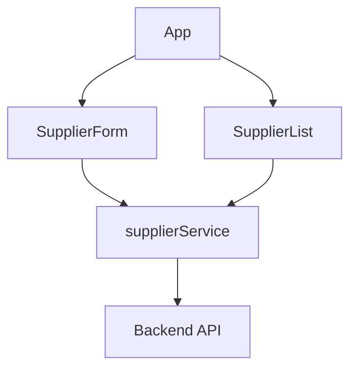
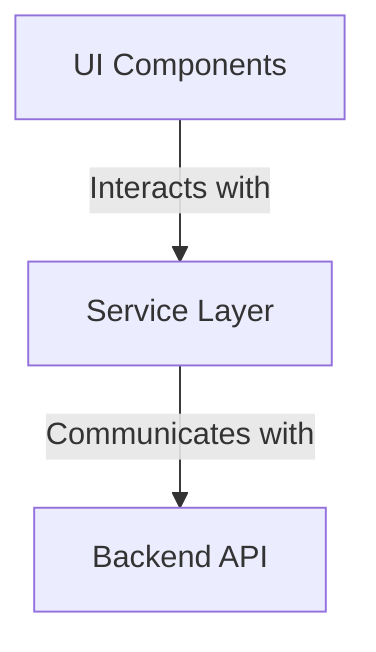
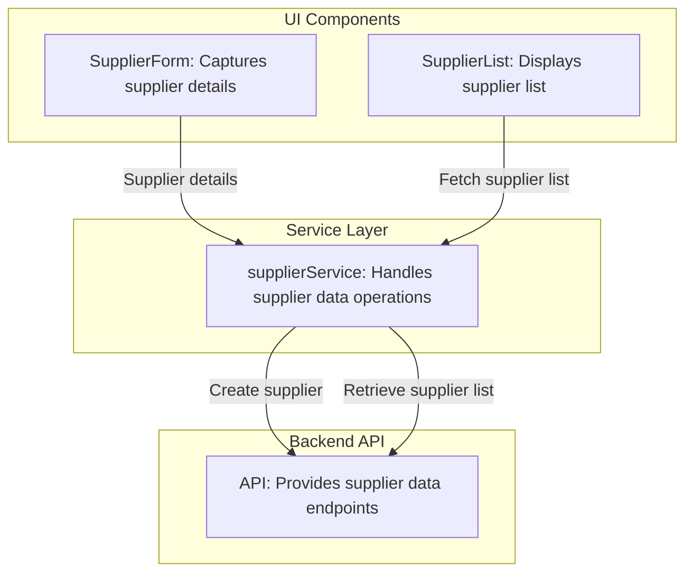
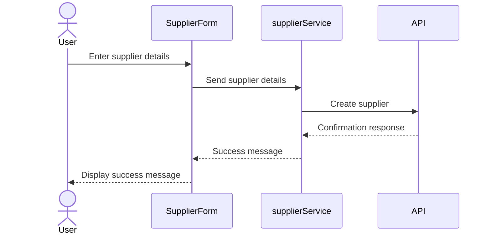
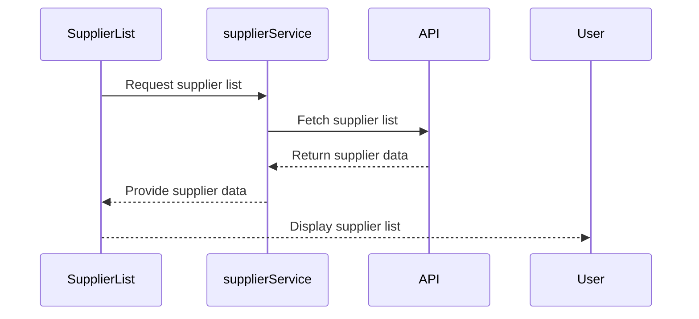

# Supplier Management System Architecture Overview

The provided context and code analysis indicate that the system is designed to manage suppliers, including functionalities for creating and listing suppliers. The architecture revolves around React components and service functions that interact with supplier data. The main focus is on the `SupplierForm` and `SupplierList` components, which handle user interactions and display supplier information, respectively. These components rely on the `supplierService` module for data operations, such as fetching and creating suppliers.

## Key Components

### UI Components
- **SupplierForm**: *Responsible for capturing supplier details from the user and initiating the creation of a new supplier. It interacts with the `supplierService` to send data for persistence.*
- **SupplierList**: *Displays a list of suppliers fetched from the backend. It leverages the `supplierService` to retrieve supplier data.*

### Service Layer
- **supplierService**: *Provides methods for interacting with supplier data, including fetching all suppliers (`getAllSuppliers`) and creating a new supplier (`createSupplier`). This layer abstracts the data operations and serves as the bridge between the UI components and the backend.*

### Application Root
- **App**: *Serves as the entry point of the application, orchestrating the layout and rendering the main components (`SupplierForm` and `SupplierList`). It provides a cohesive structure for the supplier management system.*

## Component Interaction Diagram

### Explanation of Diagram
- The `App` component acts as the root of the application, rendering the `SupplierForm` and `SupplierList` components.
- The `SupplierForm` component interacts with the `supplierService` to create new suppliers.
- The `SupplierList` component fetches supplier data through the `supplierService`.
- The `supplierService` communicates with the backend API to perform data operations, ensuring separation of concerns between the UI and data layers.
## Component Relationships

### Context Diagram

### Explanation of Flowchart

- **UI Components**: This category includes `SupplierForm` and `SupplierList`. These components are responsible for interacting with the user. 
  - `SupplierForm` captures supplier details and sends them to the service layer for creation.
  - `SupplierList` retrieves supplier data from the service layer to display it to the user.

- **Service Layer**: This category is represented by the `supplierService`. It acts as the intermediary between the UI components and the backend API.
  - It provides methods like `getAllSuppliers` and `createSupplier` to fulfill the data needs of the UI components.

- **Backend API**: The service layer communicates with the backend API to perform data operations, such as fetching supplier data or persisting new supplier information. This ensures that the UI components remain decoupled from the backend logic.
### Detailed Vision

### Explanation of Flowchart

- **UI Components**:
  - `SupplierForm` captures supplier details from the user and sends them to the `supplierService` for creation. This interaction ensures that the user input is processed and passed to the service layer for persistence.
  - `SupplierList` fetches the supplier list from the `supplierService` and displays it to the user. This interaction ensures that the user can view the current supplier data.

- **Service Layer**:
  - The `supplierService` acts as the intermediary between the UI components and the backend API. It receives supplier details from `SupplierForm` and sends them to the backend API for creation.
  - It also fetches the supplier list from the backend API and provides it to `SupplierList` for display.

- **Backend API**:
  - The backend API provides endpoints for supplier data operations. It receives requests from the `supplierService` to create new suppliers and retrieve the supplier list. This ensures that the data is stored and retrieved from a centralized source.
## Integration Scenarios

### Supplier Creation Workflow

This scenario describes the process of creating a new supplier. It begins with the user interacting with the `SupplierForm` component to input supplier details. The data is then passed to the `supplierService`, which communicates with the backend API to persist the new supplier information.

#### Explanation of Diagram

- **User**: Initiates the workflow by entering supplier details into the `SupplierForm`.
- **SupplierForm**: Captures the user input and sends the supplier details to the `supplierService` for processing.
- **supplierService**: Receives the supplier details and communicates with the backend API to create the new supplier.
- **API**: Processes the request to create the supplier and sends a confirmation response back to the `supplierService`.
- **supplierService**: Relays the success message back to the `SupplierForm`.
- **SupplierForm**: Displays the success message to the user, completing the workflow.

---

### Supplier List Retrieval Workflow

This scenario describes the process of retrieving and displaying the list of suppliers. It begins with the `SupplierList` component requesting supplier data from the `supplierService`, which fetches the data from the backend API and returns it for display.

#### Explanation of Diagram

- **SupplierList**: Initiates the workflow by requesting the supplier list from the `supplierService`.
- **supplierService**: Processes the request and communicates with the backend API to fetch the supplier data.
- **API**: Retrieves the supplier data and sends it back to the `supplierService`.
- **supplierService**: Relays the supplier data back to the `SupplierList`.
- **SupplierList**: Displays the supplier list to the user, completing the workflow.
