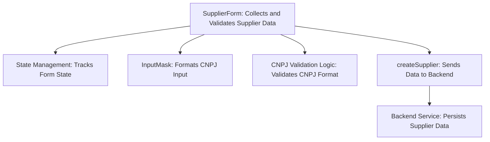
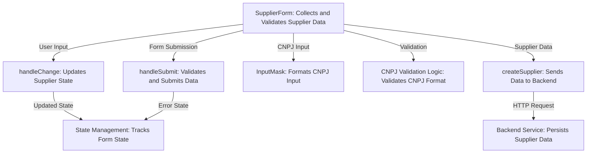
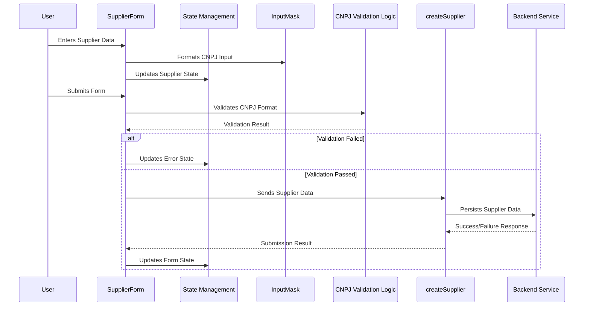

# Supplier Management Form: High-Level Architecture Overview

The provided code snippet represents a React component, `SupplierForm`, designed to manage supplier creation in a web application. Its primary responsibility is to collect supplier information, validate the data (especially the CNPJ field), and submit it to a backend service for persistence. This component interacts with external services and leverages state management to handle user input and validation errors.

## Key Components

### **SupplierForm: Supplier Creation and Validation**
- *Responsibility*: Acts as the main interface for supplier creation. It collects user input, validates the data (e.g., CNPJ format), and submits the supplier information to the backend service. It also manages error handling and state updates for user feedback.
- *Relation*: Relies on the `createSupplier` function from the `supplierService` module to send supplier data to the backend. It uses `InputMask` for formatting the CNPJ input field.

### **createSupplier: Backend Communication**
- *Responsibility*: Handles the communication with the backend service to persist supplier data. It abstracts the HTTP request logic, ensuring the `SupplierForm` component remains focused on UI and validation logic.
- *Relation*: Called by `SupplierForm` during the form submission process.

### **InputMask: Input Formatting**
- *Responsibility*: Provides input masking functionality for the CNPJ field, ensuring users enter data in the correct format (e.g., `99.999.999/9999-99`).
- *Relation*: Integrated into the `SupplierForm` component to enhance user experience and enforce input formatting.

### **State Management (useState): UI State Handling**
- *Responsibility*: Manages the state of the supplier form, including the supplier data and error messages. It ensures the UI reflects the current state of the form (e.g., displaying error messages or clearing fields after successful submission).
- *Relation*: Used within `SupplierForm` to track user input and validation errors.

### **CNPJ Validation Logic**
- *Responsibility*: Implements custom validation logic for Brazilian CNPJ numbers. Ensures the entered CNPJ is valid before submission.
- *Relation*: Encapsulated within the `SupplierForm` component and invoked during form submission.

## System Interaction Diagram

```mermaid
graph TD
    A[SupplierForm] --> B[createSupplier]
    A --> C[InputMask]
    A --> D[State Management (useState)]
    A --> E[CNPJ Validation Logic]
    B --> F[Backend Service]
```

### Explanation of Diagram
1. **SupplierForm** is the central component that interacts with other modules and services.
2. It calls **createSupplier** to send supplier data to the **Backend Service**.
3. **InputMask** is used for formatting the CNPJ field.
4. **State Management** tracks the form's state, including user input and error messages.
5. **CNPJ Validation Logic** ensures the CNPJ field is valid before submission.

This architecture ensures modularity, with clear separation of concerns between UI, validation, and backend communication.
## Component Relationships

### Context Diagram



### Explanation of Flowchart

- **SupplierForm**:
  - Acts as the central component responsible for collecting supplier data, validating it, and submitting it. It interacts with all other categories to fulfill its responsibilities.
  
- **State Management**:
  - Tracks the state of the form, including user input and error messages. This ensures the UI reflects the current state, such as displaying validation errors or clearing fields after successful submission.

- **InputMask**:
  - Provides input formatting for the CNPJ field, ensuring users enter data in the correct format. This enhances user experience and enforces data consistency.

- **CNPJ Validation Logic**:
  - Implements custom validation for Brazilian CNPJ numbers. It ensures the entered CNPJ is valid before the data is submitted to the backend.

- **createSupplier**:
  - Handles communication with the backend service to persist supplier data. It abstracts the HTTP request logic, allowing the `SupplierForm` to focus on UI and validation.

- **Backend Service**:
  - Receives supplier data from `createSupplier` and persists it in the database or other storage systems. It represents the final step in the supplier creation process.
### Detailed Vision



### Explanation of Flowchart

- **SupplierForm**:
  - **handleChange**: Updates the supplier state whenever the user modifies an input field. This ensures the form reflects the latest user input.
  - **handleSubmit**: Validates the form data (e.g., checks for required fields and valid CNPJ) and submits it to the backend service. It interacts with `State Management` to update error messages and clear the form upon successful submission.

- **State Management**:
  - Tracks the state of the form, including the supplier data and error messages. It ensures the UI reflects the current state, such as displaying validation errors or clearing fields after successful submission.

- **InputMask**:
  - Formats the CNPJ input field to ensure users enter data in the correct format (e.g., `99.999.999/9999-99`). This enhances user experience and enforces input consistency.

- **CNPJ Validation Logic**:
  - Validates the CNPJ format and checks its authenticity using custom logic. This ensures only valid CNPJ numbers are submitted to the backend.

- **createSupplier**:
  - Sends the supplier data to the backend service via an HTTP request. It abstracts the communication logic, allowing `SupplierForm` to focus on UI and validation.

- **Backend Service**:
  - Receives the supplier data from `createSupplier` and persists it in the database or other storage systems. This represents the final step in the supplier creation process.
## Integration Scenarios

### Supplier Creation and Validation Workflow

This scenario represents the process of creating a new supplier, starting from user input in the `SupplierForm` component, through validation, and ending with the supplier data being sent to the backend service for persistence. It highlights the collaboration between components to ensure data integrity and proper submission.

#### Sequence Diagram



#### Explanation of Diagram

- **User**:
  - Initiates the workflow by entering supplier data into the form and submitting it.

- **SupplierForm**:
  - Acts as the central orchestrator of the workflow:
    - Collects user input and updates the supplier state via `State Management`.
    - Formats the CNPJ input using `InputMask`.
    - Validates the CNPJ format using `CNPJ Validation Logic`.
    - Sends the supplier data to the backend via `createSupplier` if validation passes.
    - Updates the error state or clears the form based on the validation and submission results.

- **InputMask**:
  - Ensures the CNPJ input is formatted correctly before validation.

- **State Management**:
  - Tracks the supplier state and error messages throughout the workflow. It ensures the UI reflects the current state, such as displaying validation errors or clearing fields after successful submission.

- **CNPJ Validation Logic**:
  - Validates the CNPJ format and checks its authenticity. Returns the validation result to `SupplierForm`.

- **createSupplier**:
  - Sends the supplier data to the backend service for persistence. Handles the communication logic and returns the submission result to `SupplierForm`.

- **Backend Service**:
  - Persists the supplier data and returns a success or failure response to `createSupplier`. This represents the final step in the supplier creation process.
