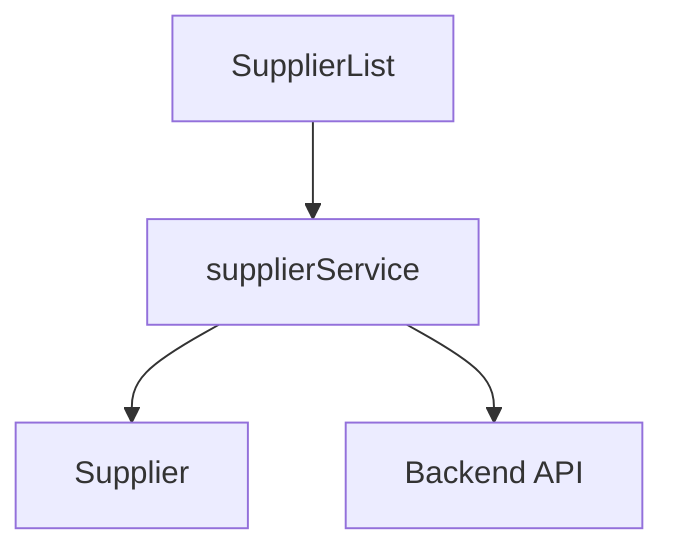
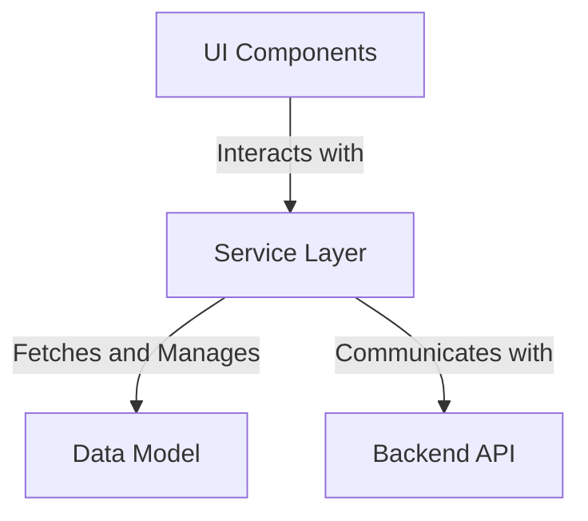
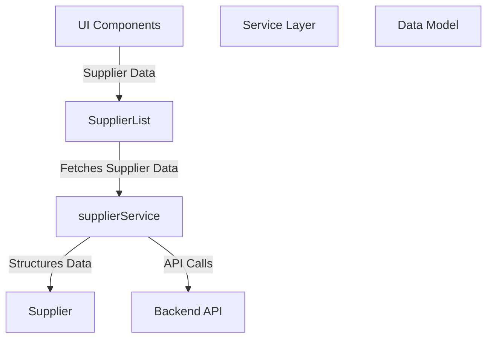
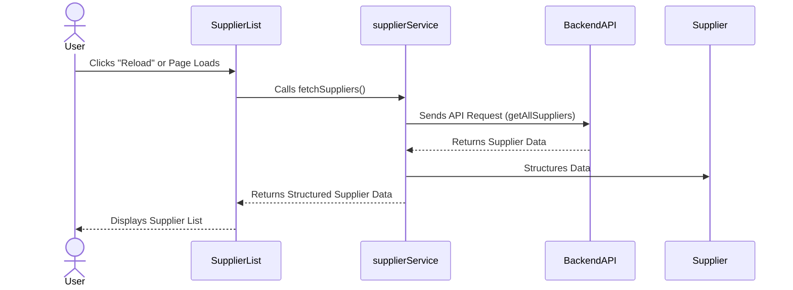

# Supplier Management System Overview

The provided code snippet is part of a Supplier Management System, focusing on the **SupplierList** component. This component is responsible for displaying a list of suppliers and providing functionality to reload the supplier data. The system interacts with external services to fetch supplier data and manage supplier-related operations. The architecture revolves around the **SupplierList** component and its interaction with the **supplierService** module, which encapsulates the logic for supplier-related API calls.

## Key Components

### UI Components
- **SupplierList**: *Responsible for rendering the supplier list and providing a reload functionality. It interacts with the supplierService to fetch supplier data and displays it in a structured format.*

### Service Layer
- **supplierService**: *Encapsulates the logic for supplier-related API calls, including fetching all suppliers and creating new suppliers. It serves as the bridge between the UI components and the backend API.*

### Data Model
- **Supplier**: *Represents the supplier entity with attributes such as `id`, `nome`, `cnpj`, `nomeContato`, `emailContato`, and `telefoneContato`. This model is used to structure the supplier data fetched from the backend.*

## Component Interaction Diagram

### Explanation of the Diagram
1. **SupplierList** interacts with **supplierService** to fetch supplier data.
2. **supplierService** communicates with the **Backend API** to retrieve or create supplier data.
3. The **Supplier** data model is used to structure the data received from the backend and displayed in the **SupplierList** component.

This architecture ensures a clear separation of concerns, with the UI components focusing on rendering and user interaction, the service layer handling API communication, and the data model structuring the data.
## Component Relationships

### Context Diagram

### Explanation of the Flowchart

- **UI Components**: The **SupplierList** component resides in this category. It interacts with the **Service Layer** to fetch supplier data and display it to the user. Its primary responsibility is rendering the supplier list and providing user interaction capabilities, such as reloading the data.

- **Service Layer**: The **supplierService** is part of this category. It acts as the intermediary between the **UI Components** and the **Backend API**. Its responsibilities include fetching all suppliers, creating new suppliers, and managing API communication logic.

- **Data Model**: The **Supplier** entity is part of this category. It structures the supplier data fetched from the backend, ensuring consistency and usability for the **UI Components**.

- **Backend API**: The **Service Layer** communicates with the **Backend API** to retrieve and manage supplier data. This external system provides the raw data that is processed and structured by the **Service Layer** and displayed by the **UI Components**.
## Component Relationships

### Detailed Vision

### Explanation of the Flowchart

- **UI Components**:
  - The **SupplierList** component resides in this category. It is responsible for rendering the supplier list and interacting with the **Service Layer** to fetch supplier data. It passes the supplier data to the UI for display purposes.

- **Service Layer**:
  - The **supplierService** component is part of this category. It handles the logic for API communication, fetching supplier data from the **Backend API**, and structuring it using the **Supplier** data model. It acts as the intermediary between the **UI Components** and the **Backend API**.

- **Data Model**:
  - The **Supplier** entity resides in this category. It structures the supplier data fetched from the backend, ensuring it is consistent and usable by the **SupplierList** component.

- **Backend API**:
  - The **supplierService** communicates with the **Backend API** to retrieve supplier data. This external system provides raw data, which is processed and structured by the **Service Layer** before being passed to the **UI Components** for rendering.
## Integration Scenarios

### Fetching and Displaying Supplier Data

This scenario describes the process of fetching supplier data from the backend and displaying it in the **SupplierList** component. It highlights the interaction between the **SupplierList**, **supplierService**, and **Backend API**, as well as the role of the **Supplier** data model in structuring the data.

### Explanation of the Diagram

- **User**:
  - The process begins when the user either loads the page or clicks the "Reload" button in the **SupplierList** component.

- **SupplierList**:
  - The **SupplierList** component initiates the data-fetching process by calling the `fetchSuppliers()` method in the **supplierService**.

- **supplierService**:
  - The **supplierService** sends an API request to the **Backend API** using the `getAllSuppliers` method.
  - Once the data is received, the **supplierService** uses the **Supplier** data model to structure the raw data into a usable format.

- **Backend API**:
  - The **Backend API** responds to the request by providing raw supplier data, which is then processed by the **supplierService**.

- **Supplier**:
  - The **Supplier** data model is used by the **supplierService** to structure the raw data into a consistent format, ensuring it is ready for display.

- **User**:
  - Finally, the structured supplier data is returned to the **SupplierList** component, which displays the supplier list to the user.
